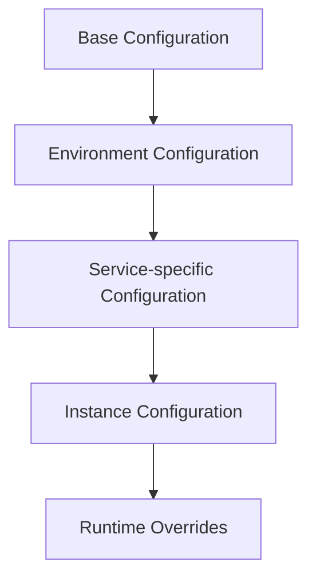

# Configuration Management

## Overview

The Configuration Management document outlines the strategies, patterns, and tools used for managing configurations across different environments within the Engineering AI Agent system. This document details configuration sources, hierarchy, security practices, and runtime management for service configurations.

## Key Components

### Configuration Sources

The system uses a layered approach to configuration management, prioritizing sources in the following order:

1. **Environment Variables**: For runtime overrides and secrets
2. **Kubernetes ConfigMaps/Secrets**: For container-specific configuration
3. **Configuration Server**: For centralized, dynamic configuration
4. **Local Files**: For default values and development use

### Configuration Hierarchy



### Secrets Management

- Secrets are managed separately from regular configuration
- Encryption at rest and in transit is enforced
- Just-in-time access with short-lived credentials
- Access is audited and logged

### Dynamic Configuration

The system supports dynamic configuration changes without service restarts:

```python
class ConfigListener:
    def __init__(self, config_service_url, service_name):
        self.config_service_url = config_service_url
        self.service_name = service_name
        self.callbacks = {}
        self.start_listening()
    
    def register_callback(self, config_key, callback_fn):
        """Register a function to be called when a config value changes"""
        self.callbacks[config_key] = callback_fn
    
    def handle_config_change(self, config_key, new_value):
        """Called when a configuration change is detected"""
        if config_key in self.callbacks:
            self.callbacks[config_key](new_value)
    
    def start_listening(self):
        """Start listening for configuration changes"""
        # Implementation for establishing connection to config service
        pass
```

## Configuration Schema

Each service defines its configuration schema, which includes:

- Required and optional parameters
- Type information and validation rules
- Default values
- Documentation
- Security classification

Example schema definition:

```yaml
service: knowledge-base
version: 1.0
parameters:
  - name: database_url
    type: string
    required: true
    secret: true
    description: "Connection string for the database"
    validation: "^(postgresql|mysql)://.*$"
  
  - name: vector_dimension
    type: integer
    required: false
    default: 1536
    description: "Dimension size for vector embeddings"
    validation: "^[0-9]{3,4}$"
  
  - name: cache_ttl_seconds
    type: integer
    required: false
    default: 3600
    description: "Time-to-live for cache entries in seconds"
    validation: "^[0-9]{1,5}$"
```

## Configuration Management Tools

The Engineering AI Agent system uses the following tools for configuration management:

1. **Vault**: For secrets management
2. **Spring Cloud Config**: For centralized configuration
3. **Kubernetes ConfigMaps**: For container configuration
4. **Envoy**: For dynamic runtime configuration

## Environment Management

The system defines several environments with specific configuration profiles:

1. **Development**: For local development work
2. **Testing**: For automated tests
3. **Staging**: For pre-production validation
4. **Production**: For live operation

Each environment has specific overrides and security measures appropriate to its purpose.

## Detailed Design and Specifications

This section will cover detailed specifications for configuration management including implementation patterns, tooling setup, security measures, and integration with service lifecycle management.
