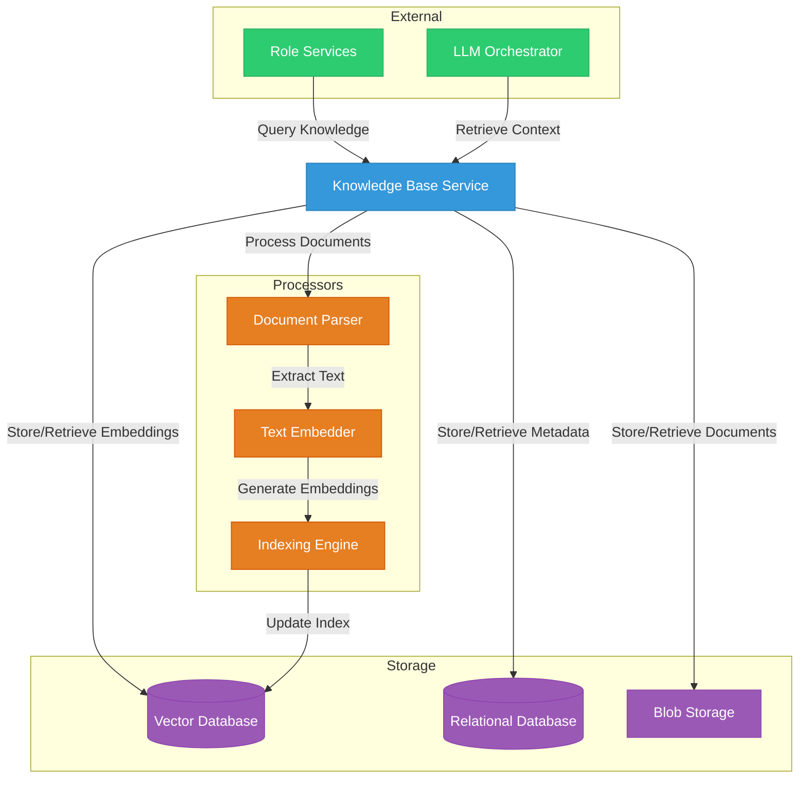
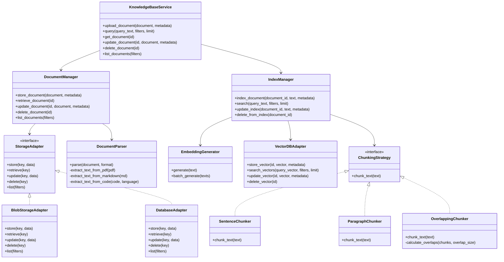

# Knowledge Base Service

The Knowledge Base Service is a critical component of the Engineering AI Agent system that stores, manages, and provides access to various types of knowledge required by the AI agents to perform their tasks effectively.

## Overview



The Knowledge Base Service provides the following key functionalities:

1. **Knowledge Storage**: Stores various types of knowledge including documentation, code, historical data, and domain-specific information.
2. **Knowledge Retrieval**: Enables semantic search and retrieval of relevant information based on queries.
3. **Knowledge Processing**: Processes different document formats, generates embeddings, and maintains indexes.
4. **Knowledge Management**: Provides CRUD operations for knowledge items with metadata management.
5. **Access Control**: Implements permissions and access control for knowledge items.

## Architecture

The Knowledge Base Service is built using a modular architecture that separates concerns and enables scalability:



## Components

### Document Manager

The Document Manager handles the storage and retrieval of document content and metadata:

```python
class DocumentManager:
    def __init__(self, blob_storage: BlobStorageAdapter, metadata_storage: DatabaseAdapter, 
                 parser: DocumentParser):
        self.blob_storage = blob_storage
        self.metadata_storage = metadata_storage
        self.parser = parser
        
    async def store_document(self, document: bytes, metadata: Dict[str, Any]) -> str:
        """
        Store a document and its metadata.
        
        Args:
            document: The document content as bytes
            metadata: Document metadata including format, source, tags, etc.
            
        Returns:
            The ID of the stored document
        """
        document_id = str(uuid.uuid4())
        
        # Store the document in blob storage
        document_key = f"documents/{document_id}"
        await self.blob_storage.store(document_key, document)
        
        # Store metadata in database
        metadata["id"] = document_id
        metadata["created_at"] = datetime.now().isoformat()
        metadata["updated_at"] = metadata["created_at"]
        metadata["size"] = len(document)
        
        await self.metadata_storage.store(document_id, metadata)
        
        return document_id
    
    async def retrieve_document(self, document_id: str) -> Tuple[bytes, Dict[str, Any]]:
        """
        Retrieve a document and its metadata.
        
        Args:
            document_id: The ID of the document to retrieve
            
        Returns:
            A tuple containing the document content and its metadata
        """
        # Retrieve the document from blob storage
        document_key = f"documents/{document_id}"
        document = await self.blob_storage.retrieve(document_key)
        
        # Retrieve metadata from database
        metadata = await self.metadata_storage.retrieve(document_id)
        
        return document, metadata
```

### Index Manager

The Index Manager handles the generation of embeddings and maintains the vector database for semantic search:

```python
class IndexManager:
    def __init__(self, vector_db: VectorDBAdapter, embedder: EmbeddingGenerator, 
                 chunker: ChunkingStrategy):
        self.vector_db = vector_db
        self.embedder = embedder
        self.chunker = chunker
        
    async def index_document(self, document_id: str, text: str, metadata: Dict[str, Any]) -> None:
        """
        Index a document by generating embeddings and storing them in the vector DB.
        
        Args:
            document_id: The ID of the document
            text: The text content of the document
            metadata: Document metadata
        """
        # Chunk the text
        chunks = self.chunker.chunk_text(text)
        
        # Generate embeddings for each chunk
        for i, chunk in enumerate(chunks):
            # Generate embedding
            embedding = await self.embedder.generate(chunk)
            
            # Create chunk metadata
            chunk_metadata = {
                "document_id": document_id,
                "chunk_index": i,
                "chunk_content": chunk,
                "document_metadata": metadata
            }
            
            # Store in vector DB
            chunk_id = f"{document_id}_chunk_{i}"
            await self.vector_db.store_vector(chunk_id, embedding, chunk_metadata)
    
    async def search(self, query_text: str, filters: Dict[str, Any] = None, 
                     limit: int = 10) -> List[Dict[str, Any]]:
        """
        Search for relevant documents using semantic search.
        
        Args:
            query_text: The search query
            filters: Optional filters to apply to the search
            limit: Maximum number of results to return
            
        Returns:
            A list of document chunks matching the query
        """
        # Generate embedding for the query
        query_embedding = await self.embedder.generate(query_text)
        
        # Search the vector DB
        results = await self.vector_db.search_vectors(
            query_vector=query_embedding,
            filters=filters,
            limit=limit
        )
        
        return results
```

### Document Parser

The Document Parser extracts text content from various document formats:

```python
class DocumentParser:
    async def parse(self, document: bytes, format: str) -> str:
        """
        Parse a document and extract its text content.
        
        Args:
            document: The document content as bytes
            format: The format of the document (pdf, markdown, code, etc.)
            
        Returns:
            The extracted text content
        """
        if format == "pdf":
            return await self._extract_text_from_pdf(document)
        elif format == "markdown":
            return await self._extract_text_from_markdown(document)
        elif format.startswith("code/"):
            language = format.split("/")[1]
            return await self._extract_text_from_code(document, language)
        elif format == "text":
            return document.decode("utf-8")
        else:
            raise ValueError(f"Unsupported document format: {format}")
    
    async def _extract_text_from_pdf(self, pdf_document: bytes) -> str:
        """Extract text from a PDF document."""
        # Implementation using PyPDF2 or similar library
        pass
    
    async def _extract_text_from_markdown(self, md_document: bytes) -> str:
        """Extract text from a Markdown document."""
        # Implementation using a Markdown parser
        pass
    
    async def _extract_text_from_code(self, code_document: bytes, language: str) -> str:
        """Extract text from code, preserving important syntax and structure."""
        # Implementation using a code parser specific to the language
        pass
```

### Chunking Strategies

The system implements various strategies for chunking text to optimize for different types of content:

```python
class OverlappingChunker(ChunkingStrategy):
    def __init__(self, chunk_size: int = 1000, overlap_size: int = 200):
        self.chunk_size = chunk_size
        self.overlap_size = overlap_size
        
    def chunk_text(self, text: str) -> List[str]:
        """
        Chunk text into overlapping chunks of specified size.
        
        Args:
            text: The text to chunk
            
        Returns:
            A list of text chunks
        """
        chunks = []
        text_length = len(text)
        
        if text_length <= self.chunk_size:
            chunks.append(text)
        else:
            start = 0
            while start < text_length:
                end = min(start + self.chunk_size, text_length)
                chunks.append(text[start:end])
                start = end - self.overlap_size
                if start >= text_length:
                    break
        
        return chunks
```

## API Endpoints

The Knowledge Base Service exposes a RESTful API for interacting with the knowledge base:

| Endpoint | Method | Description |
|----------|--------|-------------|
| `/documents` | POST | Upload a new document |
| `/documents` | GET | List documents with optional filters |
| `/documents/{id}` | GET | Retrieve a document by ID |
| `/documents/{id}` | PUT | Update a document |
| `/documents/{id}` | DELETE | Delete a document |
| `/search` | GET | Search the knowledge base |
| `/search/similar` | POST | Find similar documents to a provided text |

Example API request and response for searching the knowledge base:

```json
// Request
GET /search?query=microservice architecture&limit=5

// Response
{
  "results": [
    {
      "document_id": "550e8400-e29b-41d4-a716-446655440000",
      "chunk_index": 3,
      "chunk_content": "Microservice architecture is an approach to application development in which a large application is built as a suite of modular services. Each module supports a specific business goal and uses a simple, well-defined interface to communicate with other modules.",
      "relevance_score": 0.92,
      "metadata": {
        "title": "System Architecture Overview",
        "format": "markdown",
        "tags": ["architecture", "microservices", "design"],
        "created_at": "2023-04-15T10:23:45Z"
      }
    },
    // Additional results...
  ],
  "total_results": 28,
  "query_time_ms": 45
}
```

## Storage Solutions

The Knowledge Base Service utilizes different storage solutions for different types of data:

### Vector Database

The system uses a vector database (such as Pinecone, Weaviate, or Milvus) to store embeddings and enable semantic search:

```python
class PineconeAdapter(VectorDBAdapter):
    def __init__(self, api_key: str, environment: str, index_name: str, dimension: int = 1536):
        import pinecone
        
        pinecone.init(api_key=api_key, environment=environment)
        
        # Create index if it doesn't exist
        if index_name not in pinecone.list_indexes():
            pinecone.create_index(
                name=index_name,
                dimension=dimension,
                metric="cosine"
            )
            
        self.index = pinecone.Index(index_name)
        
    async def store_vector(self, id: str, vector: List[float], metadata: Dict[str, Any]) -> None:
        """Store a vector in the Pinecone index."""
        self.index.upsert([(id, vector, metadata)])
        
    async def search_vectors(self, query_vector: List[float], filters: Dict[str, Any] = None, 
                            limit: int = 10) -> List[Dict[str, Any]]:
        """Search for similar vectors in the Pinecone index."""
        results = self.index.query(
            vector=query_vector,
            filter=filters,
            top_k=limit,
            include_metadata=True
        )
        
        # Transform results to standardized format
        transformed_results = []
        for match in results.matches:
            transformed_results.append({
                "id": match.id,
                "relevance_score": match.score,
                "metadata": match.metadata
            })
            
        return transformed_results
```

### Document Storage

For storing the actual document content, the service uses blob storage:

```python
class S3BlobStorageAdapter(BlobStorageAdapter):
    def __init__(self, bucket_name: str, aws_access_key: str = None, 
                 aws_secret_key: str = None, region: str = None):
        import boto3
        
        self.s3 = boto3.client(
            's3',
            aws_access_key_id=aws_access_key,
            aws_secret_access_key=aws_secret_key,
            region_name=region
        )
        self.bucket_name = bucket_name
        
    async def store(self, key: str, data: bytes) -> None:
        """Store data in S3."""
        self.s3.put_object(
            Bucket=self.bucket_name,
            Key=key,
            Body=data
        )
        
    async def retrieve(self, key: str) -> bytes:
        """Retrieve data from S3."""
        response = self.s3.get_object(
            Bucket=self.bucket_name,
            Key=key
        )
        return response['Body'].read()
```

## Embedding Generation

The Embedding Generator creates vector representations of text that capture semantic meaning:

```python
class OpenAIEmbeddingGenerator(EmbeddingGenerator):
    def __init__(self, api_key: str, model: str = "text-embedding-ada-002"):
        import openai
        
        openai.api_key = api_key
        self.model = model
        
    async def generate(self, text: str) -> List[float]:
        """
        Generate an embedding for a text using OpenAI's API.
        
        Args:
            text: The text to generate an embedding for
            
        Returns:
            A list of floats representing the embedding vector
        """
        import openai
        
        response = await openai.Embedding.acreate(
            input=[text],
            model=self.model
        )
        
        return response['data'][0]['embedding']
    
    async def batch_generate(self, texts: List[str]) -> List[List[float]]:
        """
        Generate embeddings for multiple texts in a single API call.
        
        Args:
            texts: A list of texts to generate embeddings for
            
        Returns:
            A list of embedding vectors
        """
        import openai
        
        response = await openai.Embedding.acreate(
            input=texts,
            model=self.model
        )
        
        return [item['embedding'] for item in response['data']]
```

## Usage Examples

### Indexing a New Document

```python
async def add_documentation_to_kb(kb_service, file_path, metadata):
    """Add a documentation file to the knowledge base."""
    # Read the file
    with open(file_path, 'rb') as f:
        document_content = f.read()
    
    # Determine format from file extension
    format = file_path.split('.')[-1]
    if format == 'md':
        format = 'markdown'
    elif format == 'py':
        format = 'code/python'
    
    # Add format to metadata
    metadata['format'] = format
    
    # Upload to knowledge base
    document_id = await kb_service.upload_document(document_content, metadata)
    
    print(f"Document uploaded with ID: {document_id}")
    return document_id
```

### Searching the Knowledge Base

```python
async def search_knowledge_base(kb_service, query, filters=None):
    """Search the knowledge base for relevant information."""
    results = await kb_service.query(
        query_text=query,
        filters=filters,
        limit=5
    )
    
    for i, result in enumerate(results):
        print(f"Result {i+1} (Score: {result['relevance_score']:.2f}):")
        print(f"Content: {result['metadata']['chunk_content'][:200]}...")
        print(f"Source: {result['metadata']['document_metadata']['title']}")
        print("---")
    
    return results
```

## Caching Strategy

The Knowledge Base Service implements caching to improve performance:

```python
class KnowledgeBaseCache:
    def __init__(self, redis_client):
        self.redis = redis_client
        self.default_ttl = 3600  # 1 hour
    
    async def get_search_results(self, query, filters):
        """Get cached search results."""
        cache_key = self._build_search_cache_key(query, filters)
        cached_data = await self.redis.get(cache_key)
        
        if cached_data:
            return json.loads(cached_data)
        
        return None
    
    async def set_search_results(self, query, filters, results, ttl=None):
        """Cache search results."""
        cache_key = self._build_search_cache_key(query, filters)
        ttl = ttl or self.default_ttl
        
        await self.redis.setex(
            cache_key,
            ttl,
            json.dumps(results)
        )
    
    def _build_search_cache_key(self, query, filters):
        """Build a cache key for search results."""
        filters_str = ""
        if filters:
            filters_str = hashlib.md5(json.dumps(filters, sort_keys=True).encode()).hexdigest()
        
        return f"kb:search:{hashlib.md5(query.encode()).hexdigest()}:{filters_str}"
```

## Security and Access Control

The Knowledge Base Service implements fine-grained access control:

```python
class KnowledgeBaseAccessControl:
    def __init__(self, permission_db):
        self.permission_db = permission_db
    
    async def check_access(self, user_id, document_id, permission_type):
        """
        Check if a user has access to a document.
        
        Args:
            user_id: The ID of the user
            document_id: The ID of the document
            permission_type: The type of permission (read, write, delete)
            
        Returns:
            True if the user has access, False otherwise
        """
        # Get document metadata
        doc_metadata = await self.permission_db.get_document_metadata(document_id)
        
        if not doc_metadata:
            return False
        
        # Check if document is public
        if doc_metadata.get('public', False) and permission_type == 'read':
            return True
        
        # Check user's roles
        user_roles = await self.permission_db.get_user_roles(user_id)
        
        # Check document's access control list
        acl = doc_metadata.get('acl', {})
        
        # Check direct user permissions
        if user_id in acl and permission_type in acl[user_id]:
            return True
        
        # Check role-based permissions
        for role in user_roles:
            if role in acl and permission_type in acl[role]:
                return True
        
        return False
```

## Deployment Configuration

Example Kubernetes deployment for the Knowledge Base Service:

```yaml
apiVersion: apps/v1
kind: Deployment
metadata:
  name: knowledge-base-service
  namespace: engineering-ai-agent
spec:
  replicas: 3
  selector:
    matchLabels:
      app: knowledge-base-service
  template:
    metadata:
      labels:
        app: knowledge-base-service
    spec:
      containers:
        - name: knowledge-base-service
          image: engineering-ai-agent/knowledge-base:latest
          ports:
            - containerPort: 8000
          env:
            - name: VECTOR_DB_URI
              valueFrom:
                secretKeyRef:
                  name: kb-secrets
                  key: vector-db-uri
            - name: BLOB_STORAGE_CONNECTION
              valueFrom:
                secretKeyRef:
                  name: kb-secrets
                  key: blob-storage-connection
            - name: OPENAI_API_KEY
              valueFrom:
                secretKeyRef:
                  name: llm-secrets
                  key: openai-api-key
          resources:
            requests:
              memory: "512Mi"
              cpu: "250m"
            limits:
              memory: "1Gi"
              cpu: "500m"
          livenessProbe:
            httpGet:
              path: /health
              port: 8000
            initialDelaySeconds: 30
            periodSeconds: 10
          readinessProbe:
            httpGet:
              path: /health/ready
              port: 8000
            initialDelaySeconds: 5
            periodSeconds: 5
```

## Testing Strategy

The Knowledge Base Service includes comprehensive testing:

### Unit Tests

```python
import pytest
from unittest.mock import AsyncMock, MagicMock, patch

@pytest.mark.asyncio
async def test_index_document():
    # Mock dependencies
    vector_db = AsyncMock()
    embedder = AsyncMock()
    chunker = MagicMock()
    
    # Configure mock behavior
    chunker.chunk_text.return_value = ["chunk1", "chunk2"]
    embedder.generate.side_effect = [
        [0.1, 0.2, 0.3],  # embedding for chunk1
        [0.4, 0.5, 0.6]   # embedding for chunk2
    ]
    
    # Create index manager with mocks
    index_manager = IndexManager(vector_db, embedder, chunker)
    
    # Test data
    document_id = "test-doc-123"
    text = "This is a test document with multiple chunks of text."
    metadata = {"title": "Test Document", "format": "text"}
    
    # Call the method
    await index_manager.index_document(document_id, text, metadata)
    
    # Verify chunker was called
    chunker.chunk_text.assert_called_once_with(text)
    
    # Verify embedder was called for each chunk
    assert embedder.generate.call_count == 2
    embedder.generate.assert_any_call("chunk1")
    embedder.generate.assert_any_call("chunk2")
    
    # Verify vector DB store was called for each chunk
    assert vector_db.store_vector.call_count == 2
    vector_db.store_vector.assert_any_call(
        f"{document_id}_chunk_0",
        [0.1, 0.2, 0.3],
        {
            "document_id": document_id,
            "chunk_index": 0,
            "chunk_content": "chunk1",
            "document_metadata": metadata
        }
    )
    vector_db.store_vector.assert_any_call(
        f"{document_id}_chunk_1",
        [0.4, 0.5, 0.6],
        {
            "document_id": document_id,
            "chunk_index": 1,
            "chunk_content": "chunk2",
            "document_metadata": metadata
        }
    )
```

### Integration Tests

```python
@pytest.mark.integration
@pytest.mark.asyncio
async def test_knowledge_base_search_integration():
    # Create a test client
    from app.main import app
    from httpx import AsyncClient
    
    async with AsyncClient(app=app, base_url="http://test") as client:
        # First upload a test document
        with open("tests/data/test_document.md", "rb") as f:
            document_content = f.read()
        
        metadata = {
            "title": "Test Document",
            "format": "markdown",
            "tags": ["test", "integration"]
        }
        
        upload_response = await client.post(
            "/documents",
            files={"document": ("test_document.md", document_content)},
            data={"metadata": json.dumps(metadata)}
        )
        
        assert upload_response.status_code == 200
        document_id = upload_response.json()["document_id"]
        
        # Wait for indexing to complete
        await asyncio.sleep(2)
        
        # Now search for content in the document
        search_response = await client.get(
            "/search",
            params={"query": "integration test example", "limit": 5}
        )
        
        assert search_response.status_code == 200
        results = search_response.json()["results"]
        
        # Verify we got results
        assert len(results) > 0
        
        # Verify the results contain our document
        found = False
        for result in results:
            if result["document_id"] == document_id:
                found = True
                break
                
        assert found, "Uploaded document not found in search results"
```

## Future Enhancements

1. **Incremental Updating**: Implement efficient incremental updates to avoid reprocessing entire documents when only parts change.

2. **Multi-Modal Knowledge**: Extend to handle image, video, and audio content with appropriate embedding techniques.

3. **Knowledge Graph Integration**: Build and maintain knowledge graphs to represent relationships between entities.

4. **Active Learning**: Implement feedback loops to improve search relevance based on user interactions.

5. **Cross-Document Knowledge**: Enable the system to synthesize information across multiple knowledge sources.
