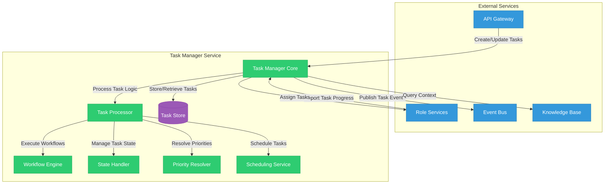
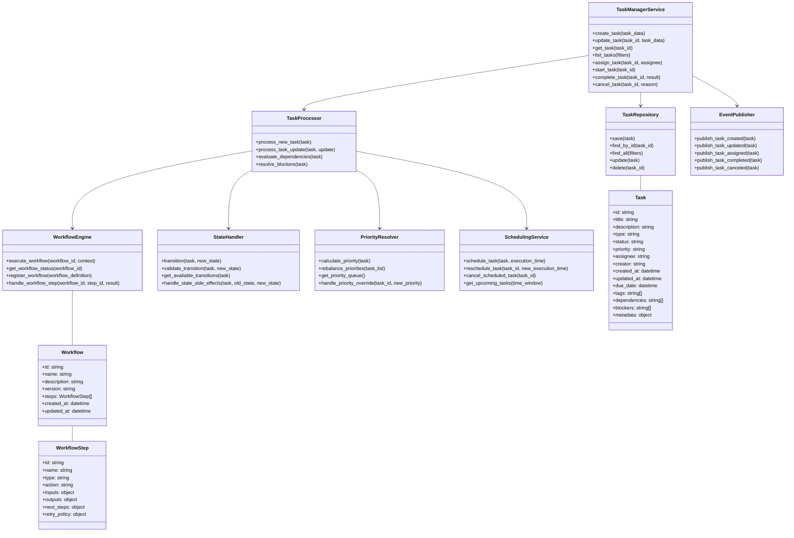
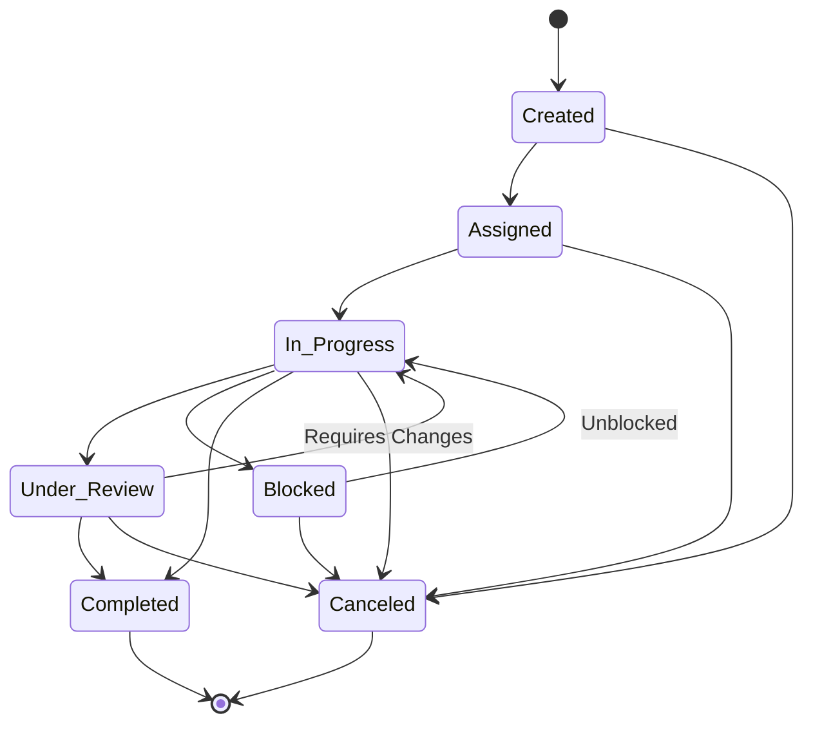
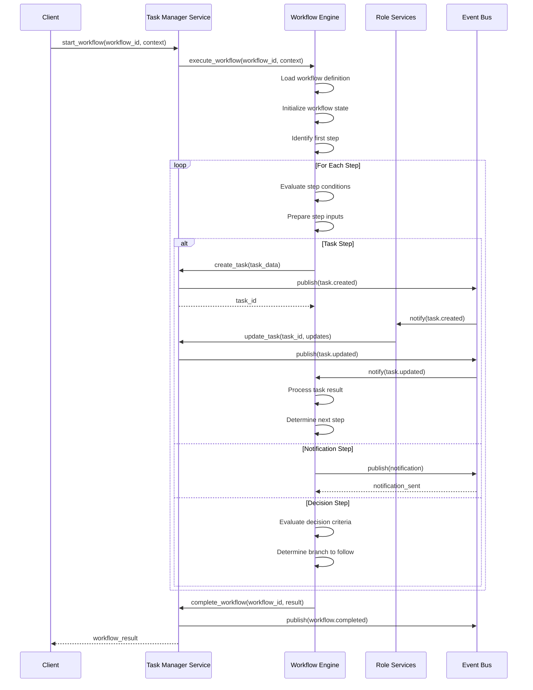
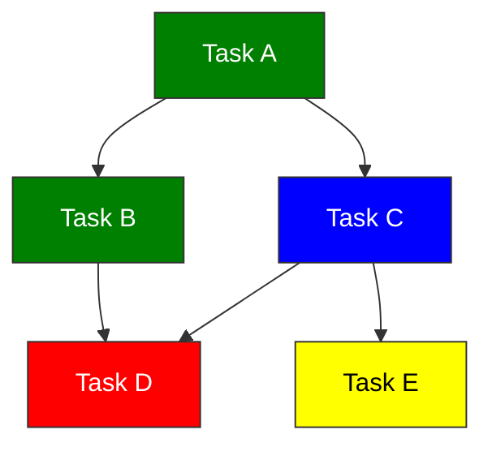

# Task Manager Service

## Overview

The Task Manager Service is a central component of the Engineering AI Agent system that handles task creation, assignment, tracking, and coordination across different role services. It serves as the orchestration layer that ensures tasks flow through the system in the correct sequence and are properly managed throughout their lifecycle.



The Task Manager Service provides the following key functionalities:

1. **Task Lifecycle Management**: Tracks tasks through their entire lifecycle from creation to completion.
2. **Workflow Orchestration**: Executes predefined workflows to coordinate complex multi-step processes.
3. **Task Assignment**: Assigns tasks to appropriate role services based on task type and context.
4. **Priority Management**: Determines task priorities and manages task queues.
5. **Dependency Tracking**: Manages dependencies between tasks and ensures they are executed in the correct order.
6. **Progress Monitoring**: Tracks the progress of tasks and provides reporting capabilities.
7. **Scheduling**: Handles time-based task scheduling and deadline management.

## Architecture

The Task Manager Service follows a modular architecture with clear separation of concerns:



## Task Model

Tasks in the system follow a standardized structure:

```json
{
  "id": "task_123456789",
  "title": "Implement user authentication API",
  "description": "Create a secure API endpoint for user authentication using JWT",
  "type": "implementation",
  "status": "in_progress",
  "priority": "high",
  "assignee": "software_developer_service",
  "creator": "requirement_analyst_service",
  "created_at": "2025-06-03T02:15:23.456Z",
  "updated_at": "2025-06-03T02:30:45.789Z",
  "due_date": "2025-06-10T00:00:00Z",
  "tags": ["authentication", "security", "api"],
  "dependencies": ["task_987654321"],
  "blockers": [],
  "progress": 30,
  "estimated_effort": "4h",
  "actual_effort": "2h",
  "metadata": {
    "requirement_id": "req_abcdef123",
    "sprint_id": "sprint_202506",
    "project_id": "proj_xyz789"
  },
  "history": [
    {
      "timestamp": "2025-06-03T02:15:23.456Z",
      "action": "created",
      "actor": "requirement_analyst_service",
      "details": {}
    },
    {
      "timestamp": "2025-06-03T02:20:15.123Z",
      "action": "assigned",
      "actor": "project_manager_service",
      "details": {
        "assignee": "software_developer_service"
      }
    },
    {
      "timestamp": "2025-06-03T02:30:45.789Z",
      "action": "status_updated",
      "actor": "software_developer_service",
      "details": {
        "old_status": "assigned",
        "new_status": "in_progress"
      }
    }
  ]
}
```

### Task Types

The system supports various task types, each with specific workflows:

1. **Requirements Analysis**
   - Analyzing user requirements
   - Breaking down requirements into tasks
   - Defining acceptance criteria

2. **Design**
   - Creating system architecture
   - Designing components
   - Creating technical specifications

3. **Implementation**
   - Writing code
   - Creating unit tests
   - Implementing features

4. **Testing**
   - Creating test plans
   - Executing test cases
   - Reporting bugs

5. **Review**
   - Code reviews
   - Design reviews
   - Documentation reviews

6. **Deployment**
   - Preparing deployment plans
   - Executing deployments
   - Monitoring deployment results

### Task Statuses

Tasks progress through a defined state machine:



## Workflow Engine

The Workflow Engine orchestrates complex multi-step processes:

### Workflow Definition

Workflows are defined using a YAML-based DSL:

```yaml
id: workflow_user_story_implementation
name: User Story Implementation Workflow
description: Workflow for implementing a user story from analysis to deployment
version: 1.0.0
steps:
  - id: analyze_requirements
    name: Analyze Requirements
    type: task
    action: create_task
    inputs:
      type: requirements_analysis
      title: "Analyze requirements for: {{user_story.title}}"
      description: "Analyze the requirements for user story: {{user_story.description}}"
      assignee: requirement_analyst_service
    outputs:
      task_id: $.id
    next_steps:
      success: design_solution
      failure: notify_failure
  
  - id: design_solution
    name: Design Solution
    type: task
    action: create_task
    inputs:
      type: design
      title: "Design solution for: {{user_story.title}}"
      description: "Create technical design for: {{outputs.analyze_requirements.detailed_requirements}}"
      assignee: software_architect_service
      dependencies: ["{{outputs.analyze_requirements.task_id}}"]
    outputs:
      task_id: $.id
      design_document_id: $.metadata.design_document_id
    next_steps:
      success: implement_solution
      failure: notify_failure
  
  - id: implement_solution
    name: Implement Solution
    type: task
    action: create_task
    inputs:
      type: implementation
      title: "Implement: {{user_story.title}}"
      description: "Implement solution based on design document: {{outputs.design_solution.design_document_id}}"
      assignee: software_developer_service
      dependencies: ["{{outputs.design_solution.task_id}}"]
    outputs:
      task_id: $.id
      code_repository_url: $.metadata.code_repository_url
      pull_request_id: $.metadata.pull_request_id
    next_steps:
      success: test_implementation
      failure: notify_failure
  
  - id: test_implementation
    name: Test Implementation
    type: task
    action: create_task
    inputs:
      type: testing
      title: "Test implementation of: {{user_story.title}}"
      description: "Test implementation based on pull request: {{outputs.implement_solution.pull_request_id}}"
      assignee: quality_assurance_service
      dependencies: ["{{outputs.implement_solution.task_id}}"]
    outputs:
      task_id: $.id
      test_results_id: $.metadata.test_results_id
    next_steps:
      success: deploy_solution
      failure: fix_issues
  
  - id: fix_issues
    name: Fix Issues
    type: task
    action: create_task
    inputs:
      type: implementation
      title: "Fix issues in: {{user_story.title}}"
      description: "Fix issues found during testing: {{outputs.test_implementation.test_results_id}}"
      assignee: software_developer_service
      dependencies: ["{{outputs.test_implementation.task_id}}"]
    outputs:
      task_id: $.id
    next_steps:
      success: test_implementation
      failure: notify_failure
  
  - id: deploy_solution
    name: Deploy Solution
    type: task
    action: create_task
    inputs:
      type: deployment
      title: "Deploy: {{user_story.title}}"
      description: "Deploy implementation to production"
      assignee: site_reliability_engineer_service
      dependencies: ["{{outputs.test_implementation.task_id}}"]
    outputs:
      task_id: $.id
      deployment_id: $.metadata.deployment_id
    next_steps:
      success: workflow_complete
      failure: notify_failure
  
  - id: notify_failure
    name: Notify Failure
    type: notification
    action: send_notification
    inputs:
      channel: slack
      recipients: ["project_manager", "team_lead"]
      message: "Workflow for {{user_story.title}} failed at step {{current_step.id}}"
    next_steps:
      success: workflow_complete
      failure: workflow_complete
  
  - id: workflow_complete
    name: Workflow Complete
    type: terminal
    action: complete_workflow
```

### Workflow Execution

The Workflow Engine executes workflows by creating and tracking tasks:



## Priority Management

The Priority Resolver uses multiple factors to determine task priority:

### Priority Calculation Factors

1. **Explicit Priority**: Manually set priority level
2. **Due Date**: Tasks with closer deadlines get higher priority
3. **Dependencies**: Tasks that block other tasks get higher priority
4. **Business Value**: Tasks with higher business value get higher priority
5. **Effort**: Smaller tasks may be prioritized to clear the backlog
6. **Risk**: Higher risk tasks may be prioritized for early attention

### Priority Adjustment

The system dynamically adjusts priorities based on changing conditions:

```json
// Priority Adjustment Rules
{
  "rules": [
    {
      "name": "approaching_deadline",
      "condition": "task.due_date - now() < 24 hours",
      "action": "increase_priority",
      "parameters": {
        "levels": 1
      }
    },
    {
      "name": "blocking_high_priority",
      "condition": "task.blocks_task.priority == 'critical'",
      "action": "set_priority",
      "parameters": {
        "priority": "high"
      }
    },
    {
      "name": "too_many_critical",
      "condition": "count(tasks.priority == 'critical') > 5",
      "action": "rebalance_priorities",
      "parameters": {
        "strategy": "normalize"
      }
    }
  ]
}
```

## Task Assignment

The Task Manager Service uses various strategies to assign tasks:

### Assignment Strategies

1. **Role-Based**: Assign tasks based on the role service best suited for the task
2. **Load-Balanced**: Distribute tasks evenly across available services
3. **Skill-Based**: Assign tasks based on specific skills required
4. **Round-Robin**: Rotate task assignments among services
5. **Priority-Based**: Assign high-priority tasks to specialized services

### Assignment Algorithm

```javascript
function assign_task(task) {
    eligible_services = find_eligible_services(task.type, task.required_skills)
    
    if (task.priority == "critical") {
        return select_optimal_service(eligible_services, "performance")
    }
    
    if (task.has_deadline && is_approaching_deadline(task)) {
        return select_optimal_service(eligible_services, "performance")
    }
    
    current_loads = get_service_loads(eligible_services)
    
    if (max(current_loads) - min(current_loads) > LOAD_THRESHOLD) {
        return select_optimal_service(eligible_services, "load_balancing")
    }
    
    return select_optimal_service(eligible_services, "affinity")
}
```

## API Endpoints

The Task Manager Service exposes a RESTful API:

| Endpoint | Method | Description |
|----------|--------|-------------|
| `/tasks` | POST | Create a new task |
| `/tasks` | GET | List tasks with optional filters |
| `/tasks/{id}` | GET | Get a specific task by ID |
| `/tasks/{id}` | PUT | Update a task |
| `/tasks/{id}/status` | PUT | Update a task's status |
| `/tasks/{id}/assign` | POST | Assign a task to a service or user |
| `/tasks/{id}/start` | POST | Mark a task as started |
| `/tasks/{id}/complete` | POST | Mark a task as completed |
| `/tasks/{id}/cancel` | POST | Cancel a task |
| `/workflows` | POST | Start a new workflow |
| `/workflows` | GET | List workflows |
| `/workflows/{id}` | GET | Get workflow status |
| `/workflows/{id}/cancel` | POST | Cancel a workflow |

## Scheduling

The Scheduling Service handles time-based task management:

### Scheduling Capabilities

1. **Time-Based Execution**: Schedule tasks to run at specific times
2. **Recurring Tasks**: Create recurring tasks based on schedules
3. **Deadline Tracking**: Monitor task deadlines and send alerts
4. **Time Estimation**: Track and improve time estimates for tasks

### Cron-Based Scheduling

The system supports cron-based scheduling for recurring tasks:

```json
// Recurring Task Definition
{
  "title": "Weekly Code Quality Scan",
  "description": "Run code quality analysis on the main repository",
  "type": "code_quality",
  "assignee": "quality_assurance_service",
  "schedule": {
    "type": "cron",
    "expression": "0 0 * * 1",  // Every Monday at midnight
    "timezone": "UTC"
  },
  "metadata": {
    "repository_url": "https://github.com/organization/repo",
    "scan_depth": "full"
  }
}
```

## Dependency Management

The Task Manager Service tracks and manages dependencies between tasks:

### Dependency Types

1. **Hard Dependencies**: Task cannot start until dependencies are completed
2. **Soft Dependencies**: Task can start but with warnings or limitations
3. **Temporal Dependencies**: Task must start/end in relation to another task's timing
4. **Resource Dependencies**: Tasks compete for the same resources

### Dependency Resolution

The system automatically resolves dependencies and identifies blockers:



## Event Integration

The Task Manager Service publishes and subscribes to events:

### Published Events

1. `task.created`: When a new task is created
2. `task.updated`: When a task is updated
3. `task.assigned`: When a task is assigned
4. `task.started`: When a task is started
5. `task.completed`: When a task is completed
6. `task.canceled`: When a task is canceled
7. `workflow.started`: When a workflow is started
8. `workflow.step.completed`: When a workflow step is completed
9. `workflow.completed`: When a workflow is completed

### Subscribed Events

1. `role.task.progress`: Updates on task progress from role services
2. `role.task.blocked`: Notifications about blocked tasks
3. `role.task.completed`: Notifications about completed tasks

## Reporting

The Task Manager Service provides comprehensive reporting capabilities:

### Available Reports

1. **Task Status Summary**: Overview of tasks by status
2. **Service Workload**: Current workload by service
3. **Completion Timeline**: Timeline of task completions
4. **Workflow Performance**: Performance metrics for workflows
5. **Bottleneck Analysis**: Identification of workflow bottlenecks

### Example Report

```json
// Task Status Summary Report
{
  "report_type": "task_status_summary",
  "generated_at": "2025-06-03T03:00:00Z",
  "time_period": {
    "start": "2025-05-01T00:00:00Z",
    "end": "2025-06-01T00:00:00Z"
  },
  "summary": {
    "total_tasks": 120,
    "by_status": {
      "created": 15,
      "assigned": 22,
      "in_progress": 43,
      "blocked": 7,
      "under_review": 12,
      "completed": 18,
      "canceled": 3
    },
    "by_priority": {
      "critical": 8,
      "high": 27,
      "medium": 65,
      "low": 20
    },
    "by_service": {
      "requirement_analyst_service": 12,
      "software_architect_service": 18,
      "software_developer_service": 45,
      "quality_assurance_service": 30,
      "site_reliability_engineer_service": 15
    }
  },
  "trends": {
    "completion_rate": {
      "current_period": 18,
      "previous_period": 15,
      "change_percentage": 20
    },
    "average_completion_time": {
      "current_period": "3d 4h",
      "previous_period": "3d 10h",
      "change_percentage": -7.1
    }
  }
}
```

## Deployment Configuration

### Kubernetes Deployment

```yaml
apiVersion: apps/v1
kind: Deployment
metadata:
  name: task-manager-service
  namespace: engineering-ai-agent
spec:
  replicas: 3
  selector:
    matchLabels:
      app: task-manager-service
  template:
    metadata:
      labels:
        app: task-manager-service
    spec:
      containers:
        - name: task-manager-service
          image: engineering-ai-agent/task-manager:latest
          ports:
            - containerPort: 8000
          env:
            - name: DATABASE_URL
              valueFrom:
                secretKeyRef:
                  name: task-manager-secrets
                  key: database-url
            - name: EVENT_BUS_URL
              valueFrom:
                configMapKeyRef:
                  name: task-manager-config
                  key: event-bus-url
            - name: REDIS_URL
              valueFrom:
                secretKeyRef:
                  name: task-manager-secrets
                  key: redis-url
          resources:
            requests:
              memory: "256Mi"
              cpu: "100m"
            limits:
              memory: "512Mi"
              cpu: "300m"
          livenessProbe:
            httpGet:
              path: /health
              port: 8000
            initialDelaySeconds: 30
            periodSeconds: 10
          readinessProbe:
            httpGet:
              path: /health/ready
              port: 8000
            initialDelaySeconds: 5
            periodSeconds: 5
```

## Monitoring

### Health Checks

The Task Manager Service exposes health check endpoints:

- `/health/live`: Liveness probe checking if the service is running
- `/health/ready`: Readiness probe checking if the service can handle requests
- `/health/db`: Health check for the database connection
- `/health/event-bus`: Health check for the event bus connection

### Metrics

The service exports Prometheus metrics:

- `task_manager_tasks_total`: Counter of tasks by type and status
- `task_manager_task_completion_time`: Histogram of task completion times
- `task_manager_workflows_total`: Counter of workflows by type and status
- `task_manager_workflow_completion_time`: Histogram of workflow completion times
- `task_manager_active_tasks`: Gauge of active tasks by service
- `task_manager_blocked_tasks`: Gauge of blocked tasks

## Testing Strategy

### Unit Testing

Tests for individual components:

- Test task state transitions
- Test priority calculation
- Test dependency resolution
- Test workflow step execution

### Integration Testing

Tests for interactions between components:

- Test end-to-end workflow execution
- Test task creation and assignment
- Test event publishing and handling
- Test scheduling and execution

### Load Testing

Performance tests under load:

- Test concurrent task creation
- Test workflow execution under load
- Test priority rebalancing with large task sets
- Test dependency resolution with complex dependency graphs

## Future Enhancements

1. **AI-Powered Assignments**: Use machine learning to optimize task assignments
2. **Natural Language Processing**: Extract tasks from natural language inputs
3. **Predictive Analytics**: Predict task completion times and potential bottlenecks
4. **Adaptive Workflows**: Self-adjusting workflows based on past performance
5. **Integrated Gantt Charts**: Visual timeline management for complex workflows
