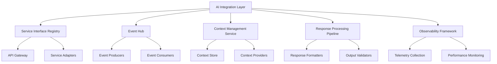
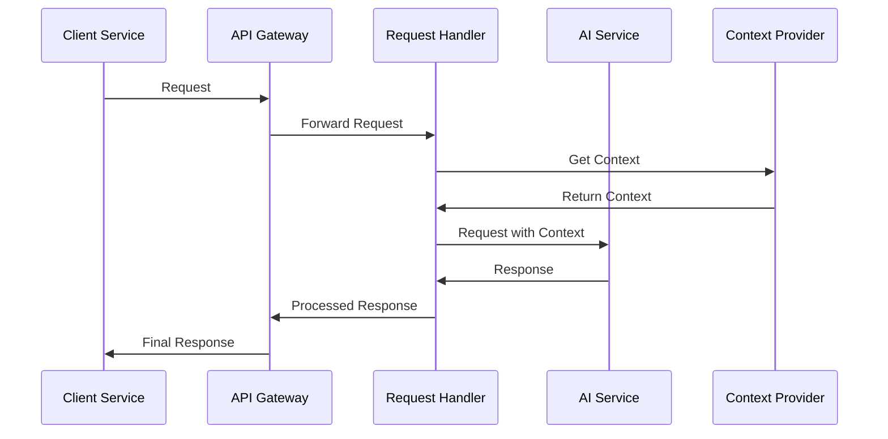
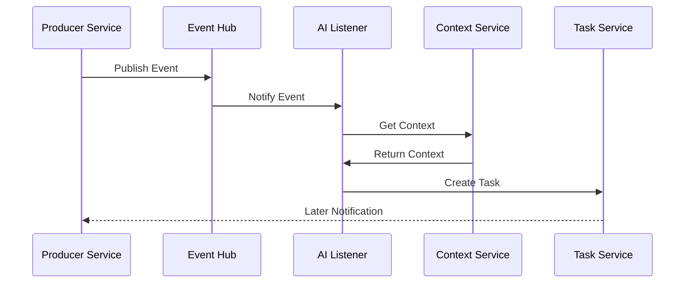

# AI Integration

## Overview

The AI Integration document outlines how AI components are integrated with other services and systems within the Engineering AI Agent. This document details the interfaces, communication patterns, and integration points between AI services and the broader application ecosystem to ensure seamless interaction and coordination.

## System Architecture

The AI Integration layer serves as the foundation for connecting AI capabilities with the rest of the Engineering AI Agent system, enabling AI to be embedded across multiple services while maintaining clear boundaries and interfaces.



## Key Components

### Service Interface Registry

The Service Interface Registry maintains definitions for all service interfaces that AI components interact with. It provides standardized contract definitions, versioning, and discovery capabilities.

```python
class ServiceInterfaceRegistry:
    def __init__(self, config):
        self.interfaces = {}
        self.load_interfaces(config)
    
    def get_interface(self, service_name, version=None):
        """Return interface definition for a service"""
        if service_name not in self.interfaces:
            raise InterfaceNotFoundError(f"No interface for {service_name}")
        
        interfaces = self.interfaces[service_name]
        if version is None:
            # Return latest version
            return max(interfaces.items(), key=lambda x: x[0])[1]
        
        if version not in interfaces:
            raise InterfaceVersionError(f"Version {version} not found")
        
        return interfaces[version]
```

### Event Hub

The Event Hub provides a publish-subscribe mechanism for asynchronous communication between AI components and other services, supporting event-driven architectures.

#### Event Schema

```json
{
  "event_id": "evt_12345678",
  "event_type": "code_review_completed",
  "version": "1.0",
  "source": "ai-code-reviewer",
  "timestamp": "2025-06-02T14:30:00Z",
  "data": {
    "repository": "engineering-ai-agent",
    "pull_request_id": "PR-123",
    "review_summary": "3 critical issues, 5 suggestions",
    "review_url": "/reviews/PR-123"
  },
  "metadata": {
    "correlation_id": "corr_87654321",
    "trace_id": "trace_11223344"
  }
}
```

### Context Management Service

The Context Management Service collects, organizes, and provides contextual information to AI components to ensure they have the necessary background for their tasks.

#### Context Types

1. **User Context**: Information about the user, their preferences, and history
2. **Project Context**: Information about the project being worked on
3. **Domain Context**: Domain-specific knowledge and constraints
4. **Interaction Context**: Information about the current interaction session
5. **System Context**: Information about the current system state

### Response Processing Pipeline

The Response Processing Pipeline handles post-processing of AI-generated content before it's returned to the requesting service or user.

#### Pipeline Stages

1. **Validation**: Ensures responses meet quality standards and constraints
2. **Formatting**: Applies appropriate formatting to responses
3. **Enhancement**: Adds additional information or links as needed
4. **Security Check**: Filters sensitive information
5. **Delivery**: Routes response to the correct destination

### Integration Patterns

#### 1. Synchronous Request-Response



#### 2. Asynchronous Event-Driven



## Integration with Core Services

### Task Manager Integration

The AI components integrate with the Task Manager Service to create, update, and process tasks based on AI-driven insights and recommendations.

### Knowledge Base Integration

AI components access and update the Knowledge Base to retrieve information and store new learnings during operation.

### Workflow Engine Integration

AI components interact with the Workflow Engine to trigger or participate in workflow processes, following defined patterns for different engineering tasks.

## API Endpoints

| Endpoint | Method | Description |
|----------|--------|-------------|
| `/api/v1/ai/integrate/services` | GET | List available service integrations |
| `/api/v1/ai/integrate/events` | POST | Publish event to the Event Hub |
| `/api/v1/ai/integrate/context` | GET | Retrieve context for an AI request |
| `/api/v1/ai/integrate/invoke` | POST | Synchronously invoke an AI capability |
| `/api/v1/ai/integrate/tasks` | POST | Create a task for asynchronous AI processing |

## Security Considerations

1. **Authentication and Authorization**: All AI integration points require proper authentication and authorization
2. **Request and Response Validation**: All data passing through integration points is validated
3. **Sensitive Data Handling**: PII and sensitive information is filtered at integration boundaries
4. **Rate Limiting and Throttling**: Integration points implement rate limiting to prevent abuse
5. **Audit Logging**: All AI interactions via integration points are logged for audit purposes

## Future Enhancements

1. **Dynamic Service Discovery**: Implementing service mesh for automatic discovery and routing
2. **Real-time Streaming Integration**: Adding support for streaming AI responses
3. **Multi-modal Integration**: Expanding to handle non-text data types efficiently
4. **Integration Analytics**: Dashboards for monitoring integration performance
5. **Self-healing Integration**: Automatic recovery from integration failures
