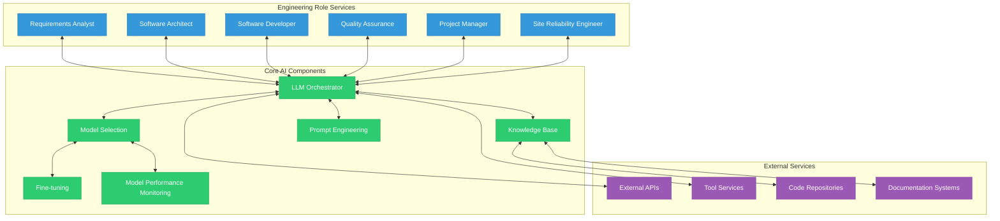
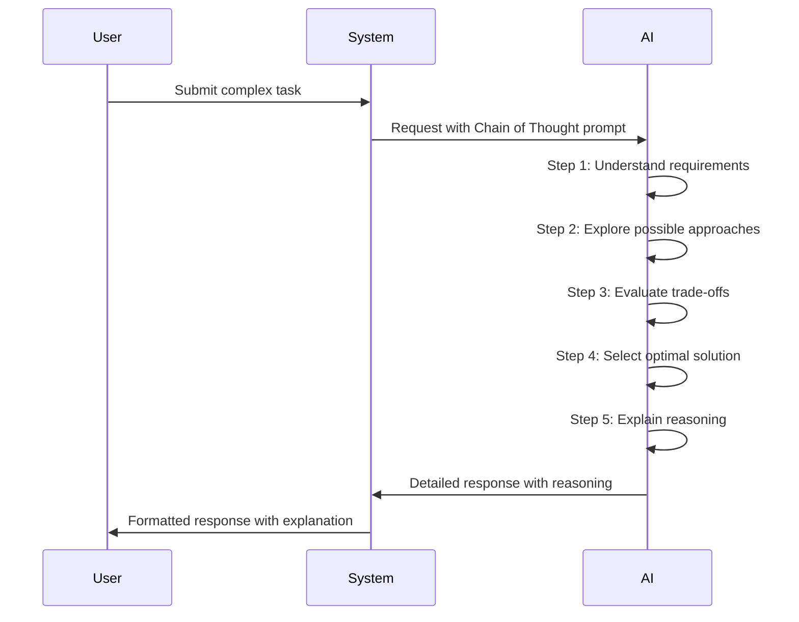
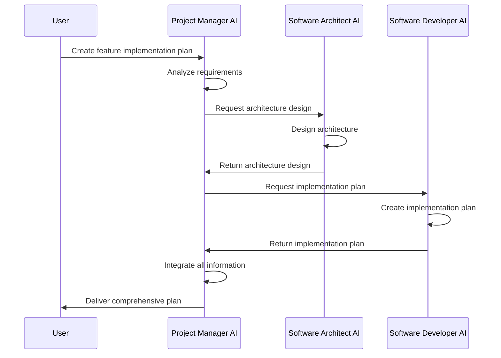
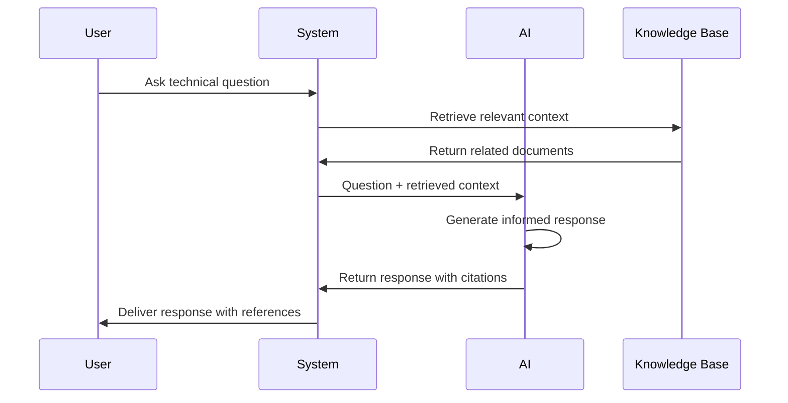
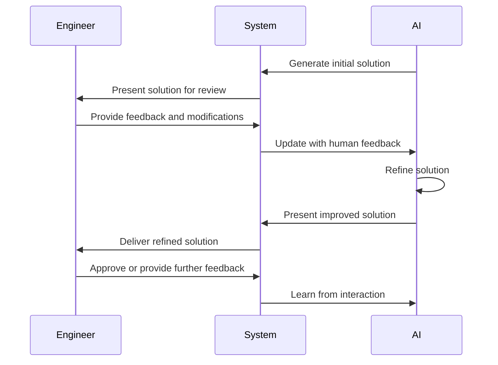

# AI Overview

## Introduction

The Engineering AI Agent system leverages state-of-the-art artificial intelligence to automate and enhance software engineering processes. This document provides a comprehensive overview of the AI architecture, components, and methodologies used throughout the system.

## AI Strategy

The Engineering AI Agent employs a multi-model, multi-paradigm approach to AI implementation with the following key principles:

1. **Specialization**: Each engineering role is modeled by specialized AI services tailored to that role's responsibilities.
2. **Collaboration**: AI services communicate and collaborate through a standardized event-driven architecture.
3. **Augmentation**: The system is designed to augment human engineers, not replace them.
4. **Continuous Learning**: Models are continuously improved through feedback loops and fine-tuning.
5. **Transparency**: All AI decisions are explainable and traceable.
6. **Fallback Mechanisms**: Multiple redundancy and fallback strategies ensure reliability.
7. **Contextual Awareness**: Knowledge base integration provides rich context for decisions.

## Core AI Components

### LLM Orchestrator

The LLM Orchestrator is the central AI hub that manages interactions with language models and coordinates responses across the system. It:

- Routes requests to appropriate models
- Manages context and conversation history
- Implements retry and fallback mechanisms
- Optimizes prompts dynamically
- Manages model selection based on task requirements
- Handles rate limiting and cost optimization

### Knowledge Base

The Knowledge Base stores and retrieves contextual information that enriches AI capabilities:

- Code repository knowledge
- Documentation and specifications
- Previous conversations and decisions
- Best practices and patterns
- Domain-specific knowledge
- Project-specific context

### Model Selection System

The Model Selection system dynamically chooses the most appropriate AI model for each task based on:

- Task complexity and requirements
- Performance metrics and historical success rates
- Cost and latency constraints
- Specialized capabilities required
- Available context window size
- Security and privacy requirements

### Prompt Engineering Framework

The Prompt Engineering Framework standardizes how the system interacts with language models:

- Template-based prompt construction
- Dynamic prompt adaptation
- Context window optimization
- Few-shot learning examples
- Instruction design patterns
- Evaluation and improvement feedback loops

### Fine-tuning Pipeline

The Fine-tuning Pipeline customizes base models for specific engineering roles and tasks:

- Data collection and curation
- Training configuration management
- Model versioning and deployment
- Performance evaluation
- Continuous improvement processes
- Domain-specific adaptation

### Model Performance Monitoring

The Model Performance Monitoring system tracks AI performance across the system:

- Response quality metrics
- Latency and throughput monitoring
- Cost tracking and optimization
- Error rates and types
- User feedback integration
- Comparative benchmarking

## Role-Specific AI Implementation

Each engineering role service uses specialized AI capabilities:

### Requirements Analyst Service

- Natural language understanding for requirement extraction
- Ambiguity detection and resolution
- Completeness and consistency checking
- Requirement classification and prioritization
- User story generation and refinement
- Acceptance criteria formulation

### Software Architect Service

- Architecture pattern recognition and application
- Component relationship modeling
- Trade-off analysis and recommendation
- Technical constraint evaluation
- Scalability and performance prediction
- Integration strategy planning

### Software Developer Service

- Code generation and completion
- Refactoring suggestion
- Bug detection and fixing
- Code review and improvement
- Documentation generation
- Test case generation

### Quality Assurance Service

- Test strategy development
- Test case generation from requirements
- Bug severity and priority assessment
- Regression testing planning
- Performance testing analysis
- Test coverage optimization

### Project Manager Service

- Task breakdown and estimation
- Resource allocation optimization
- Risk identification and mitigation
- Timeline prediction and adjustment
- Progress tracking and reporting
- Stakeholder communication preparation

### Site Reliability Engineer Service

- Infrastructure as code generation
- Deployment strategy optimization
- Monitoring configuration suggestion
- Incident response planning
- Performance optimization recommendation
- Security vulnerability assessment

## AI Interaction Patterns

The system implements several AI interaction patterns:

### Chain of Thought Reasoning

### Multi-Agent Collaboration

### Retrieval-Augmented Generation (RAG)

### Human-in-the-Loop Collaboration

## Technical Implementation Approach

### Model Hosting and Deployment

The Engineering AI Agent supports multiple model deployment strategies:

1. **Cloud Provider APIs**: Integration with OpenAI, Anthropic, Google, and other model providers
2. **Self-Hosted Models**: On-premises deployment of open-source models
3. **Hybrid Approach**: Combination of cloud and self-hosted models based on requirements

### Context Management

The system employs sophisticated context management techniques:

1. **Sliding Window**: Dynamic management of context window based on relevance
2. **Hierarchical Summarization**: Multi-level summarization for extended conversations
3. **Semantic Chunking**: Content-aware segmentation of large documents
4. **Relevance Filtering**: Selective inclusion of context based on relevance scores
5. **Memory Management**: Long-term and short-term memory systems for persistence

### Security and Privacy

AI implementation includes robust security measures:

1. **Data Minimization**: Only necessary information is passed to AI models
2. **PII Detection and Redaction**: Automatic detection and removal of sensitive information
3. **Model Isolation**: Separate models for different security domains
4. **Audit Logging**: Comprehensive logging of all AI interactions
5. **Access Control**: Role-based access to AI capabilities
6. **Output Filtering**: Scanning responses for security issues before delivery

## Performance Considerations

The AI implementation addresses several performance aspects:

### Latency Optimization

1. **Request Batching**: Combining multiple similar requests
2. **Model Quantization**: Using optimized model variants for lower latency
3. **Caching**: Storing common responses for rapid retrieval
4. **Parallel Processing**: Concurrent execution of independent AI tasks
5. **Preemptive Generation**: Anticipating and preparing responses in advance

### Cost Management

1. **Token Optimization**: Minimizing token usage in prompts and responses
2. **Model Tiering**: Using smaller models for simpler tasks
3. **Batch Processing**: Grouping non-time-sensitive requests
4. **Result Caching**: Avoiding duplicate model calls
5. **Budget Controls**: Enforcing usage limits and alerting

## Evaluation Framework

The AI implementation includes comprehensive evaluation mechanisms:

### Evaluation Metrics

1. **Functional Correctness**: Accuracy of generated code, designs, etc.
2. **Consistency**: Reliability of responses across similar queries
3. **Relevance**: Alignment of responses with user intent
4. **Completeness**: Coverage of all aspects of the request
5. **Efficiency**: Resource usage (tokens, time, cost)
6. **User Satisfaction**: Feedback from human users

### Evaluation Methods

1. **Automated Testing**: Predefined test suites for common tasks
2. **Human Evaluation**: Expert review of AI outputs
3. **Comparative Analysis**: Benchmarking against alternative approaches
4. **A/B Testing**: Controlled experiments with different AI strategies
5. **Continuous Monitoring**: Real-time performance tracking

## Future Roadmap

The AI implementation roadmap includes:

1. **Multimodal Capabilities**: Integration of image, audio, and video understanding
2. **Agent Autonomy**: Increased self-direction and initiative in AI services
3. **Specialized Models**: Custom models for specific engineering domains
4. **Reinforcement Learning**: Optimization through feedback and rewards
5. **Explainable AI**: Enhanced transparency in decision-making processes
6. **Collaborative Intelligence**: Deeper human-AI collaboration patterns
7. **Edge Deployment**: AI capabilities distributed to edge environments
