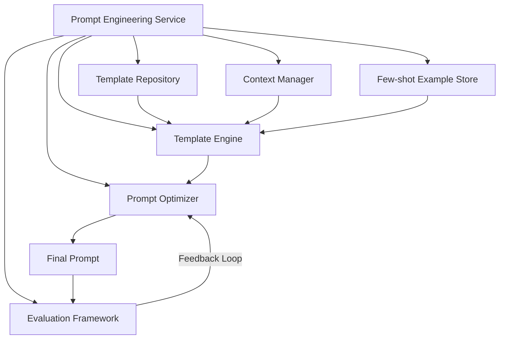
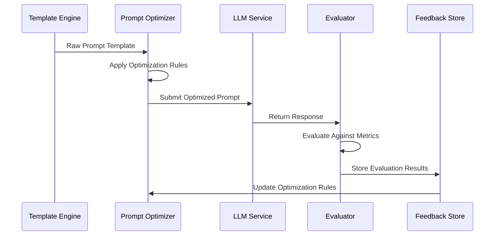

# Prompt Engineering

## Overview

The Prompt Engineering framework provides standardized approaches for crafting effective prompts for different AI models across the Engineering AI Agent system. This document outlines the architecture, components, and methodologies for creating, managing, and optimizing prompts to ensure consistent, high-quality AI interactions across all engineering roles.

## Key Components

- Prompt Templates
- Dynamic Prompt Construction
- Few-shot Learning Examples
- Chain-of-thought Patterns
- Context Management
- Performance Measurement

## Architecture

The Prompt Engineering framework is designed as a modular system that enables consistent, role-specific prompt generation while supporting dynamic adaptation based on context and feedback.



### Core Components

1. **Prompt Template Repository**
   - Centralized storage for all prompt templates
   - Version control and template history
   - Role-specific template collections
   - Template metadata and tagging

2. **Context Manager**
   - Contextual information gathering
   - User intent analysis
   - Relevant information extraction
   - Context prioritization and windowing

3. **Template Engine**
   - Template selection logic
   - Variable substitution
   - Conditional template assembly
   - Multi-part prompt construction

4. **Few-shot Example Store**
   - Curated examples for different tasks
   - Dynamic example selection
   - Example effectiveness tracking
   - Domain-specific example collections

5. **Prompt Optimizer**
   - Length optimization
   - Clarity enhancement
   - Instruction refinement
   - Model-specific adaptations

6. **Evaluation Framework**
   - Response quality assessment
   - Prompt effectiveness metrics
   - A/B testing capabilities
   - Continuous improvement feedback loops

## Prompt Template System

### Template Structure

Prompt templates follow a standardized YAML format with sections for metadata, variables, content blocks, and optional components:

```yaml
template_id: "requirements-analysis-task"
version: "1.0"
applicable_models: ["gpt-4", "claude-3-opus", "gemini-pro"]
role: "requirements-analyst"
description: "Template for analyzing requirements documents"

variables:
  - name: "project_context"
    required: true
    description: "Background information about the project"
  - name: "requirements_document"
    required: true
    description: "The requirements document to analyze"
  - name: "analysis_depth"
    required: false
    default: "standard"
    options: ["basic", "standard", "comprehensive"]

system_prompt: |
  You are an expert Requirements Analyst AI assistant helping software engineers analyze requirements documents.
  Your goal is to help identify clear, actionable requirements while flagging ambiguities,
  inconsistencies, and potential issues. Maintain a professional, analytical approach.
  Analysis depth: {{analysis_depth}}

content_blocks:
  - type: "context"
    content: |
      Project Context:
      {{project_context}}

  - type: "main_input"
    content: |
      Requirements Document:
      {{requirements_document}}

  - type: "instructions"
    content: |
      Please analyze these requirements and:
      1. Identify all explicit functional requirements
      2. Identify all explicit non-functional requirements
      3. Flag any ambiguities or inconsistencies
      4. Suggest clarifying questions for ambiguous points
      5. Identify any missing requirements that should be considered

few_shot_examples:
  - condition: "analysis_depth == 'comprehensive'"
    examples: ["comprehensive_example_1", "comprehensive_example_2"]
  - condition: "analysis_depth == 'basic'"
    examples: ["basic_example_1"]
```

### Dynamic Template Assembly

Templates are assembled dynamically based on:

1. **Role context**: Adapting to the specific engineering role (developer, architect, QA, etc.)
2. **Task context**: Customizing for the specific task being performed
3. **User context**: Including relevant user preferences and history
4. **Model capabilities**: Adapting to the specific AI model being used

## Chain-of-thought Engineering

The framework implements structured chain-of-thought prompting patterns to improve reasoning:

### Reasoning Patterns

1. **Decomposition Pattern**
   ```
   1. Break down the problem into sub-problems
   2. Solve each sub-problem independently
   3. Synthesize the solutions into a coherent whole
   4. Verify the combined solution against the original problem
   ```

2. **Comparative Analysis Pattern**
   ```
   1. Consider multiple approaches to the problem
   2. Analyze the trade-offs of each approach
   3. Select the most appropriate approach based on criteria
   4. Implement the selected approach
   ```

3. **Refinement Pattern**
   ```
   1. Generate an initial solution
   2. Identify weaknesses or limitations
   3. Refine the solution to address the limitations
   4. Repeat until the solution meets quality thresholds
   ```

## Context Management

### Context Types

1. **Project Context**: Overall project information, constraints, and goals
2. **Technical Context**: Technologies, frameworks, and technical specifications
3. **Historical Context**: Prior decisions, existing code, and established patterns
4. **User Intent Context**: Current task objectives and user expectations
5. **Role Context**: Engineering role-specific information and perspectives

### Context Window Optimization

```python
def optimize_context(raw_context, model_max_tokens, priority_rules):
    """
    Optimize context by prioritizing and truncating information to fit model context window
    
    Args:
        raw_context (dict): Dictionary containing different context types
        model_max_tokens (int): Maximum token limit for the target model
        priority_rules (dict): Rules for prioritizing different context types
        
    Returns:
        dict: Optimized context that fits within token limits
    """
    # Tokenize all context elements
    tokenized_context = {k: tokenize(v) for k, v in raw_context.items()}
    
    # Calculate total tokens
    total_tokens = sum(len(tokens) for tokens in tokenized_context.values())
    
    # If within limits, return as is
    if total_tokens <= model_max_tokens:
        return raw_context
    
    # Apply priority-based truncation
    optimized_context = {}
    available_tokens = model_max_tokens
    
    # Sort context types by priority
    sorted_context_types = sorted(
        tokenized_context.keys(), 
        key=lambda k: priority_rules.get(k, 0),
        reverse=True
    )
    
    # Allocate tokens based on priority
    for context_type in sorted_context_types:
        allocation = min(
            len(tokenized_context[context_type]),
            int(available_tokens * priority_rules.get(context_type, 0))
        )
        
        if allocation > 0:
            optimized_context[context_type] = detokenize(
                tokenized_context[context_type][:allocation]
            )
            available_tokens -= allocation
    
    return optimized_context
```

## Few-shot Learning Implementation

### Example Selection Algorithm

The framework dynamically selects the most relevant few-shot examples based on:

1. **Semantic similarity**: Using embedding similarity to find relevant examples
2. **Task alignment**: Matching examples to the specific task requirements
3. **Complexity matching**: Aligning example complexity with the current task
4. **Performance history**: Prioritizing examples that have led to successful outcomes

```python
def select_few_shot_examples(task_description, available_examples, num_examples=3):
    """
    Select the most relevant few-shot examples for a given task
    
    Args:
        task_description (str): Description of the current task
        available_examples (list): List of available examples with metadata
        num_examples (int): Number of examples to select
        
    Returns:
        list: Selected examples ordered by relevance
    """
    # Generate embedding for task description
    task_embedding = get_embedding(task_description)
    
    # Calculate similarity scores for all examples
    scored_examples = []
    for example in available_examples:
        # Get example embedding
        example_embedding = get_embedding(example['description'])
        
        # Calculate semantic similarity
        semantic_score = cosine_similarity(task_embedding, example_embedding)
        
        # Calculate task alignment score
        task_alignment = calculate_task_alignment(
            task_description, 
            example['metadata']['task_type']
        )
        
        # Get historical performance score
        performance_score = example['metadata'].get('success_rate', 0.5)
        
        # Calculate composite score
        composite_score = (
            semantic_score * 0.5 + 
            task_alignment * 0.3 + 
            performance_score * 0.2
        )
        
        scored_examples.append({
            'example': example,
            'score': composite_score
        })
    
    # Sort by score and select top examples
    top_examples = sorted(
        scored_examples, 
        key=lambda x: x['score'], 
        reverse=True
    )[:num_examples]
    
    return [item['example'] for item in top_examples]
```

## Model-specific Adaptations

The framework includes model-specific adaptations to optimize prompts for different LLM architectures:

### Model Adaptation Rules

| Model Family | Adaptation Strategy |
|--------------|---------------------|
| GPT-4 Series | - More explicit reasoning steps<br>- Clear instruction delimiters<br>- Structured output formatting |
| Claude Series | - More conversational style<br>- Less repetition in instructions<br>- Constitutional AI alignment hooks |
| Gemini Series | - Clearer task boundaries<br>- More examples<br>- More explicit output format requirements |
| Llama Series | - More detailed step-by-step instructions<br>- More explicit knowledge assertions<br>- Simpler output formats |

## Performance Measurement and Optimization

### Evaluation Metrics

1. **Task Completion Rate**: Percentage of tasks correctly completed
2. **Instruction Following**: Adherence to prompt instructions
3. **Output Quality**: Quality of generated content
4. **Consistency**: Consistency of outputs across similar prompts
5. **Efficiency**: Token usage optimization

### Optimization Workflow



## API Endpoints

| Endpoint | Method | Description |
|----------|--------|-------------|
| `/api/v1/prompts/templates` | GET | List available prompt templates |
| `/api/v1/prompts/templates/{id}` | GET | Get specific template by ID |
| `/api/v1/prompts/generate` | POST | Generate prompt from template with variables |
| `/api/v1/prompts/optimize` | POST | Optimize an existing prompt |
| `/api/v1/prompts/evaluate` | POST | Evaluate prompt effectiveness |
| `/api/v1/prompts/examples` | GET | List available few-shot examples |

## Future Enhancements

1. **Automated Prompt Optimization**: Using reinforcement learning to automatically improve prompts
2. **Personalized Prompt Adaptation**: Learning user-specific prompt preferences
3. **Cross-Model Prompt Translation**: Converting prompts between different model formats
4. **Prompt Composition Framework**: Combining prompt components like building blocks
5. **Collaborative Prompt Library**: Shared repository of effective prompts with community contributions
6. **Prompt Debugging Tools**: Visual tools for analyzing and improving prompt effectiveness
7. **Automated A/B Testing**: Systematic comparison of prompt variations to identify improvements
