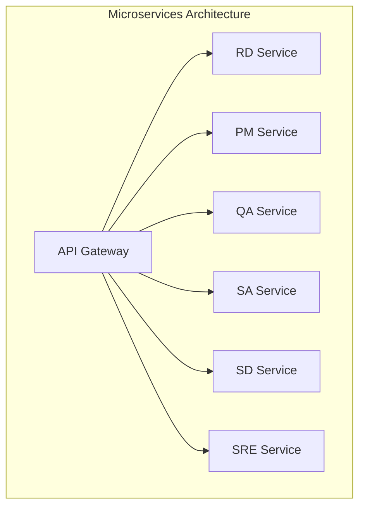
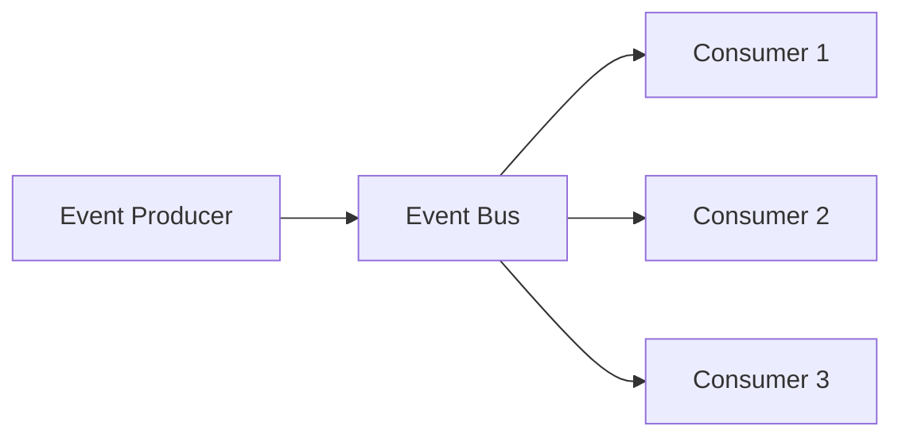

# Design Patterns

This document outlines the key design patterns used throughout the Engineering AI Agent codebase. Following these patterns ensures consistency, maintainability, and scalability of the system.

## Architectural Patterns

### Microservices Architecture

The Engineering AI Agent system follows a microservices architecture to enable independent development, deployment, and scaling of components.



**Implementation Guidelines:**
- Services should be organized around business capabilities
- Each service owns its data storage
- Communication between services should be through well-defined APIs
- Services should be independently deployable

**Example Implementation:**
```python
# Each service has its own entry point
# api_gateway/main.py
from fastapi import FastAPI, Depends
from .auth import get_current_user
from .routers import rd, pm, qa, sa, sd, sre

app = FastAPI(title="Engineering AI Agent API Gateway")

app.include_router(rd.router, prefix="/api/v1/rd", tags=["RD"])
app.include_router(pm.router, prefix="/api/v1/pm", tags=["PM"])
app.include_router(qa.router, prefix="/api/v1/qa", tags=["QA"])
app.include_router(sa.router, prefix="/api/v1/sa", tags=["SA"])
app.include_router(sd.router, prefix="/api/v1/sd", tags=["SD"])
app.include_router(sre.router, prefix="/api/v1/sre", tags=["SRE"])
```

### Event-Driven Architecture

The system uses an event-driven architecture for asynchronous communication between components.



**Implementation Guidelines:**
- Events should be immutable records of something that happened
- Events should be named in past tense (e.g., `TaskCreated`, `CodeGenerated`)
- Consumers should be idempotent to handle duplicate events
- Events should include timestamps and correlation IDs

**Example Implementation:**
```python
# events/base.py
from pydantic import BaseModel, Field
from datetime import datetime
import uuid
from typing import Optional, Dict, Any

class Event(BaseModel):
    event_id: str = Field(default_factory=lambda: str(uuid.uuid4()))
    event_type: str
    timestamp: datetime = Field(default_factory=datetime.now)
    correlation_id: Optional[str] = None
    data: Dict[str, Any]

# Example event producer
async def publish_event(event: Event):
    # Publish to message broker (e.g., RabbitMQ, Kafka, etc.)
    await message_broker.publish(
        exchange="events",
        routing_key=event.event_type,
        body=event.json().encode()
    )

# Example event consumer
async def handle_task_created(event_data: dict):
    event = Event(**event_data)
    # Process the event
    # Ensure idempotency by checking if we've seen this event_id before
```

## Creational Patterns

### Factory Method Pattern

Used to create objects without specifying the exact class of object that will be created.

**Use Cases:**
- Creating role-specific handlers based on message content
- Instantiating the appropriate LLM client based on configuration
- Creating integration connectors based on service type

**Example Implementation:**
```python
# llm/factory.py
from abc import ABC, abstractmethod
from typing import Dict, Any

class LLMProvider(ABC):
    @abstractmethod
    async def generate(self, prompt: str, **kwargs) -> str:
        pass

class OpenAIProvider(LLMProvider):
    async def generate(self, prompt: str, **kwargs) -> str:
        # OpenAI-specific implementation
        pass

class AnthropicProvider(LLMProvider):
    async def generate(self, prompt: str, **kwargs) -> str:
        # Anthropic-specific implementation
        pass

class LLMProviderFactory:
    @staticmethod
    def create_provider(provider_type: str, config: Dict[str, Any]) -> LLMProvider:
        if provider_type == "openai":
            return OpenAIProvider(**config)
        elif provider_type == "anthropic":
            return AnthropicProvider(**config)
        else:
            raise ValueError(f"Unsupported provider type: {provider_type}")
```

### Dependency Injection

Used to achieve Inversion of Control by injecting dependencies rather than creating them internally.

**Use Cases:**
- Providing database connections to repositories
- Supplying configuration to services
- Injecting mock dependencies for testing

**Example Implementation:**
```python
# Using FastAPI's dependency injection system
from fastapi import Depends
from sqlalchemy.orm import Session

from .database import get_db
from .repositories import TaskRepository

class TaskService:
    def __init__(self, task_repository: TaskRepository):
        self.task_repository = task_repository

# In FastAPI route
async def get_tasks(
    db: Session = Depends(get_db),
    task_service: TaskService = Depends()
):
    # Use task_service to get tasks
    pass

# For testing
def test_task_service():
    mock_repo = MockTaskRepository()
    service = TaskService(mock_repo)
    # Test service with mock repository
```

## Structural Patterns

### Adapter Pattern

Used to allow incompatible interfaces to work together.

**Use Cases:**
- Wrapping external APIs (GitHub, Slack, etc.) with a consistent interface
- Converting between different data formats
- Integrating with different LLM providers

**Example Implementation:**
```python
# integrations/github/adapter.py
from abc import ABC, abstractmethod
from typing import List, Dict, Any

class VersionControlAdapter(ABC):
    @abstractmethod
    async def create_pull_request(self, title: str, branch: str, base: str, body: str) -> Dict[str, Any]:
        pass
    
    @abstractmethod
    async def get_commits(self, branch: str, since: str) -> List[Dict[str, Any]]:
        pass

class GitHubAdapter(VersionControlAdapter):
    def __init__(self, client):
        self.client = client
    
    async def create_pull_request(self, title: str, branch: str, base: str, body: str) -> Dict[str, Any]:
        # GitHub-specific implementation
        response = await self.client.post(
            "/pulls",
            json={
                "title": title,
                "head": branch,
                "base": base,
                "body": body
            }
        )
        return response.json()
    
    async def get_commits(self, branch: str, since: str) -> List[Dict[str, Any]]:
        # GitHub-specific implementation
        response = await self.client.get(
            f"/commits?sha={branch}&since={since}"
        )
        return response.json()
```

### Facade Pattern

Used to provide a simplified interface to a complex subsystem.

**Use Cases:**
- Providing a unified API for multiple microservices
- Simplifying interaction with complex external systems
- Creating a higher-level interface for common operations

**Example Implementation:**
```python
# llm/facade.py
class LLMFacade:
    def __init__(
        self, 
        provider_factory, 
        prompt_manager, 
        context_manager
    ):
        self.provider_factory = provider_factory
        self.prompt_manager = prompt_manager
        self.context_manager = context_manager
    
    async def generate_code(self, requirements: str, language: str) -> str:
        # Complex orchestration simplified into a single method
        context = await self.context_manager.get_context(requirements)
        prompt = self.prompt_manager.create_code_prompt(
            requirements=requirements,
            language=language,
            context=context
        )
        provider = self.provider_factory.create_provider("openai", {})
        return await provider.generate(prompt)
    
    async def analyze_requirements(self, text: str) -> dict:
        # Another simplified high-level operation
        pass
```

## Behavioral Patterns

### Strategy Pattern

Defines a family of algorithms, encapsulates each one, and makes them interchangeable.

**Use Cases:**
- Different code generation strategies for various languages
- Multiple approaches for task prioritization
- Alternative methods for context retrieval

**Example Implementation:**
```python
# code_generation/strategies.py
from abc import ABC, abstractmethod
from typing import List, Dict, Any

class CodeGenerationStrategy(ABC):
    @abstractmethod
    async def generate(self, requirements: str, context: Dict[str, Any]) -> str:
        pass

class PythonGenerationStrategy(CodeGenerationStrategy):
    async def generate(self, requirements: str, context: Dict[str, Any]) -> str:
        # Python-specific implementation
        pass

class JavaScriptGenerationStrategy(CodeGenerationStrategy):
    async def generate(self, requirements: str, context: Dict[str, Any]) -> str:
        # JavaScript-specific implementation
        pass

class CodeGenerator:
    def __init__(self, strategy: CodeGenerationStrategy):
        self.strategy = strategy
    
    def set_strategy(self, strategy: CodeGenerationStrategy):
        self.strategy = strategy
    
    async def generate_code(self, requirements: str, context: Dict[str, Any]) -> str:
        return await self.strategy.generate(requirements, context)
```

### Observer Pattern

Defines a one-to-many dependency between objects so that when one object changes state, all its dependents are notified.

**Use Cases:**
- Notifying multiple services when a task status changes
- Updating UIs when backend state changes
- Triggering workflows when certain events occur

**Example Implementation:**
```python
# events/observer.py
from abc import ABC, abstractmethod
from typing import List, Dict, Any

class EventListener(ABC):
    @abstractmethod
    async def on_event(self, event_type: str, data: Dict[str, Any]):
        pass

class EventPublisher:
    def __init__(self):
        self._listeners: Dict[str, List[EventListener]] = {}
    
    def subscribe(self, event_type: str, listener: EventListener):
        if event_type not in self._listeners:
            self._listeners[event_type] = []
        self._listeners[event_type].append(listener)
    
    def unsubscribe(self, event_type: str, listener: EventListener):
        if event_type in self._listeners:
            self._listeners[event_type].remove(listener)
    
    async def publish(self, event_type: str, data: Dict[str, Any]):
        if event_type in self._listeners:
            for listener in self._listeners[event_type]:
                await listener.on_event(event_type, data)

# Example usage
class TaskStatusListener(EventListener):
    async def on_event(self, event_type: str, data: Dict[str, Any]):
        if event_type == "task.status_changed":
            # Handle task status change
            pass

# In application startup
event_publisher = EventPublisher()
task_listener = TaskStatusListener()
event_publisher.subscribe("task.status_changed", task_listener)

# When task status changes
await event_publisher.publish("task.status_changed", {
    "task_id": "123",
    "old_status": "in_progress",
    "new_status": "completed"
})
```

### Command Pattern

Encapsulates a request as an object, allowing for parameterization of clients with different requests and queue or log requests.

**Use Cases:**
- Implementing undo/redo functionality
- Queuing and scheduling tasks
- Implementing workflow steps

**Example Implementation:**
```python
# workflows/commands.py
from abc import ABC, abstractmethod
from typing import Dict, Any, List

class Command(ABC):
    @abstractmethod
    async def execute(self) -> Dict[str, Any]:
        pass
    
    @abstractmethod
    async def undo(self) -> Dict[str, Any]:
        pass

class CreateTaskCommand(Command):
    def __init__(self, task_service, task_data: Dict[str, Any]):
        self.task_service = task_service
        self.task_data = task_data
        self.created_task_id = None
    
    async def execute(self) -> Dict[str, Any]:
        task = await self.task_service.create_task(self.task_data)
        self.created_task_id = task["id"]
        return task
    
    async def undo(self) -> Dict[str, Any]:
        if self.created_task_id:
            await self.task_service.delete_task(self.created_task_id)
        return {"status": "undone"}

class CommandInvoker:
    def __init__(self):
        self.history: List[Command] = []
    
    async def execute_command(self, command: Command) -> Dict[str, Any]:
        result = await command.execute()
        self.history.append(command)
        return result
    
    async def undo_last_command(self) -> Dict[str, Any]:
        if self.history:
            command = self.history.pop()
            return await command.undo()
        return {"status": "nothing to undo"}
```

## Concurrency Patterns

### Asynchronous Service Pattern

Leverages asynchronous programming for non-blocking I/O operations.

**Use Cases:**
- API calls to external services
- Database operations
- File I/O operations

**Example Implementation:**
```python
# services/async_service.py
import asyncio
from typing import List, Dict, Any

class AsyncTaskService:
    def __init__(self, repository, event_publisher):
        self.repository = repository
        self.event_publisher = event_publisher
    
    async def create_tasks_in_parallel(self, task_data_list: List[Dict[str, Any]]) -> List[Dict[str, Any]]:
        # Create multiple tasks concurrently
        create_tasks = [
            self.create_task(task_data) 
            for task_data in task_data_list
        ]
        return await asyncio.gather(*create_tasks)
    
    async def create_task(self, task_data: Dict[str, Any]) -> Dict[str, Any]:
        # Asynchronous task creation
        task = await self.repository.create(task_data)
        # Publish event asynchronously
        await self.event_publisher.publish("task.created", task)
        return task
```

### Circuit Breaker Pattern

Prevents cascading failures by detecting failures and encapsulating the logic of preventing a failure from constantly recurring.

**Use Cases:**
- Protecting against external API failures
- Managing database connection issues
- Handling rate limiting gracefully

**Example Implementation:**
```python
# resilience/circuit_breaker.py
import time
from enum import Enum
from typing import Callable, Any, TypeVar, Generic

T = TypeVar('T')

class CircuitState(Enum):
    CLOSED = "CLOSED"  # Normal operation
    OPEN = "OPEN"      # Not allowing calls
    HALF_OPEN = "HALF_OPEN"  # Testing if service is back

class CircuitBreaker(Generic[T]):
    def __init__(
        self,
        failure_threshold: int = 5,
        recovery_time: float = 30.0,
        fallback: Callable[..., T] = None
    ):
        self.failure_threshold = failure_threshold
        self.recovery_time = recovery_time
        self.fallback = fallback
        self.state = CircuitState.CLOSED
        self.failure_count = 0
        self.last_failure_time = 0
    
    async def execute(self, func: Callable[..., T], *args, **kwargs) -> T:
        if self.state == CircuitState.OPEN:
            # Check if recovery time has elapsed
            if time.time() - self.last_failure_time > self.recovery_time:
                self.state = CircuitState.HALF_OPEN
            else:
                return await self._handle_open_circuit(*args, **kwargs)
        
        try:
            result = await func(*args, **kwargs)
            
            # If the call succeeded and we were in HALF_OPEN, reset to CLOSED
            if self.state == CircuitState.HALF_OPEN:
                self.reset()
                
            return result
            
        except Exception as e:
            return await self._handle_failure(e, *args, **kwargs)
    
    async def _handle_failure(self, exception, *args, **kwargs) -> T:
        self.failure_count += 1
        self.last_failure_time = time.time()
        
        if self.state == CircuitState.HALF_OPEN or self.failure_count >= self.failure_threshold:
            self.state = CircuitState.OPEN
        
        return await self._handle_open_circuit(exception, *args, **kwargs)
    
    async def _handle_open_circuit(self, exception=None, *args, **kwargs) -> T:
        if self.fallback:
            return await self.fallback(*args, **kwargs)
        raise exception or RuntimeError("Circuit is open")
    
    def reset(self):
        self.failure_count = 0
        self.state = CircuitState.CLOSED

# Example usage
async def fallback_get_user(user_id: str) -> dict:
    # Return cached or default user when the service is down
    return {"id": user_id, "name": "Unknown", "is_fallback": True}

user_service_cb = CircuitBreaker(
    failure_threshold=3,
    recovery_time=60.0,
    fallback=fallback_get_user
)

async def get_user(user_id: str) -> dict:
    # This function will be protected by the circuit breaker
    async def _get_user(user_id: str) -> dict:
        # Actual API call
        response = await api_client.get(f"/users/{user_id}")
        return response.json()
    
    return await user_service_cb.execute(_get_user, user_id)
```

## Data Access Patterns

### Repository Pattern

Mediates between the domain and data mapping layers, acting like an in-memory domain object collection.

**Use Cases:**
- Abstracting data access logic from business logic
- Providing a consistent interface to data sources
- Simplifying testing with mock repositories

**Example Implementation:**
```python
# repositories/base.py
from abc import ABC, abstractmethod
from typing import Generic, TypeVar, List, Optional, Dict, Any
from pydantic import BaseModel

T = TypeVar('T', bound=BaseModel)

class Repository(Generic[T], ABC):
    @abstractmethod
    async def find_by_id(self, id: str) -> Optional[T]:
        pass
    
    @abstractmethod
    async def find_all(self, filter_params: Dict[str, Any] = None) -> List[T]:
        pass
    
    @abstractmethod
    async def create(self, data: Dict[str, Any]) -> T:
        pass
    
    @abstractmethod
    async def update(self, id: str, data: Dict[str, Any]) -> Optional[T]:
        pass
    
    @abstractmethod
    async def delete(self, id: str) -> bool:
        pass

# repositories/task_repository.py
from sqlalchemy.ext.asyncio import AsyncSession
from sqlalchemy import select, update, delete
from typing import List, Optional, Dict, Any

from .base import Repository
from ..models.task import Task, TaskInDB

class TaskRepository(Repository[TaskInDB]):
    def __init__(self, session: AsyncSession):
        self.session = session
    
    async def find_by_id(self, id: str) -> Optional[TaskInDB]:
        result = await self.session.execute(
            select(Task).where(Task.id == id)
        )
        task = result.scalar_one_or_none()
        return TaskInDB.from_orm(task) if task else None
    
    async def find_all(self, filter_params: Dict[str, Any] = None) -> List[TaskInDB]:
        query = select(Task)
        
        if filter_params:
            for key, value in filter_params.items():
                if hasattr(Task, key):
                    query = query.where(getattr(Task, key) == value)
        
        result = await self.session.execute(query)
        tasks = result.scalars().all()
        return [TaskInDB.from_orm(task) for task in tasks]
    
    async def create(self, data: Dict[str, Any]) -> TaskInDB:
        task = Task(**data)
        self.session.add(task)
        await self.session.commit()
        await self.session.refresh(task)
        return TaskInDB.from_orm(task)
    
    async def update(self, id: str, data: Dict[str, Any]) -> Optional[TaskInDB]:
        await self.session.execute(
            update(Task).where(Task.id == id).values(**data)
        )
        await self.session.commit()
        return await self.find_by_id(id)
    
    async def delete(self, id: str) -> bool:
        result = await self.session.execute(
            delete(Task).where(Task.id == id)
        )
        await self.session.commit()
        return result.rowcount > 0
```

### Unit of Work Pattern

Maintains a list of objects affected by a business transaction and coordinates the writing out of changes.

**Use Cases:**
- Ensuring database transaction consistency
- Grouping related operations into atomic units
- Managing complex database operations

**Example Implementation:**
```python
# repositories/unit_of_work.py
from sqlalchemy.ext.asyncio import AsyncSession
from typing import Dict, Any, Optional, Type
from contextlib import asynccontextmanager

from .task_repository import TaskRepository
from .user_repository import UserRepository

class UnitOfWork:
    def __init__(self, session: AsyncSession):
        self.session = session
        self.task_repository = TaskRepository(session)
        self.user_repository = UserRepository(session)
    
    async def commit(self):
        await self.session.commit()
    
    async def rollback(self):
        await self.session.rollback()

@asynccontextmanager
async def get_unit_of_work(session_factory) -> UnitOfWork:
    async with session_factory() as session:
        uow = UnitOfWork(session)
        try:
            yield uow
            await uow.commit()
        except Exception:
            await uow.rollback()
            raise

# Example usage in a service
async def assign_task_to_user(
    task_id: str, 
    user_id: str,
    session_factory
):
    async with get_unit_of_work(session_factory) as uow:
        # These operations will be in a single transaction
        task = await uow.task_repository.find_by_id(task_id)
        user = await uow.user_repository.find_by_id(user_id)
        
        if not task or not user:
            raise ValueError("Task or user not found")
        
        await uow.task_repository.update(
            task_id, 
            {"assigned_to": user_id, "status": "assigned"}
        )
        
        await uow.user_repository.update(
            user_id,
            {"assigned_task_count": user.assigned_task_count + 1}
        )
        
        # Both operations succeed or fail together
```

## Best Practices

### Implementing New Patterns

When implementing a new pattern in the codebase:

1. **Document the pattern**: Add clear documentation explaining the pattern and its use cases
2. **Create examples**: Provide example implementations in the codebase
3. **Establish naming conventions**: Follow consistent naming conventions for pattern components
4. **Review with team**: Discuss pattern implementations with the team to ensure alignment

### Choosing the Right Pattern

Consider these factors when selecting a pattern:

1. **Problem domain fit**: Choose patterns that naturally solve the problem at hand
2. **Simplicity**: Prefer simpler patterns over complex ones when they meet requirements
3. **Consistency**: Align with existing patterns in the codebase
4. **Performance implications**: Consider the performance characteristics of the pattern
5. **Maintainability**: Evaluate how the pattern affects code maintainability

### Anti-Patterns to Avoid

1. **God Objects**: Avoid creating classes that know or do too much
2. **Spaghetti Code**: Maintain clear separation of concerns
3. **Premature Optimization**: Don't add complexity for performance without evidence
4. **Reinventing the Wheel**: Use established libraries and frameworks when appropriate
5. **Overengineering**: Don't apply patterns where simple code would suffice
