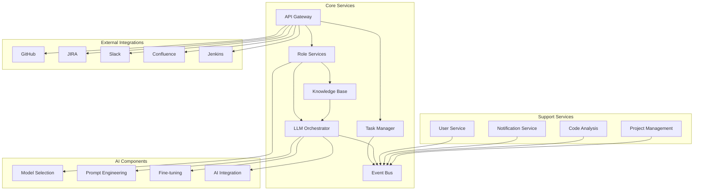

# Development Overview

## Introduction

This document provides a high-level overview of the Engineering AI Agent development architecture, principles, and key components. It serves as an entry point for developers to understand the system before diving into specific sections.

## System Architecture

The Engineering AI Agent follows a microservices architecture pattern, with clear separation of concerns across multiple specialized services. The system is designed to be scalable, maintainable, and resilient.

## Key Design Principles

1. **Modularity**: Components are designed with clear interfaces and separation of concerns
2. **Scalability**: Services can scale independently based on demand
3. **Resilience**: System continues functioning despite partial failures
4. **Observability**: Comprehensive logging, monitoring, and tracing
5. **Security**: Zero-trust architecture with auth at all service boundaries
6. **AI-first**: AI capabilities are integrated throughout the system

## Technology Stack

- **Backend Services**: Python microservices with FastAPI
- **AI/ML**: OpenAI, Hugging Face, LangChain
- **Data Storage**: PostgreSQL, Redis, Vector Databases
- **Infrastructure**: Kubernetes, Docker
- **CI/CD**: Jenkins, GitHub Actions
- **Monitoring**: Prometheus, Grafana
- **Messaging**: Kafka, RabbitMQ

## Development Workflow

The development process follows these key steps:

1. **Requirements Analysis**: Understanding and capturing user needs
2. **Design**: Creating detailed specifications for components
3. **Implementation**: Developing and testing features
4. **Review**: Code review and quality assurance
5. **Deployment**: Staged rollout across environments
6. **Monitoring**: Continuous observation of system behavior

## Documentation Structure

The development documentation is organized into the following key sections:

- **Services**: Core and supporting microservices architecture
- **AI**: LLM integration, prompt engineering, fine-tuning
- **Data**: Storage, schema, persistence, migrations
- **Integrations**: External system connections (GitHub, JIRA, etc.)
- **Infrastructure**: Deployment, scaling, and operations
- **Workflow**: Business process modeling and execution
- **Security**: Authentication, authorization, data protection
- **Performance**: Optimization, scaling, and monitoring
- **Troubleshooting**: Logging, debugging, error handling

Each section contains detailed specifications, architectural guidelines, and design patterns to ensure consistent implementation across the system.
