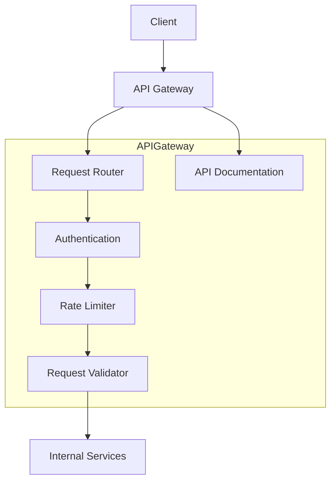
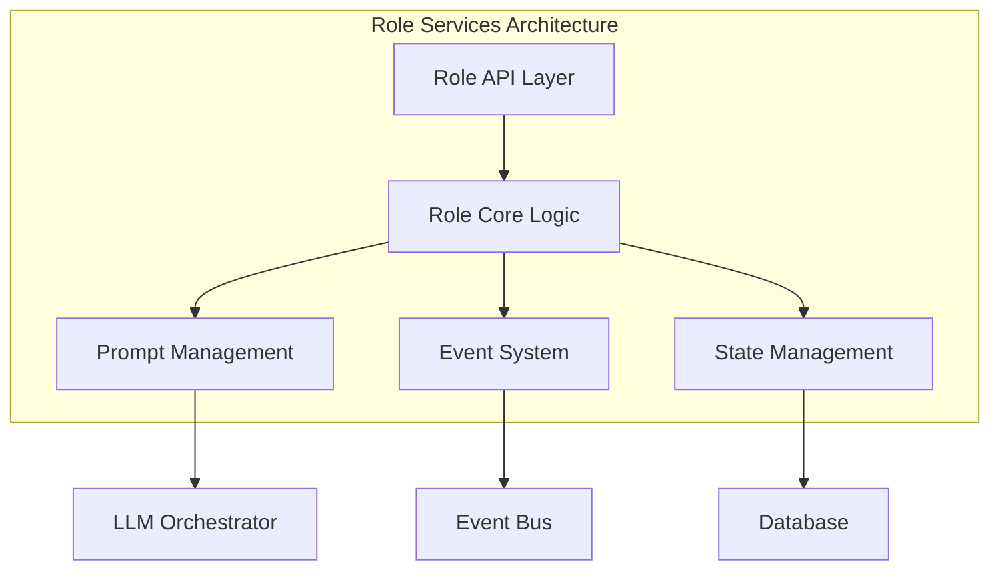
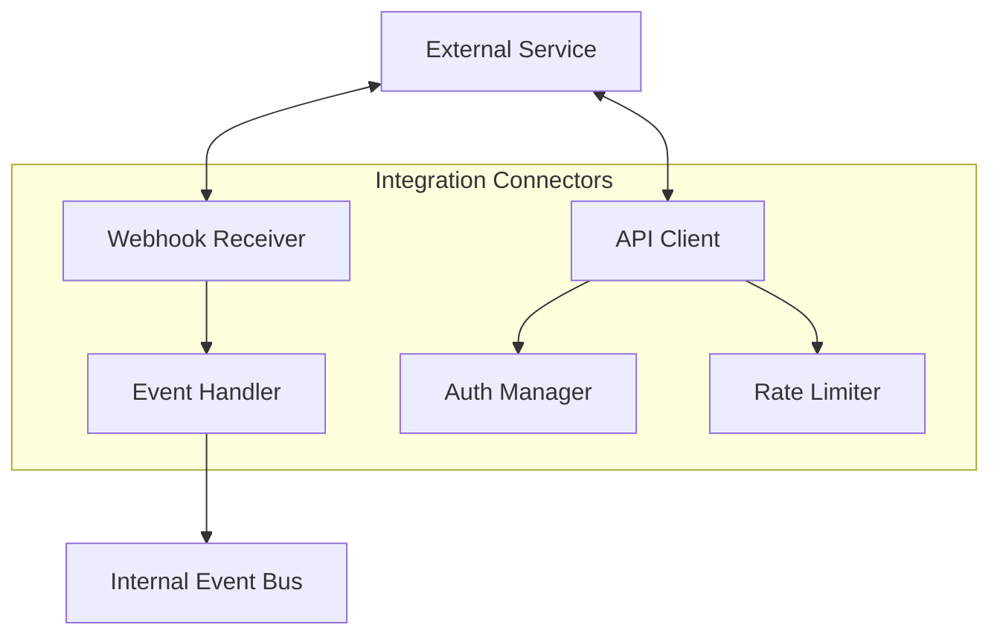
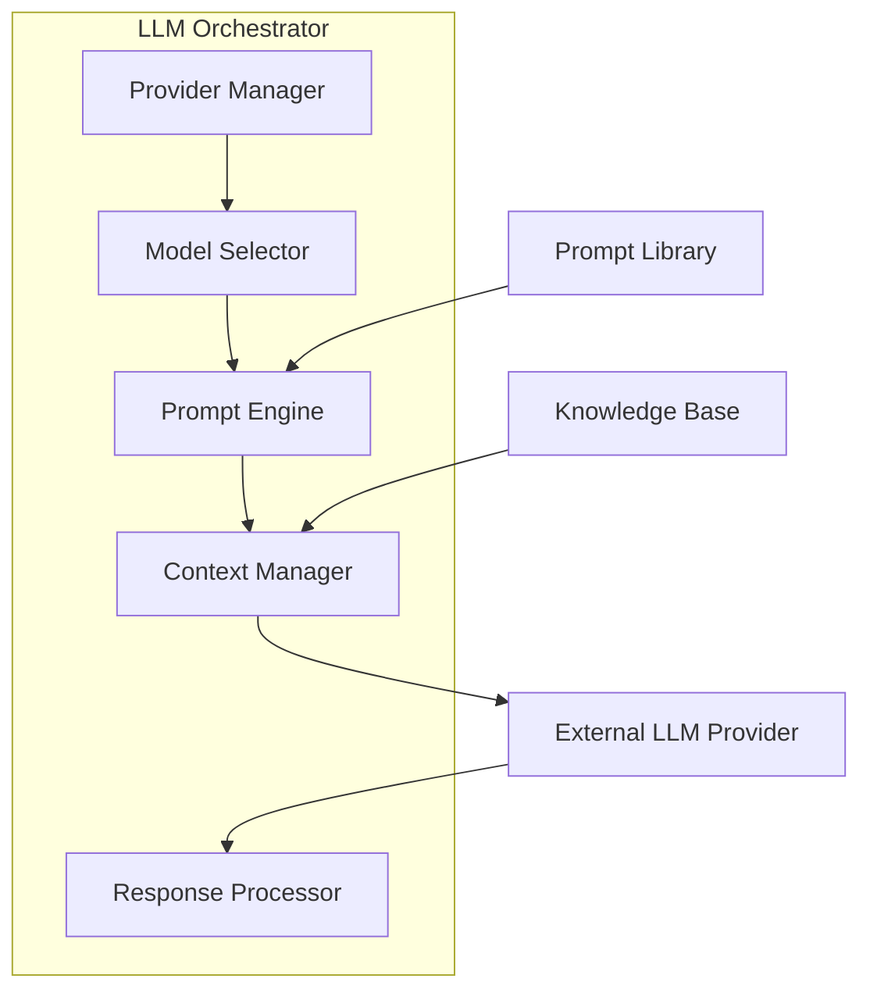
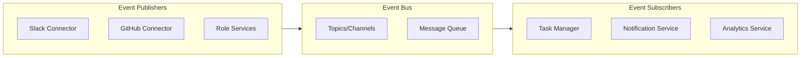
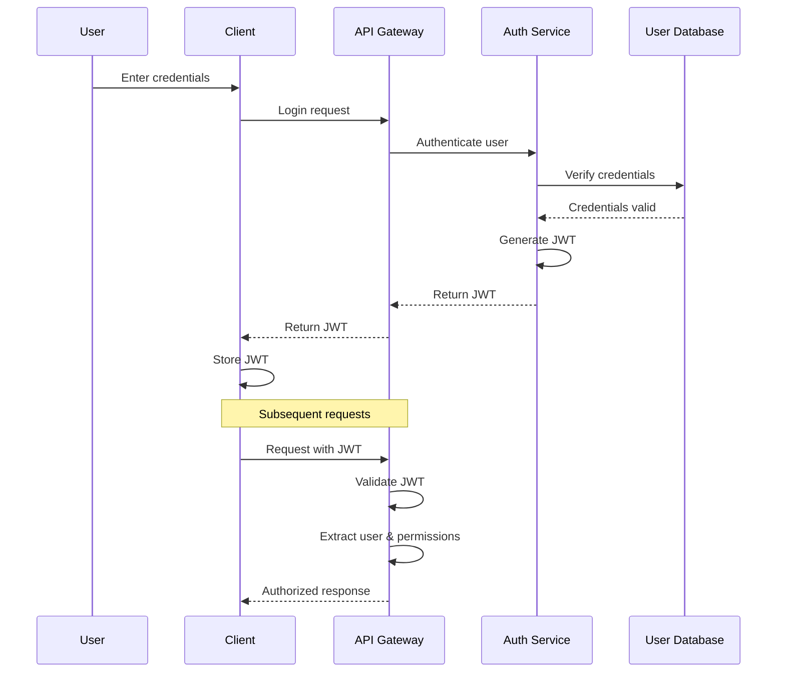

# Engineering AI Agent System Design

This document provides detailed insights into the system design of the Engineering AI Agent platform, covering design principles, patterns, and implementation strategies.

## Design Principles

The Engineering AI Agent platform is built on the following core design principles:

1. **Modularity**: The system is composed of loosely coupled components that can be developed, tested, and deployed independently.

2. **Extensibility**: The architecture allows for easy addition of new roles, integrations, and features without significant changes to the existing codebase.

3. **Scalability**: All components are designed to scale horizontally to handle increased load.

4. **Resilience**: The system incorporates fault tolerance, graceful degradation, and self-healing mechanisms.

5. **Observability**: Comprehensive logging, metrics, and tracing enable effective monitoring and debugging.

6. **Security**: Security is integrated into every layer of the system, following the principle of defense in depth.

## System Components Design

### API Gateway Design

#### Key Design Decisions:

1. **Technology Choice**: FastAPI provides high performance with automatic OpenAPI documentation.
2. **Authentication Strategy**: 
   - JWT-based authentication for stateless operation
   - OAuth 2.0 flow for third-party integration
   - API keys for machine-to-machine communication
3. **Rate Limiting Implementation**: 
   - Distributed rate limiting using Redis
   - Configurable limits based on user tiers
   - Graceful rejection with retry-after headers
4. **Request Validation**: 
   - Pydantic models for schema validation
   - Input sanitization to prevent injection attacks
5. **Routing Strategy**:
   - Role-specific endpoints for direct access
   - Generic endpoints for cross-role functionality
   - Versioned API paths for backward compatibility

### Role Services Design

#### Key Design Decisions:

1. **Role Separation**: Each role (RD, PM, QA, etc.) is implemented as a separate microservice for independent development and scaling.

2. **Common Framework**: 
   - Shared base classes for common functionality
   - Role-specific extensions for specialized behavior
   - Dependency injection for flexible component composition

3. **State Management**:
   - Primarily stateless design
   - Persistent state stored in databases
   - Distributed caching for performance
   - Event sourcing for complex state transitions

4. **Event System**:
   - Event-driven architecture for cross-service communication
   - Publish-subscribe pattern for loose coupling
   - Event schemas for type-safe messaging

5. **Role-Specific Logic Encapsulation**:
   - Strategy pattern for interchangeable algorithms
   - Factory pattern for creating appropriate handlers
   - Template method pattern for workflow standardization

### Integration Connectors Design

#### Key Design Decisions:

1. **Unified Interface**: Common interface for all integration connectors providing consistent patterns across different services.

2. **Abstraction Layers**:
   - Service-specific API clients
   - Common webhook handling framework
   - Shared authentication patterns
   - Standardized event transformation

3. **Authentication Patterns**:
   - OAuth 2.0 for user-authenticated access
   - API tokens for system-authenticated access
   - Secure storage of credentials in vault services
   - Token refresh mechanisms

4. **Rate Limit Management**:
   - Adaptive rate limiting based on provider constraints
   - Queuing mechanisms for high-volume operations
   - Backpressure handling for overload scenarios

5. **Event Translation**:
   - Mapping external events to internal event schema
   - Normalization of data structures
   - Enrichment with contextual information

### LLM Orchestrator Design

#### Key Design Decisions:

1. **Provider Abstraction**:
   - Interface-based design for multi-provider support
   - Adapter pattern for provider-specific implementations
   - Strategy pattern for model selection logic

2. **Prompt Engineering**:
   - Template-based prompt generation
   - Version-controlled prompt library
   - Parameter interpolation for dynamic prompts
   - Few-shot example management

3. **Context Management**:
   - Efficient token usage through summarization
   - Retrieval-augmented generation (RAG) for knowledge incorporation
   - Sliding window approach for conversation history
   - Context priority ranking for token optimization

4. **Response Processing**:
   - Schema validation of LLM responses
   - Fallback strategies for invalid responses
   - Post-processing for consistency
   - Classification and extraction of structured data

5. **Performance Optimization**:
   - Asynchronous API calls
   - Response caching
   - Batching of similar requests
   - Stream processing for long responses

## Event-Driven Architecture

### Event Types

1. **Integration Events**:
   - `slack.message.received`
   - `github.pr.created`
   - `jira.ticket.updated`

2. **Role Events**:
   - `rd.code.generated`
   - `pm.requirements.analyzed`
   - `qa.tests.completed`

3. **Task Events**:
   - `task.created`
   - `task.assigned`
   - `task.completed`

4. **System Events**:
   - `system.error`
   - `system.rate_limit_reached`
   - `system.health_check`

### Event Processing Patterns

1. **At-Least-Once Delivery**:
   - Messages are persisted before processing
   - Acknowledgment only after successful processing
   - Retry mechanism for failed processing

2. **Idempotent Handlers**:
   - Handlers designed to safely process duplicate events
   - Unique event IDs for deduplication
   - State-based idempotency checks

3. **Dead Letter Queues**:
   - Failed messages routed to DLQ
   - Monitoring and alerting on DLQ growth
   - Manual or automated recovery processes

## Data Model Design

### Relational Data Model

Core entities in the relational database:

1. **Users**:
   - Authentication information
   - Permissions and roles
   - Preferences and settings

2. **Tasks**:
   - Task metadata (title, description, etc.)
   - Assignment information
   - Status and progress tracking
   - Relationships to other entities

3. **Projects**:
   - Project configuration
   - Member associations
   - Integration settings
   - Workflow definitions

4. **Workflows**:
   - Step definitions
   - Transition rules
   - Role assignments
   - Automation triggers

### Vector Database Design

1. **Knowledge Embeddings**:
   - Document chunks with vector representations
   - Metadata for filtering and retrieval
   - Source tracking for attribution
   - Version history for evolution

2. **Semantic Search Indexes**:
   - Optimized for similarity queries
   - Multi-dimensional indexing
   - Approximate nearest neighbor algorithms

3. **Context Storage**:
   - Conversation history embeddings
   - Project context embeddings
   - Code snippet embeddings
   - Technical document embeddings

## Security Design

### Authentication Flow

### Authorization Model

1. **Role-Based Access Control (RBAC)**:
   - Standard roles (Admin, Developer, Viewer)
   - Role inheritance hierarchy
   - Permission groupings by function

2. **Resource-Based Permissions**:
   - Project-level access control
   - Integration-specific permissions
   - Data visibility rules

3. **OAuth Scopes**:
   - Fine-grained API permissions
   - Integration-specific scopes
   - User-controlled authorization

### Secrets Management

1. **Credential Storage**:
   - AWS Secrets Manager / HashiCorp Vault
   - Encryption at rest
   - Rotation policies
   - Access auditing

2. **API Key Management**:
   - Scoped API keys
   - Usage tracking
   - Revocation mechanisms
   - Expiration policies

## User Experience Design

### Interaction Patterns

1. **Slack Integration UX**:
   - Conversational interface
   - Rich message formatting
   - Interactive components (buttons, menus)
   - Progressive disclosure of information

2. **GitHub Integration UX**:
   - PR templates and checklists
   - Automated code review comments
   - Status checks and notifications
   - Documentation generation

3. **Task Management UX**:
   - Clear status visualization
   - Progress tracking
   - Priority indicators
   - Assignee management

### Notification Strategy

1. **Real-time Notifications**:
   - Critical events (build failures, security issues)
   - Direct mentions and requests
   - Task assignments and updates

2. **Digest Notifications**:
   - Daily summaries
   - Project status updates
   - Weekly progress reports
   - Performance metrics

3. **Notification Channels**:
   - Slack messages
   - Email notifications
   - System dashboard alerts
   - Mobile push notifications (future)

## Technical Debt Management

1. **Code Quality Standards**:
   - Automated linting and formatting
   - Code coverage requirements
   - Complexity limits
   - Documentation requirements

2. **Refactoring Strategy**:
   - Scheduled refactoring sprints
   - Incremental improvement approach
   - Legacy code retirement plan
   - Technical debt tracking

3. **Architecture Evolution**:
   - Deprecation policy for APIs
   - Migration paths for major changes
   - Backward compatibility requirements
   - Feature flag management

## Future Design Considerations

1. **Machine Learning Enhancements**:
   - Custom model fine-tuning
   - Task success prediction
   - Code quality assessment
   - Anomaly detection

2. **Advanced Workflow Automation**:
   - Self-optimizing workflows
   - Predictive task assignment
   - Intelligent scheduling
   - Resource optimization

3. **Extended Integration Ecosystem**:
   - Additional version control systems
   - More messaging platforms
   - CI/CD system integrations
   - Cloud provider integrations
