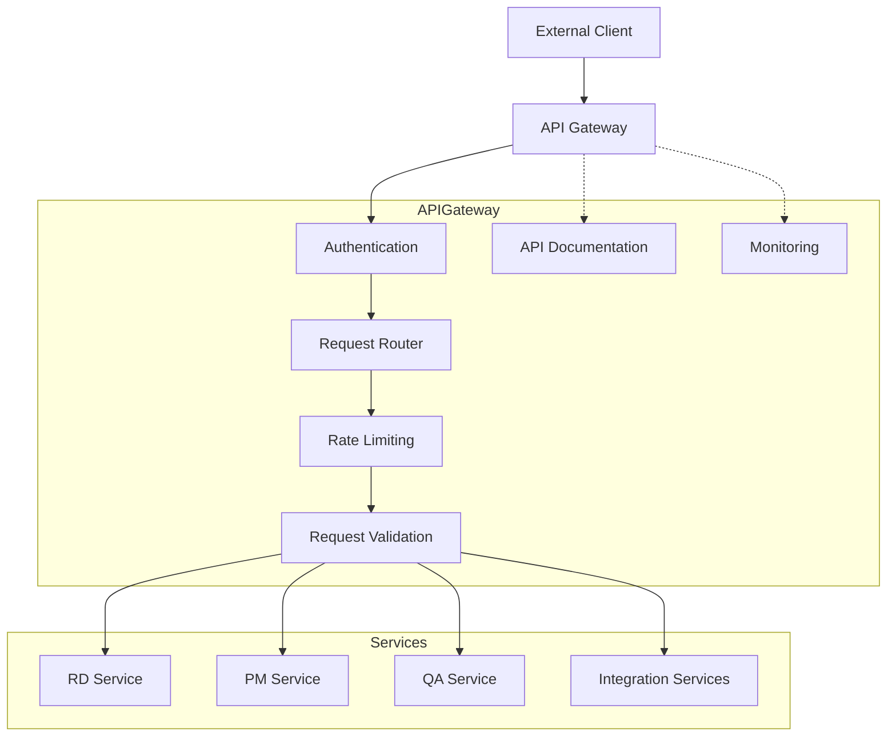
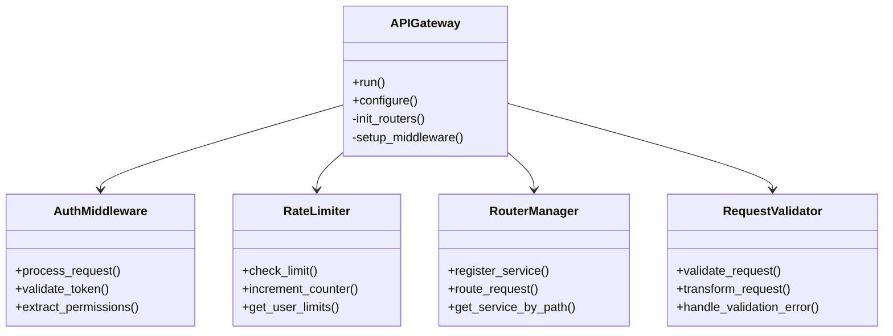
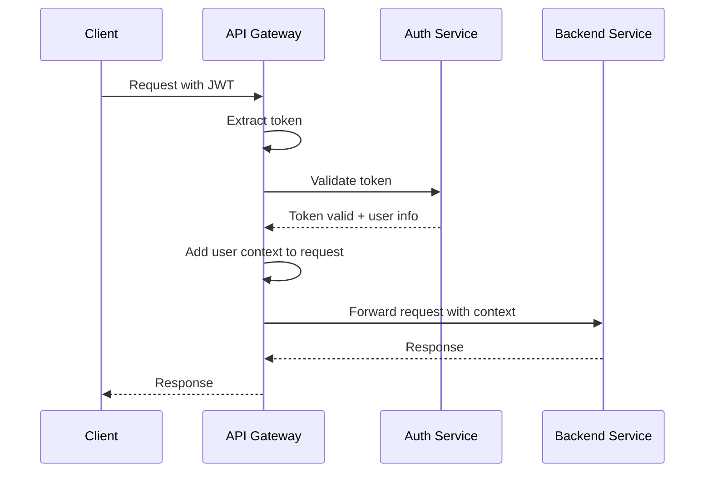
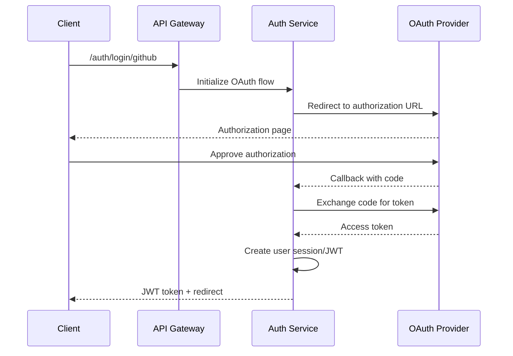

# API Gateway

This document provides detailed information about the API Gateway service in the Engineering AI Agent system, including its architecture, implementation details, and development guidelines.

## Overview

The API Gateway serves as the central entry point for all external requests to the Engineering AI Agent system. It provides a unified interface for clients, handling cross-cutting concerns such as authentication, authorization, rate limiting, and request routing.



## Key Responsibilities

The API Gateway is responsible for:

1. **Authentication and Authorization**
   - JWT token validation
   - OAuth 2.0 flow integration
   - Role-based access control
   - Permission enforcement

2. **Request Routing**
   - Directing requests to appropriate microservices
   - Version-based routing
   - Service discovery integration
   - Path normalization

3. **Rate Limiting and Throttling**
   - Per-user rate limits
   - Burst handling
   - Token bucket implementation
   - Quota management

4. **Request/Response Transformation**
   - Request validation
   - Response formatting
   - Error standardization
   - Data transformation

5. **API Documentation**
   - OpenAPI/Swagger integration
   - Interactive documentation
   - SDK generation
   - Example request/response samples

6. **Monitoring and Logging**
   - Request/response logging
   - Performance metrics
   - Error tracking
   - Distributed tracing

## Implementation Architecture

### Core Components



### Key Design Patterns

1. **Chain of Responsibility Pattern**
   - Request processing pipeline
   - Sequential middleware execution
   - Early termination on failure

2. **Adapter Pattern**
   - Consistent interface for varied service backends
   - Protocol translation
   - Data format normalization

3. **Façade Pattern**
   - Simplified interface to complex subsystems
   - Abstraction of implementation details
   - Consistent client experience

## Authentication System

### JWT Authentication



#### JWT Structure

```json
{
  "header": {
    "alg": "RS256",
    "typ": "JWT"
  },
  "payload": {
    "sub": "user-id",
    "name": "User Name",
    "roles": ["admin", "developer"],
    "permissions": ["read:tasks", "write:tasks"],
    "iat": 1516239022,
    "exp": 1516242622
  },
  "signature": "..."
}
```

### OAuth 2.0 Integration



## Request Routing

### Service Registration

Services register themselves with the API Gateway through:

1. **Static Configuration**
   - Configuration files
   - Environment variables
   - Command-line arguments

2. **Dynamic Discovery**
   - Service registry integration
   - Kubernetes service discovery
   - Health check-based routing

### Routing Rules

```yaml
# Example routing configuration
routes:
  - path: /api/v1/rd/**
    service: rd-service
    timeout: 30s
    retry: 3
    circuit_breaker:
      threshold: 5
      timeout: 60s
  
  - path: /api/v1/pm/**
    service: pm-service
    timeout: 20s
    rate_limit:
      requests_per_minute: 100
      burst: 20
  
  - path: /api/v1/integrations/slack/**
    service: slack-connector
    authentication: required
    permissions: ["manage:integrations"]
```

## Rate Limiting Implementation

### Token Bucket Algorithm

```python
class TokenBucket:
    def __init__(self, capacity, refill_rate):
        """
        Initialize a token bucket.
        
        :param capacity: Maximum number of tokens in the bucket
        :param refill_rate: Tokens per second to refill
        """
        self.capacity = capacity
        self.refill_rate = refill_rate
        self.tokens = capacity
        self.last_refill = time.time()
    
    def consume(self, tokens=1):
        """
        Consume tokens from the bucket.
        
        :param tokens: Number of tokens to consume
        :return: True if tokens were consumed, False otherwise
        """
        # Refill tokens based on time elapsed
        now = time.time()
        elapsed = now - self.last_refill
        refill = elapsed * self.refill_rate
        self.tokens = min(self.capacity, self.tokens + refill)
        self.last_refill = now
        
        # Check if we have enough tokens
        if tokens <= self.tokens:
            self.tokens -= tokens
            return True
        return False
```

### Distributed Rate Limiting with Redis

```python
import redis
import time

class RedisRateLimiter:
    def __init__(self, redis_client, key_prefix="rate_limit"):
        self.redis = redis_client
        self.key_prefix = key_prefix
    
    async def check_rate_limit(self, user_id, limit, window_seconds):
        """
        Check if a user has exceeded their rate limit.
        
        :param user_id: Identifier for the user
        :param limit: Maximum number of requests allowed
        :param window_seconds: Time window in seconds
        :return: Tuple of (allowed, remaining, reset_time)
        """
        key = f"{self.key_prefix}:{user_id}"
        now = int(time.time())
        window_start = now - window_seconds
        
        # Execute Redis pipeline
        pipe = self.redis.pipeline()
        
        # Remove expired entries
        pipe.zremrangebyscore(key, 0, window_start)
        
        # Add current request timestamp
        pipe.zadd(key, {now: now})
        
        # Count requests in current window
        pipe.zcount(key, window_start, "+inf")
        
        # Set expiration on the key
        pipe.expire(key, window_seconds)
        
        # Execute pipeline
        _, _, request_count, _ = await pipe.execute()
        
        # Calculate remaining requests and reset time
        remaining = max(0, limit - request_count)
        reset_time = now + window_seconds
        
        return request_count <= limit, remaining, reset_time
```

## Request Validation

### Pydantic Models

```python
from pydantic import BaseModel, Field, validator
from typing import List, Optional
from datetime import datetime
import uuid

class TaskCreate(BaseModel):
    title: str = Field(..., min_length=3, max_length=100)
    description: str = Field(..., min_length=10, max_length=1000)
    due_date: Optional[datetime] = None
    assignee_id: Optional[uuid.UUID] = None
    tags: List[str] = Field(default_factory=list)
    priority: str = Field(..., pattern="^(low|medium|high)$")
    
    @validator('due_date')
    def due_date_must_be_future(cls, v):
        if v and v < datetime.now():
            raise ValueError('due date must be in the future')
        return v

# In FastAPI route
@router.post("/tasks")
async def create_task(task: TaskCreate):
    # Validation happens automatically
    # Proceed with creating the task
    pass
```

### Error Handling

```python
from fastapi import FastAPI, Request, status
from fastapi.responses import JSONResponse
from fastapi.exceptions import RequestValidationError
from pydantic import ValidationError

app = FastAPI()

@app.exception_handler(RequestValidationError)
async def validation_exception_handler(request: Request, exc: RequestValidationError):
    return JSONResponse(
        status_code=status.HTTP_422_UNPROCESSABLE_ENTITY,
        content={
            "detail": "Validation error",
            "errors": [
                {
                    "field": ".".join(error["loc"]),
                    "message": error["msg"],
                    "type": error["type"]
                }
                for error in exc.errors()
            ]
        }
    )

@app.exception_handler(Exception)
async def generic_exception_handler(request: Request, exc: Exception):
    return JSONResponse(
        status_code=status.HTTP_500_INTERNAL_SERVER_ERROR,
        content={
            "detail": "Internal server error",
            "message": str(exc)
        }
    )
```

## API Documentation

### OpenAPI Integration

FastAPI automatically generates OpenAPI documentation based on route definitions and Pydantic models.

```python
from fastapi import FastAPI, Depends, HTTPException, status
from fastapi.security import OAuth2PasswordBearer

app = FastAPI(
    title="Engineering AI Agent API",
    description="API for the Engineering AI Agent platform",
    version="1.0.0",
    openapi_url="/api/openapi.json",
    docs_url="/api/docs",
    redoc_url="/api/redoc"
)

oauth2_scheme = OAuth2PasswordBearer(tokenUrl="token")

@app.get(
    "/users/me",
    summary="Get current user",
    description="Retrieves information about the currently authenticated user",
    response_model=UserResponse,
    responses={
        401: {"description": "Not authenticated"},
        404: {"description": "User not found"}
    },
    tags=["Users"]
)
async def get_current_user(token: str = Depends(oauth2_scheme)):
    # Implementation
    pass
```

## Monitoring and Observability

### Request Logging Middleware

```python
import time
import uuid
from fastapi import FastAPI, Request
from starlette.middleware.base import BaseHTTPMiddleware
from starlette.types import ASGIApp
import logging

logger = logging.getLogger("api_gateway")

class RequestLoggingMiddleware(BaseHTTPMiddleware):
    def __init__(self, app: ASGIApp):
        super().__init__(app)
    
    async def dispatch(self, request: Request, call_next):
        request_id = str(uuid.uuid4())
        request.state.request_id = request_id
        
        # Log request details
        logger.info(
            f"Request started: method={request.method} path={request.url.path} "
            f"request_id={request_id}"
        )
        
        start_time = time.time()
        
        try:
            response = await call_next(request)
            
            # Log response details
            process_time = time.time() - start_time
            logger.info(
                f"Request completed: method={request.method} path={request.url.path} "
                f"status_code={response.status_code} duration={process_time:.3f}s "
                f"request_id={request_id}"
            )
            
            # Add request ID to response headers
            response.headers["X-Request-ID"] = request_id
            
            return response
        except Exception as e:
            process_time = time.time() - start_time
            logger.error(
                f"Request failed: method={request.method} path={request.url.path} "
                f"error={str(e)} duration={process_time:.3f}s request_id={request_id}"
            )
            raise
```

### Prometheus Metrics

```python
from prometheus_client import Counter, Histogram, Gauge
from fastapi import FastAPI
from starlette.middleware.base import BaseHTTPMiddleware
import time

# Define metrics
REQUEST_COUNT = Counter(
    "api_requests_total",
    "Total count of API requests",
    ["method", "endpoint", "status_code"]
)

REQUEST_LATENCY = Histogram(
    "api_request_latency_seconds",
    "API request latency in seconds",
    ["method", "endpoint"]
)

ACTIVE_REQUESTS = Gauge(
    "api_active_requests",
    "Number of active API requests",
    ["method", "endpoint"]
)

class PrometheusMiddleware(BaseHTTPMiddleware):
    async def dispatch(self, request, call_next):
        method = request.method
        path = request.url.path
        
        # Track active requests
        ACTIVE_REQUESTS.labels(method=method, endpoint=path).inc()
        
        # Track request latency
        start_time = time.time()
        
        try:
            response = await call_next(request)
            
            # Record metrics
            status_code = response.status_code
            duration = time.time() - start_time
            
            REQUEST_COUNT.labels(
                method=method, endpoint=path, status_code=status_code
            ).inc()
            
            REQUEST_LATENCY.labels(
                method=method, endpoint=path
            ).observe(duration)
            
            return response
        finally:
            ACTIVE_REQUESTS.labels(method=method, endpoint=path).dec()
```

## Deployment Configuration

### Kubernetes Deployment

```yaml
apiVersion: apps/v1
kind: Deployment
metadata:
  name: api-gateway
  namespace: engineering-ai-agent
spec:
  replicas: 3
  selector:
    matchLabels:
      app: api-gateway
  template:
    metadata:
      labels:
        app: api-gateway
    spec:
      containers:
        - name: api-gateway
          image: engineering-ai-agent/api-gateway:latest
          ports:
            - containerPort: 8000
          env:
            - name: LOG_LEVEL
              value: "info"
            - name: REDIS_HOST
              valueFrom:
                configMapKeyRef:
                  name: app-config
                  key: redis_host
            - name: JWT_SECRET
              valueFrom:
                secretKeyRef:
                  name: app-secrets
                  key: jwt_secret
          resources:
            limits:
              cpu: 1000m
              memory: 1Gi
            requests:
              cpu: 500m
              memory: 512Mi
          livenessProbe:
            httpGet:
              path: /health
              port: 8000
            initialDelaySeconds: 30
            periodSeconds: 10
          readinessProbe:
            httpGet:
              path: /health/ready
              port: 8000
            initialDelaySeconds: 5
            periodSeconds: 5
```

### Service Definition

```yaml
apiVersion: v1
kind: Service
metadata:
  name: api-gateway
  namespace: engineering-ai-agent
spec:
  selector:
    app: api-gateway
  ports:
    - port: 80
      targetPort: 8000
      protocol: TCP
  type: ClusterIP
```

### Ingress Configuration

```yaml
apiVersion: networking.k8s.io/v1
kind: Ingress
metadata:
  name: api-gateway-ingress
  namespace: engineering-ai-agent
  annotations:
    kubernetes.io/ingress.class: nginx
    nginx.ingress.kubernetes.io/ssl-redirect: "true"
    cert-manager.io/cluster-issuer: letsencrypt-prod
spec:
  tls:
    - hosts:
        - api.engineering-ai-agent.example.com
      secretName: api-tls-cert
  rules:
    - host: api.engineering-ai-agent.example.com
      http:
        paths:
          - path: /
            pathType: Prefix
            backend:
              service:
                name: api-gateway
                port:
                  number: 80
```

## Development Guidelines

### Local Development Setup

1. **Prerequisites**
   - Python 3.10+
   - Docker and Docker Compose
   - Redis (local or containerized)

2. **Environment Setup**
   ```bash
   # Clone the repository
   git clone https://github.com/your-org/engineering-ai-agent.git
   cd engineering-ai-agent/api-gateway
   
   # Create virtual environment
   python -m venv venv
   source venv/bin/activate  # On Windows: venv\Scripts\activate
   
   # Install dependencies
   pip install -r requirements.txt
   pip install -r requirements-dev.txt
   
   # Setup pre-commit hooks
   pre-commit install
   ```

3. **Configuration**
   ```bash
   # Copy example environment file
   cp .env.example .env
   
   # Edit .env file with your local configuration
   # Start local dependencies
   docker-compose up -d redis
   
   # Run the API Gateway
   uvicorn app.main:app --reload
   ```

### Code Structure

```
api-gateway/
├── app/
│   ├── __init__.py
│   ├── main.py                 # Application entry point
│   ├── config.py               # Configuration handling
│   ├── dependencies.py         # FastAPI dependencies
│   ├── middleware/             # Custom middleware
│   │   ├── __init__.py
│   │   ├── authentication.py
│   │   ├── logging.py
│   │   └── rate_limiting.py
│   ├── routers/                # API route definitions
│   │   ├── __init__.py
│   │   ├── auth.py
│   │   ├── health.py
│   │   └── proxy.py
│   ├── services/               # Business logic
│   │   ├── __init__.py
│   │   ├── auth_service.py
│   │   └── routing_service.py
│   ├── schemas/                # Pydantic models
│   │   ├── __init__.py
│   │   ├── auth.py
│   │   └── error.py
│   └── utils/                  # Utility functions
│       ├── __init__.py
│       ├── jwt.py
│       └── logging.py
├── tests/                      # Test suite
│   ├── __init__.py
│   ├── conftest.py
│   ├── test_auth.py
│   └── test_routing.py
├── .env.example                # Example environment variables
├── Dockerfile                  # Container definition
├── docker-compose.yml          # Local development services
├── requirements.txt            # Production dependencies
└── requirements-dev.txt        # Development dependencies
```

### Testing Strategy

1. **Unit Tests**
   - Test individual components in isolation
   - Mock external dependencies
   - Focus on edge cases and error handling

2. **Integration Tests**
   - Test interaction between components
   - Use containerized dependencies
   - Verify correct communication patterns

3. **End-to-End Tests**
   - Test complete request flow
   - Verify authentication and authorization
   - Check rate limiting behavior

```python
# Example test using pytest and FastAPI TestClient
import pytest
from fastapi.testclient import TestClient
from app.main import app

client = TestClient(app)

def test_health_endpoint():
    response = client.get("/health")
    assert response.status_code == 200
    assert response.json() == {"status": "ok"}

@pytest.mark.parametrize(
    "endpoint,expected_service",
    [
        ("/api/v1/rd/tasks", "rd-service"),
        ("/api/v1/pm/projects", "pm-service"),
        ("/api/v1/integrations/slack/events", "slack-connector"),
    ]
)
def test_routing(endpoint, expected_service, mocker):
    # Mock the routing service
    mock_router = mocker.patch("app.services.routing_service.route_request")
    mock_router.return_value = {"status": "ok", "service": expected_service}
    
    # Mock authentication
    mocker.patch(
        "app.middleware.authentication.authenticate",
        return_value={"user_id": "test-user", "roles": ["admin"]}
    )
    
    response = client.get(
        endpoint,
        headers={"Authorization": "Bearer test-token"}
    )
    
    assert response.status_code == 200
    mock_router.assert_called_once()
    call_args = mock_router.call_args[0]
    assert call_args[0] == endpoint
    assert call_args[1]["service"] == expected_service
```

## Performance Considerations

1. **Async Processing**
   - Use asynchronous handlers for I/O-bound operations
   - Implement connection pooling for database and Redis
   - Configure proper worker counts based on CPU cores

2. **Caching Strategy**
   - Cache frequently used authentication data
   - Implement response caching for static resources
   - Use distributed caching for shared state

3. **Load Balancing**
   - Deploy multiple instances behind load balancer
   - Configure session affinity when needed
   - Implement proper health checks for instance rotation

4. **Resource Optimization**
   - Set appropriate memory limits
   - Monitor and tune garbage collection
   - Optimize JSON serialization/deserialization

## Security Best Practices

1. **Secure Coding**
   - Input validation for all request parameters
   - Output encoding to prevent injection attacks
   - Proper error handling without leaking sensitive information

2. **Authentication**
   - Use strong hashing algorithms for passwords
   - Implement proper token validation
   - Support multi-factor authentication

3. **Authorization**
   - Granular permission checking
   - Context-based access control
   - Regular permission audit

4. **Network Security**
   - TLS for all communications
   - Network policies to restrict traffic
   - API firewalling for suspicious patterns

## Troubleshooting

### Common Issues

1. **Authentication Failures**
   - Check token expiration
   - Verify signing keys
   - Confirm user exists and is active

2. **Rate Limiting Problems**
   - Verify Redis connection
   - Check rate limit configuration
   - Look for clock synchronization issues

3. **Routing Errors**
   - Confirm service registration
   - Check network connectivity
   - Verify service health

### Debugging Techniques

1. **Enable Debug Logging**
   ```bash
   export LOG_LEVEL=debug
   ```

2. **Inspect Request/Response**
   ```bash
   # Add to .env
   TRACE_REQUESTS=true
   ```

3. **Profile Performance**
   ```bash
   # Run with profiling
   python -m cProfile -o api_gateway.prof app/main.py
   
   # Analyze results
   python -m pstats api_gateway.prof
   ```
