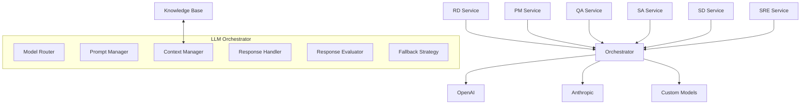
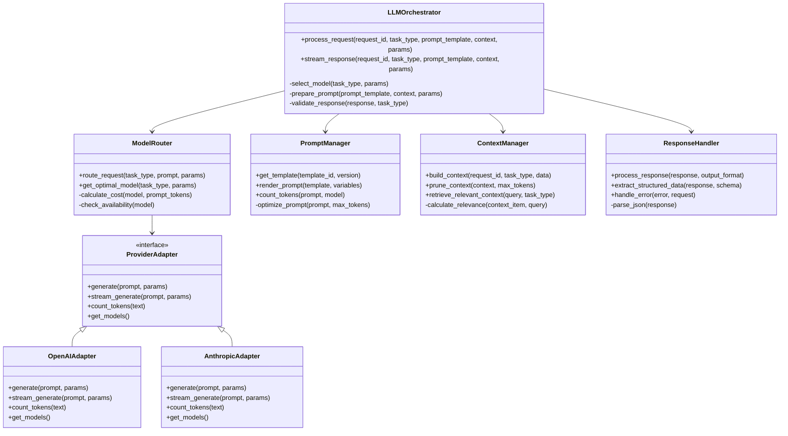
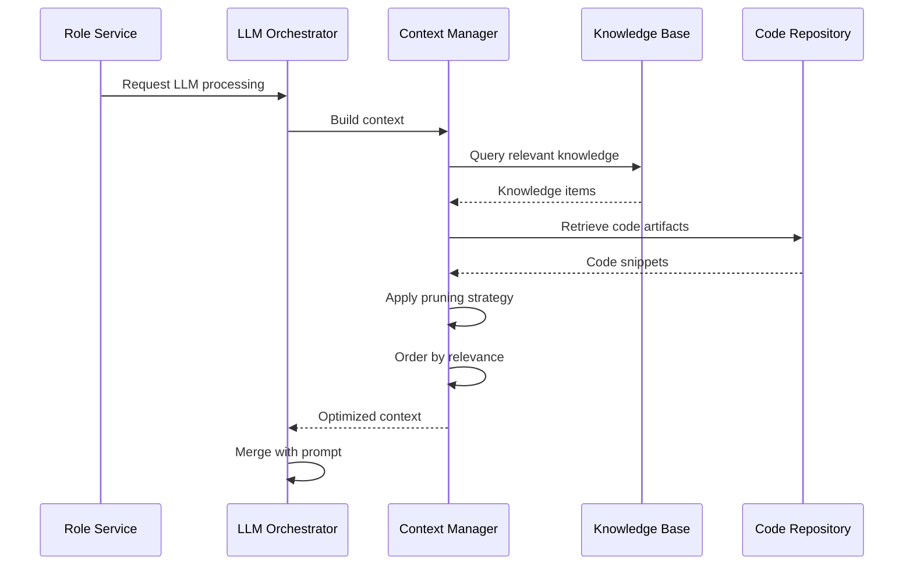
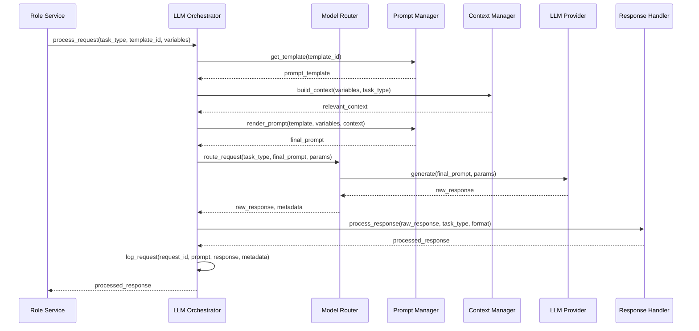

# LLM Orchestrator

This document provides detailed information about the LLM Orchestrator service in the Engineering AI Agent system, including its architecture, implementation details, and development guidelines.

## Overview

The LLM Orchestrator is a critical component of the Engineering AI Agent system, responsible for managing all interactions with Large Language Models (LLMs). It provides a unified interface for all services to access LLM capabilities, handles prompt engineering, manages context, optimizes token usage, and implements fallback strategies.



## Key Responsibilities

The LLM Orchestrator is responsible for:

1. **Model Selection and Routing**
   - Dynamically selecting the appropriate LLM for each task
   - Routing requests to different providers based on capabilities and cost
   - Handling model versioning and compatibility
   - Managing fallbacks between models

2. **Prompt Management**
   - Storing and versioning prompt templates
   - Dynamic prompt construction with context injection
   - Managing system messages and role definitions
   - Optimizing prompts for token efficiency

3. **Context Management**
   - Constructing relevant context for each request
   - Managing context window limitations
   - Implementing context pruning algorithms
   - Maintaining conversational state when needed

4. **Response Processing**
   - Parsing and validating LLM responses
   - Extracting structured data from responses
   - Handling response formats (JSON, markdown, code)
   - Implementing retry logic for invalid responses

5. **Performance Optimization**
   - Caching common responses
   - Batching requests when possible
   - Managing token budgets
   - Implementing parallel processing

## Implementation Architecture

The LLM Orchestrator is designed as a microservice with a modular architecture that allows for flexibility, extensibility, and high performance.



### Key Design Patterns

1. **Strategy Pattern**
   - Used for selecting different LLM providers and models
   - Allows for runtime selection of the appropriate algorithm
   - Enables easy addition of new providers

2. **Adapter Pattern**
   - Provides a consistent interface for different LLM providers
   - Abstracts away provider-specific implementation details
   - Simplifies integration of new LLM providers

3. **Factory Pattern**
   - Creates provider-specific adapters
   - Manages adapter lifecycle and configuration
   - Centralizes adapter creation logic

4. **Builder Pattern**
   - Used for constructing complex prompts
   - Allows for step-by-step assembly of prompt components
   - Separates prompt construction from its representation

5. **Observer Pattern**
   - Monitors LLM request/response lifecycle
   - Collects metrics and logs important events
   - Enables real-time monitoring of LLM usage

## Component Details

### Model Router

The Model Router is responsible for selecting the appropriate LLM for each request based on various factors.

#### Selection Criteria

```python
class ModelSelectionCriteria:
    def __init__(self, 
                 task_type: str,
                 required_capabilities: List[str],
                 max_cost: float = None,
                 max_latency: float = None,
                 preferred_provider: str = None,
                 preferred_model: str = None,
                 fallback_models: List[str] = None):
        self.task_type = task_type
        self.required_capabilities = required_capabilities
        self.max_cost = max_cost
        self.max_latency = max_latency
        self.preferred_provider = preferred_provider
        self.preferred_model = preferred_model
        self.fallback_models = fallback_models or []
```

#### Routing Algorithm

```python
async def route_request(self, criteria: ModelSelectionCriteria, prompt: str, params: Dict[str, Any]) -> Tuple[LLMResponse, Dict[str, Any]]:
    """
    Route the request to the most appropriate model based on the criteria.
    
    Args:
        criteria: Selection criteria for the model
        prompt: The prepared prompt to send
        params: Additional parameters for the request
        
    Returns:
        The response from the LLM and metadata about the request
    """
    # Try to get the preferred model first
    if criteria.preferred_model:
        try:
            model = self.get_model(criteria.preferred_model)
            if self._meets_criteria(model, criteria, prompt):
                return await self._execute_request(model, prompt, params)
        except (ModelNotAvailable, ModelNotFound):
            logger.warning(f"Preferred model {criteria.preferred_model} not available")
    
    # Find models that meet the criteria
    candidates = self._find_candidate_models(criteria, prompt)
    
    if not candidates:
        # Fall back to default model if no candidates found
        logger.warning("No models meet the criteria, using default model")
        return await self._execute_request(self.default_model, prompt, params)
    
    # Sort candidates by preference (cost, latency, provider preference)
    candidates.sort(key=lambda m: (
        0 if m.provider == criteria.preferred_provider else 1,
        m.estimated_cost(prompt),
        m.average_latency
    ))
    
    # Try candidates in order
    for model in candidates:
        try:
            return await self._execute_request(model, prompt, params)
        except Exception as e:
            logger.error(f"Error using model {model.name}: {str(e)}")
            continue
    
    # If all candidates fail, try fallback models
    for fallback_name in criteria.fallback_models:
        try:
            model = self.get_model(fallback_name)
            return await self._execute_request(model, prompt, params)
        except Exception as e:
            logger.error(f"Error using fallback model {fallback_name}: {str(e)}")
            continue
    
    # If everything fails, raise an exception
    raise AllModelsFailedError("All models failed to process the request")
```

### Prompt Manager

The Prompt Manager handles the storage, retrieval, and rendering of prompt templates.

#### Template Structure

```python
class PromptTemplate:
    def __init__(self,
                 template_id: str,
                 version: str,
                 system_message: str,
                 user_message_template: str,
                 required_variables: List[str],
                 optional_variables: Dict[str, Any] = None,
                 metadata: Dict[str, Any] = None):
        self.template_id = template_id
        self.version = version
        self.system_message = system_message
        self.user_message_template = user_message_template
        self.required_variables = required_variables
        self.optional_variables = optional_variables or {}
        self.metadata = metadata or {}
        
    def validate_variables(self, variables: Dict[str, Any]) -> bool:
        """Validate that all required variables are present."""
        return all(var in variables for var in self.required_variables)
        
    def render(self, variables: Dict[str, Any]) -> Dict[str, str]:
        """Render the template with the provided variables."""
        if not self.validate_variables(variables):
            missing = [var for var in self.required_variables if var not in variables]
            raise MissingVariablesError(f"Missing required variables: {', '.join(missing)}")
            
        # Combine provided variables with defaults for optional variables
        all_vars = {**self.optional_variables, **variables}
        
        # Render system message
        system = self.system_message
        
        # Render user message using Jinja2
        env = Environment(
            loader=BaseLoader,
            undefined=StrictUndefined
        )
        template = env.from_string(self.user_message_template)
        user = template.render(**all_vars)
        
        return {
            "system": system,
            "user": user
        }
```

#### Example Template

```json
{
  "template_id": "code_generation",
  "version": "1.0",
  "system_message": "You are an expert software developer with deep knowledge of software engineering principles, design patterns, and best practices. Your task is to generate high-quality, maintainable, and efficient code based on the requirements provided.",
  "user_message_template": "Please write code for the following requirement:\n\n{{ requirement }}\n\nUse {{ language }} programming language.\n\nHere is some relevant existing code:\n\n```{{ language }}\n{{ existing_code }}\n```\n\nFollow these coding standards:\n{{ coding_standards }}\n\nThe code should be well-structured, include error handling, and be fully documented with comments.",
  "required_variables": ["requirement"],
  "optional_variables": {
    "language": "python",
    "existing_code": "",
    "coding_standards": "PEP 8"
  },
  "metadata": {
    "description": "Template for generating code based on requirements",
    "use_cases": ["code_implementation", "feature_development"],
    "recommended_models": ["gpt-4", "claude-2"]
  }
}
```

### Context Manager

The Context Manager is responsible for building and managing context for LLM requests.

#### Context Building



#### Context Pruning Strategies

```python
class BasePruningStrategy:
    """Base class for context pruning strategies."""
    
    def prune(self, context_items: List[ContextItem], max_tokens: int) -> List[ContextItem]:
        """
        Prune the context items to fit within max_tokens.
        
        Args:
            context_items: List of context items to prune
            max_tokens: Maximum number of tokens allowed
            
        Returns:
            Pruned list of context items
        """
        raise NotImplementedError

class RelevancePruningStrategy(BasePruningStrategy):
    """Prune context items based on relevance score."""
    
    def prune(self, context_items: List[ContextItem], max_tokens: int) -> List[ContextItem]:
        # Sort items by relevance score (descending)
        sorted_items = sorted(context_items, key=lambda x: x.relevance_score, reverse=True)
        
        pruned_items = []
        total_tokens = 0
        
        for item in sorted_items:
            if total_tokens + item.token_count <= max_tokens:
                pruned_items.append(item)
                total_tokens += item.token_count
            else:
                break
                
        return pruned_items

class RecencyPruningStrategy(BasePruningStrategy):
    """Prune context items based on recency."""
    
    def prune(self, context_items: List[ContextItem], max_tokens: int) -> List[ContextItem]:
        # Sort items by timestamp (descending)
        sorted_items = sorted(context_items, key=lambda x: x.timestamp, reverse=True)
        
        pruned_items = []
        total_tokens = 0
        
        for item in sorted_items:
            if total_tokens + item.token_count <= max_tokens:
                pruned_items.append(item)
                total_tokens += item.token_count
            else:
                break
                
        return pruned_items

class HybridPruningStrategy(BasePruningStrategy):
    """Prune context items using a hybrid approach combining relevance and recency."""
    
    def __init__(self, relevance_weight: float = 0.7, recency_weight: float = 0.3):
        self.relevance_weight = relevance_weight
        self.recency_weight = recency_weight
        
    def prune(self, context_items: List[ContextItem], max_tokens: int) -> List[ContextItem]:
        # Normalize recency (convert timestamps to relative recency scores)
        if context_items:
            newest = max(item.timestamp for item in context_items)
            oldest = min(item.timestamp for item in context_items)
            time_range = max(1, (newest - oldest).total_seconds())
            
            # Calculate combined score for each item
            for item in context_items:
                recency_score = 1 - (newest - item.timestamp).total_seconds() / time_range
                item.combined_score = (
                    self.relevance_weight * item.relevance_score +
                    self.recency_weight * recency_score
                )
        
        # Sort by combined score
        sorted_items = sorted(context_items, key=lambda x: getattr(x, 'combined_score', 0), reverse=True)
        
        pruned_items = []
        total_tokens = 0
        
        for item in sorted_items:
            if total_tokens + item.token_count <= max_tokens:
                pruned_items.append(item)
                total_tokens += item.token_count
            else:
                break
                
        return pruned_items
```

### Response Handler

The Response Handler processes responses from LLMs and extracts structured data when needed.

#### Response Processing

```python
class ResponseHandler:
    """Handle responses from LLM providers."""
    
    def __init__(self, validator_registry: Dict[str, ResponseValidator] = None):
        self.validator_registry = validator_registry or {}
        
    def process_response(self, 
                          response: str, 
                          task_type: str, 
                          output_format: str = None,
                          schema: Dict[str, Any] = None) -> Union[str, Dict[str, Any], List]:
        """
        Process the raw response from the LLM.
        
        Args:
            response: Raw response text from the LLM
            task_type: Type of task that generated the response
            output_format: Expected output format (text, json, markdown, code)
            schema: JSON schema for structured data extraction
            
        Returns:
            Processed response in the requested format
        """
        # Validate response if validator exists for this task type
        if task_type in self.validator_registry:
            validator = self.validator_registry[task_type]
            is_valid, issues = validator.validate(response)
            
            if not is_valid:
                raise InvalidResponseError(f"Response validation failed: {issues}")
        
        # Process based on requested output format
        if output_format == "json":
            return self._extract_json(response)
        elif output_format == "code":
            return self._extract_code(response)
        elif output_format == "markdown":
            return self._process_markdown(response)
        elif schema:
            return self._extract_structured_data(response, schema)
        else:
            return response
            
    def _extract_json(self, response: str) -> Dict[str, Any]:
        """Extract JSON from the response."""
        # Find JSON blocks in markdown code blocks
        json_pattern = r"```(?:json)?\s*\n([\s\S]*?)\n```"
        matches = re.findall(json_pattern, response)
        
        if matches:
            try:
                return json.loads(matches[0])
            except json.JSONDecodeError as e:
                raise DataExtractionError(f"Failed to parse JSON: {str(e)}")
        
        # Try to find JSON without code blocks
        try:
            # Find the first { and the last }
            start = response.find('{')
            end = response.rfind('}')
            
            if start != -1 and end != -1 and end > start:
                json_str = response[start:end+1]
                return json.loads(json_str)
        except (json.JSONDecodeError, ValueError):
            pass
            
        raise DataExtractionError("No valid JSON found in response")
            
    def _extract_code(self, response: str) -> str:
        """Extract code from the response."""
        # Find code blocks with or without language specification
        code_pattern = r"```(?:\w+)?\s*\n([\s\S]*?)\n```"
        matches = re.findall(code_pattern, response)
        
        if matches:
            return matches[0]
        
        # If no code blocks found, return the entire response
        # This is a fallback for cases where the LLM didn't format properly
        return response
            
    def _process_markdown(self, response: str) -> str:
        """Process markdown response."""
        # Clean up markdown if needed
        return response
            
    def _extract_structured_data(self, response: str, schema: Dict[str, Any]) -> Dict[str, Any]:
        """Extract structured data according to a schema."""
        # Try to extract JSON first
        try:
            data = self._extract_json(response)
            validator = jsonschema.Draft7Validator(schema)
            errors = list(validator.iter_errors(data))
            
            if errors:
                error_messages = [f"{e.path}: {e.message}" for e in errors]
                raise DataExtractionError(f"Schema validation failed: {', '.join(error_messages)}")
                
            return data
        except (DataExtractionError, json.JSONDecodeError):
            # If JSON extraction fails, use a regex-based approach
            return self._regex_extract(response, schema)
            
    def _regex_extract(self, response: str, schema: Dict[str, Any]) -> Dict[str, Any]:
        """Extract data using regex patterns based on schema properties."""
        result = {}
        
        for prop, details in schema.get("properties", {}).items():
            if "pattern" in details:
                pattern = details["pattern"]
                match = re.search(pattern, response)
                
                if match and match.groups():
                    result[prop] = match.group(1)
            else:
                # For properties without patterns, look for key-value format
                pattern = f"{prop}[:\s]+(.*?)(?:\n|$)"
                match = re.search(pattern, response, re.IGNORECASE)
                
                if match:
                    result[prop] = match.group(1).strip()
        
        return result

## Request Processing Workflow

The LLM Orchestrator follows a well-defined workflow for processing requests from Role Services.



### Main Steps

1. **Request Initiation**
   - Role Service sends a request with task type, template ID, and variables
   - Orchestrator generates a unique request ID

2. **Prompt Preparation**
   - Retrieve the prompt template
   - Build relevant context for the task
   - Render the final prompt with variables and context

3. **Model Selection and Request Routing**
   - Select the appropriate model based on task requirements
   - Route the request to the chosen LLM provider

4. **Response Processing**
   - Validate and process the raw response
   - Extract structured data if needed
   - Format the response according to the requested output format

5. **Logging and Metrics**
   - Log the request details, prompt, response, and metadata
   - Record performance metrics and token usage

## Example Use Cases

### Code Generation

```python
# Example of using the LLM Orchestrator for code generation
async def generate_code(requirement: str, language: str = "python") -> str:
    """Generate code based on a requirement."""
    response = await llm_orchestrator.process_request(
        task_type="code_generation",
        template_id="code_generation",
        variables={
            "requirement": requirement,
            "language": language,
            "coding_standards": "Follow PEP 8 style guidelines."
        },
        output_format="code"
    )
    
    return response
```

### Requirement Analysis

```python
# Example of using the LLM Orchestrator for requirement analysis
async def analyze_requirement(requirement: str) -> Dict[str, Any]:
    """Analyze a requirement and break it down into tasks."""
    response = await llm_orchestrator.process_request(
        task_type="requirement_analysis",
        template_id="requirement_breakdown",
        variables={
            "requirement": requirement
        },
        output_format="json",
        schema={
            "type": "object",
            "properties": {
                "tasks": {
                    "type": "array",
                    "items": {
                        "type": "object",
                        "properties": {
                            "title": {"type": "string"},
                            "description": {"type": "string"},
                            "complexity": {"type": "string", "enum": ["low", "medium", "high"]},
                            "suggested_role": {"type": "string"}
                        },
                        "required": ["title", "description", "complexity", "suggested_role"]
                    }
                },
                "dependencies": {
                    "type": "array",
                    "items": {
                        "type": "object",
                        "properties": {
                            "from_task": {"type": "string"},
                            "to_task": {"type": "string"}
                        },
                        "required": ["from_task", "to_task"]
                    }
                }
            },
            "required": ["tasks"]
        }
    )
    
    return response
```

## Model Selection Strategy

The LLM Orchestrator implements a sophisticated model selection strategy to optimize for cost, performance, and capabilities.

### Task-Based Selection

Different task types are mapped to preferred models based on their characteristics:

```python
# Example task-to-model mapping configuration
TASK_MODEL_MAPPING = {
    "code_generation": {
        "preferred_models": ["gpt-4", "claude-2"],
        "required_capabilities": ["code_generation", "code_explanation"],
        "fallback_models": ["gpt-3.5-turbo"]
    },
    "requirement_analysis": {
        "preferred_models": ["gpt-4", "claude-2"],
        "required_capabilities": ["text_analysis", "structured_output"],
        "fallback_models": ["gpt-3.5-turbo"]
    },
    "bug_fixing": {
        "preferred_models": ["gpt-4", "claude-2"],
        "required_capabilities": ["code_understanding", "debugging"],
        "fallback_models": ["gpt-3.5-turbo"]
    },
    "documentation_generation": {
        "preferred_models": ["gpt-3.5-turbo", "claude-instant"],
        "required_capabilities": ["text_generation"],
        "fallback_models": ["gpt-3.5-turbo"]
    }
}
```

### Cost Optimization

The Orchestrator balances cost and performance based on task requirements:

1. **Token Budget Management**
   - Set maximum token budgets for different task types
   - Use cheaper models for simpler tasks
   - Reserve expensive models for complex reasoning

2. **Batch Processing**
   - Combine multiple similar requests when possible
   - Schedule non-urgent requests during off-peak hours
   - Implement request queuing for cost management

3. **Caching Strategy**
   - Cache responses for common or repetitive requests
   - Implement semantic caching for similar requests
   - Set appropriate TTL based on task type

## Fallback and Retry Strategies

The LLM Orchestrator implements robust fallback and retry strategies to handle failures gracefully.

```python
# Example fallback strategy implementation
async def _handle_model_failure(self, error, task_type, prompt, params, attempt=0):
    """
    Handle model failure with appropriate fallback strategy.
    
    Args:
        error: The error that occurred
        task_type: Type of task being processed
        prompt: The prompt that was sent
        params: Request parameters
        attempt: Current attempt number
        
    Returns:
        Response from fallback model or raises exception if all fallbacks fail
    """
    max_attempts = self.config.get("max_retry_attempts", 3)
    
    if attempt >= max_attempts:
        raise MaxRetriesExceededError(f"Failed after {max_attempts} attempts: {str(error)}")
    
    # Determine if we should retry with the same model or use a fallback
    if isinstance(error, (RateLimitError, TemporaryServerError)):
        # For temporary errors, retry with the same model after a delay
        retry_delay = self._calculate_retry_delay(attempt)
        logger.info(f"Temporary error, retrying in {retry_delay}s: {str(error)}")
        await asyncio.sleep(retry_delay)
        
        # Retry with the same model
        return await self.process_request(
            task_type=task_type,
            prompt=prompt,
            params=params,
            attempt=attempt + 1
        )
    
    # For other errors, try a fallback model
    fallback_models = self.config.get("fallback_models", {}).get(task_type, [])
    
    if not fallback_models:
        # No fallbacks defined, raise the original error
        raise error
    
    # Try each fallback model in order
    for fallback_model in fallback_models:
        try:
            logger.info(f"Trying fallback model {fallback_model}")
            # Create new params with the fallback model
            fallback_params = {**params, "model": fallback_model}
            
            # Process with fallback model
            return await self.process_request(
                task_type=task_type,
                prompt=prompt,
                params=fallback_params,
                attempt=attempt + 1
            )
        except Exception as fallback_error:
            logger.error(f"Fallback model {fallback_model} failed: {str(fallback_error)}")
            continue
    
    # If all fallbacks fail, raise the original error
    raise error
```

## Performance Monitoring

The LLM Orchestrator includes comprehensive monitoring to track performance, costs, and usage patterns.

### Key Metrics

```python
# Performance metrics tracked by the orchestrator
class LLMMetrics:
    def __init__(self, metrics_registry):
        # Request counters
        self.request_count = metrics_registry.counter(
            name="llm_requests_total",
            documentation="Total number of LLM requests",
            labelnames=["task_type", "model", "status"]
        )
        
        # Latency metrics
        self.request_latency = metrics_registry.histogram(
            name="llm_request_latency_seconds",
            documentation="LLM request latency in seconds",
            labelnames=["task_type", "model"],
            buckets=(0.1, 0.5, 1.0, 2.0, 5.0, 10.0, 30.0, 60.0)
        )
        
        # Token usage metrics
        self.token_usage = metrics_registry.counter(
            name="llm_token_usage_total",
            documentation="Total number of tokens used",
            labelnames=["task_type", "model", "token_type"]
        )
        
        # Cost metrics
        self.request_cost = metrics_registry.counter(
            name="llm_request_cost_dollars",
            documentation="Cost of LLM requests in dollars",
            labelnames=["task_type", "model"]
        )
        
        # Cache metrics
        self.cache_hit_count = metrics_registry.counter(
            name="llm_cache_hits_total",
            documentation="Total number of cache hits",
            labelnames=["task_type"]
        )
        
        # Error metrics
        self.error_count = metrics_registry.counter(
            name="llm_errors_total",
            documentation="Total number of LLM errors",
            labelnames=["task_type", "model", "error_type"]
        )
```

### Dashboards

The Orchestrator exports metrics to Prometheus and includes pre-built Grafana dashboards for:

1. **Performance Monitoring**
   - Request latency by task type and model
   - Error rates and types
   - Cache hit ratios

2. **Cost Tracking**
   - Token usage by model and task type
   - Daily/monthly cost projections
   - Cost per service and endpoint

3. **Usage Patterns**
   - Requests by time of day
   - Task type distribution
   - Model usage distribution

## Testing Strategy

### Unit Testing

```python
# Example unit tests for the LLM Orchestrator
import pytest
from unittest.mock import AsyncMock, patch

@pytest.mark.asyncio
async def test_process_request():
    # Mock dependencies
    prompt_manager = AsyncMock()
    prompt_manager.get_template.return_value = {
        "system_message": "You are a helpful assistant",
        "user_message_template": "Answer the following: {{ question }}"
    }
    prompt_manager.render_prompt.return_value = {
        "system": "You are a helpful assistant",
        "user": "Answer the following: What is Python?"
    }
    
    context_manager = AsyncMock()
    context_manager.build_context.return_value = {"relevant_info": "Python is a programming language"}
    
    model_router = AsyncMock()
    model_router.route_request.return_value = ("Python is a high-level programming language.", {"model": "gpt-3.5-turbo", "tokens": 15})
    
    response_handler = AsyncMock()
    response_handler.process_response.return_value = "Python is a high-level programming language."
    
    # Create orchestrator with mocks
    orchestrator = LLMOrchestrator(
        prompt_manager=prompt_manager,
        context_manager=context_manager,
        model_router=model_router,
        response_handler=response_handler
    )
    
    # Test data
    task_type = "general_qa"
    template_id = "qa_template"
    variables = {"question": "What is Python?"}
    
    # Execute
    result = await orchestrator.process_request(
        task_type=task_type,
        template_id=template_id,
        variables=variables
    )
    
    # Assert
    assert result == "Python is a high-level programming language."
    
    # Verify dependencies were called correctly
    prompt_manager.get_template.assert_called_once_with(template_id)
    context_manager.build_context.assert_called_once()
    prompt_manager.render_prompt.assert_called_once()
    model_router.route_request.assert_called_once()
    response_handler.process_response.assert_called_once()
```

### Integration Testing

```python
# Example integration test with mock LLM API
@pytest.mark.integration
@pytest.mark.asyncio
async def test_orchestrator_integration():
    # Setup real components with mock LLM API
    with patch("app.adapters.openai_adapter.OpenAIClient") as mock_openai:
        # Configure mock response
        mock_openai.return_value.generate.return_value = {
            "choices": [
                {
                    "message": {
                        "role": "assistant",
                        "content": "Python is a programming language."
                    }
                }
            ],
            "usage": {
                "prompt_tokens": 20,
                "completion_tokens": 5,
                "total_tokens": 25
            }
        }
        
        # Create orchestrator with real components
        orchestrator = create_test_orchestrator()
        
        # Test request
        result = await orchestrator.process_request(
            task_type="general_qa",
            template_id="qa_template",
            variables={"question": "What is Python?"}
        )
        
        # Verify result
        assert "Python is a programming language" in result
        
        # Verify mock was called with expected parameters
        mock_openai.return_value.generate.assert_called_once()
        call_args = mock_openai.return_value.generate.call_args[0]
        assert "What is Python?" in call_args[0]
```

### Load Testing

```python
# Example load testing script
async def run_load_test(
    request_count: int, 
    concurrency: int,
    task_type: str,
    template_id: str,
    variables_generator: Callable
):
    """
    Run a load test on the LLM Orchestrator.
    
    Args:
        request_count: Total number of requests to send
        concurrency: Maximum number of concurrent requests
        task_type: Type of task to test
        template_id: Template ID to use
        variables_generator: Function that generates variables for each request
    """
    orchestrator = create_test_orchestrator()
    
    # Semaphore to limit concurrency
    sem = asyncio.Semaphore(concurrency)
    
    async def process_single_request(i: int):
        async with sem:
            variables = variables_generator(i)
            start_time = time.time()
            
            try:
                result = await orchestrator.process_request(
                    task_type=task_type,
                    template_id=template_id,
                    variables=variables
                )
                
                end_time = time.time()
                latency = end_time - start_time
                
                return {
                    "request_id": i,
                    "status": "success",
                    "latency": latency,
                    "result_length": len(result)
                }
            except Exception as e:
                end_time = time.time()
                latency = end_time - start_time
                
                return {
                    "request_id": i,
                    "status": "error",
                    "latency": latency,
                    "error": str(e)
                }
    
    # Create tasks for all requests
    tasks = [process_single_request(i) for i in range(request_count)]
    
    # Run all tasks and collect results
    results = await asyncio.gather(*tasks)
    
    # Analyze results
    success_count = sum(1 for r in results if r["status"] == "success")
    error_count = sum(1 for r in results if r["status"] == "error")
    
    latencies = [r["latency"] for r in results if r["status"] == "success"]
    avg_latency = sum(latencies) / len(latencies) if latencies else 0
    p50_latency = sorted(latencies)[len(latencies) // 2] if latencies else 0
    p95_latency = sorted(latencies)[int(len(latencies) * 0.95)] if latencies else 0
    p99_latency = sorted(latencies)[int(len(latencies) * 0.99)] if latencies else 0
    
    return {
        "total_requests": request_count,
        "successful_requests": success_count,
        "failed_requests": error_count,
        "success_rate": success_count / request_count if request_count > 0 else 0,
        "average_latency": avg_latency,
        "p50_latency": p50_latency,
        "p95_latency": p95_latency,
        "p99_latency": p99_latency
    }
```

## Deployment Configuration

### Kubernetes Deployment

```yaml
apiVersion: apps/v1
kind: Deployment
metadata:
  name: llm-orchestrator
  namespace: engineering-ai-agent
spec:
  replicas: 3
  selector:
    matchLabels:
      app: llm-orchestrator
  template:
    metadata:
      labels:
        app: llm-orchestrator
    spec:
      containers:
        - name: llm-orchestrator
          image: engineering-ai-agent/llm-orchestrator:latest
          ports:
            - containerPort: 8000
          env:
            - name: LOG_LEVEL
              value: "info"
            - name: OPENAI_API_KEY
              valueFrom:
                secretKeyRef:
                  name: llm-api-keys
                  key: openai
            - name: ANTHROPIC_API_KEY
              valueFrom:
                secretKeyRef:
                  name: llm-api-keys
                  key: anthropic
            - name: REDIS_HOST
              valueFrom:
                configMapKeyRef:
                  name: app-config
                  key: redis_host
          resources:
            limits:
              cpu: 1000m
              memory: 2Gi
            requests:
              cpu: 500m
              memory: 1Gi
          livenessProbe:
            httpGet:
              path: /health
              port: 8000
            initialDelaySeconds: 30
            periodSeconds: 10
          readinessProbe:
            httpGet:
              path: /health/ready
              port: 8000
            initialDelaySeconds: 5
            periodSeconds: 5
```

### Horizontal Scaling

The LLM Orchestrator is designed to scale horizontally to handle increased load:

```yaml
apiVersion: autoscaling/v2
kind: HorizontalPodAutoscaler
metadata:
  name: llm-orchestrator-hpa
  namespace: engineering-ai-agent
spec:
  scaleTargetRef:
    apiVersion: apps/v1
    kind: Deployment
    name: llm-orchestrator
  minReplicas: 2
  maxReplicas: 10
  metrics:
    - type: Resource
      resource:
        name: cpu
        target:
          type: Utilization
          averageUtilization: 70
    - type: Resource
      resource:
        name: memory
        target:
          type: Utilization
          averageUtilization: 80
  behavior:
    scaleUp:
      stabilizationWindowSeconds: 60
      policies:
        - type: Percent
          value: 100
          periodSeconds: 30
    scaleDown:
      stabilizationWindowSeconds: 300
      policies:
        - type: Percent
          value: 20
          periodSeconds: 60
```

## Development Guidelines

### Setting Up Local Development

1. **Prerequisites**
   - Python 3.10+
   - Docker and Docker Compose
   - Redis (for caching and rate limiting)
   - API keys for LLM providers

2. **Environment Setup**
   ```bash
   # Clone the repository
   git clone https://github.com/your-org/engineering-ai-agent.git
   cd engineering-ai-agent/services/llm-orchestrator
   
   # Create virtual environment
   python -m venv venv
   source venv/bin/activate  # On Windows: venv\Scripts\activate
   
   # Install dependencies
   pip install -r requirements.txt
   pip install -r requirements-dev.txt
   
   # Setup pre-commit hooks
   pre-commit install
   ```

3. **Configuration**
   ```bash
   # Copy example environment file
   cp .env.example .env
   
   # Edit .env file with your API keys and configuration
   # Start local dependencies
   docker-compose up -d redis
   
   # Run the service
   uvicorn app.main:app --reload
   ```

### Code Organization

```
llm-orchestrator/
├── app/
│   ├── __init__.py
│   ├── main.py                 # Application entry point
│   ├── config.py               # Configuration handling
│   ├── api/                    # API endpoints
│   │   ├── __init__.py
│   │   ├── llm.py
│   │   └── health.py
│   ├── core/                   # Core business logic
│   │   ├── __init__.py
│   │   ├── orchestrator.py     # Main orchestrator implementation
│   │   ├── router.py           # Model routing logic
│   │   └── response.py         # Response processing
│   ├── prompts/                # Prompt management
│   │   ├── __init__.py
│   │   ├── manager.py          # Prompt manager
│   │   ├── templates/          # Prompt templates
│   │   │   ├── __init__.py
│   │   │   ├── code_generation.py
│   │   │   └── requirement_analysis.py
│   │   └── renderers/          # Template renderers
│   │       ├── __init__.py
│   │       └── jinja_renderer.py
│   ├── context/                # Context management
│   │   ├── __init__.py
│   │   ├── manager.py          # Context manager
│   │   ├── pruning.py          # Context pruning strategies
│   │   └── retrieval.py        # Context retrieval
│   ├── adapters/               # LLM provider adapters
│   │   ├── __init__.py
│   │   ├── base.py             # Base adapter interface
│   │   ├── openai_adapter.py   # OpenAI adapter
│   │   └── anthropic_adapter.py # Anthropic adapter
│   ├── cache/                  # Caching mechanisms
│   │   ├── __init__.py
│   │   ├── base.py             # Base cache interface
│   │   ├── redis_cache.py      # Redis implementation
│   │   └── semantic_cache.py   # Semantic caching
│   ├── metrics/                # Performance monitoring
│   │   ├── __init__.py
│   │   ├── prometheus.py       # Prometheus metrics
│   │   └── telemetry.py        # Telemetry collection
│   ├── utils/                  # Utility functions
│   │   ├── __init__.py
│   │   ├── logging.py
│   │   └── token_counter.py
│   └── tests/                  # Test suite
│       ├── __init__.py
│       ├── conftest.py
│       ├── unit/               # Unit tests
│       │   ├── __init__.py
│       │   ├── test_orchestrator.py
│       │   └── test_router.py
│       ├── integration/        # Integration tests
│       │   ├── __init__.py
│       │   └── test_llm_integration.py
│       └── load/               # Load tests
│           ├── __init__.py
│           └── test_performance.py
├── .env.example                # Example environment variables
├── Dockerfile                  # Container definition
├── docker-compose.yml          # Local development services
├── requirements.txt            # Production dependencies
└── requirements-dev.txt        # Development dependencies
```

### Best Practices

1. **Code Quality**
   - Follow PEP 8 style guidelines
   - Use type hints consistently
   - Write comprehensive docstrings
   - Apply SOLID principles

2. **Prompt Management**
   - Version all prompt templates
   - Test prompt changes with different LLMs
   - Optimize prompts for token efficiency
   - Document expected outputs

3. **Error Handling**
   - Implement proper fallback strategies
   - Use custom exception classes
   - Log detailed error information
   - Implement circuit breakers for external services

4. **Performance**
   - Cache responses when appropriate
   - Implement token budget management
   - Use async/await for I/O operations
   - Monitor and optimize bottlenecks

5. **Security**
   - Securely store API keys
   - Validate all inputs
   - Implement rate limiting
   - Audit prompt and response content

## Troubleshooting

### Common Issues

1. **Rate Limiting**
   - Implement exponential backoff
   - Distribute requests across providers
   - Monitor usage patterns
   - Consider increasing quota limits

2. **Token Context Limits**
   - Implement context pruning
   - Use summarization for large contexts
   - Split tasks into smaller steps
   - Select models with larger context windows

3. **Response Quality**
   - Refine prompt templates
   - Adjust temperature settings
   - Implement response validation
   - Provide more context or examples

### Debugging Techniques

1. **Enable Debug Logging**
   ```bash
   export LOG_LEVEL=debug
   ```

2. **Trace Requests**
   ```bash
   # Set request tracing
   export TRACE_REQUESTS=true
   ```

3. **Analyze Token Usage**
   ```bash
   # Enable token usage logging
   export LOG_TOKEN_USAGE=true
   ```

4. **Inspect Prompt Templates**
   ```bash
   # Using the API directly
   curl -X GET http://localhost:8000/debug/templates/{template_id} \
     -H "Content-Type: application/json"
   ```

## Future Enhancements

1. **Advanced Prompt Optimization**
   - Automated prompt testing and optimization
   - A/B testing for prompt variations
   - Learning from successful/unsuccessful prompts

2. **Fine-tuned Models**
   - Task-specific fine-tuned models
   - Continuous model retraining
   - Custom model deployment

3. **Self-improvement**
   - Feedback-based prompt refinement
   - Automatic error correction
   - Performance optimization based on usage patterns
