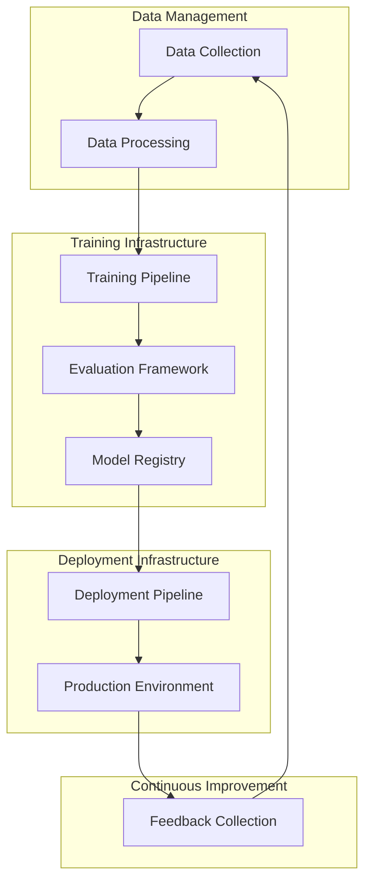
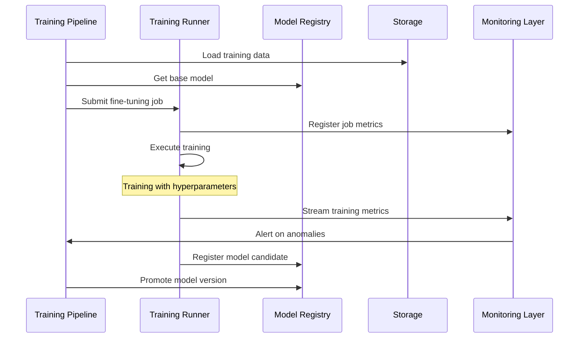
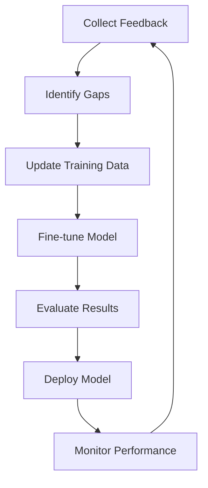

# Fine-tuning Strategy

## Overview

The Fine-tuning Strategy document outlines the approach, methodology, and infrastructure for fine-tuning Large Language Models (LLMs) to optimize their performance for specific engineering roles and tasks within the Engineering AI Agent system.

## System Architecture

The fine-tuning system follows a structured pipeline for collecting data, training models, evaluating results, and deploying optimized models:



## Key Components

### 1. Data Collection and Processing Pipeline

The data pipeline handles the collection, cleaning, transformation, and validation of fine-tuning datasets:

```python
class DataPipeline:
    """Pipeline for processing fine-tuning data"""
    
    def __init__(self, config):
        """Initialize pipeline with configuration"""
        self.config = config
        self.filters = self._initialize_filters(config.get('filters', []))
        self.transformers = self._initialize_transformers(config.get('transformers', []))
        self.validators = self._initialize_validators(config.get('validators', []))
    
    def process(self, raw_data):
        """Process raw data through the pipeline"""
        filtered_data = self._apply_filters(raw_data)
        transformed_data = self._apply_transformers(filtered_data)
        validated_data = self._apply_validators(transformed_data)
        return validated_data
    
    def _apply_filters(self, raw_data):
        """Apply filters to the raw data"""
        filtered_data = raw_data
        for filter_fn in self.filters:
            filtered_data = filter_fn(filtered_data)
        return filtered_data
    
    def _apply_transformers(self, filtered_data):
        """Apply transformations to the filtered data"""
        transformed_data = filtered_data
        for transformer in self.transformers:
            transformed_data = transformer(transformed_data)
        return transformed_data
    
    def _apply_validators(self, transformed_data):
        """Apply validation to the transformed data"""
        for validator in self.validators:
            validation_result = validator(transformed_data)
            if not validation_result['valid']:
                raise ValidationError(validation_result['message'])
        return transformed_data
    
    def _initialize_filters(self, filter_configs):
        """Initialize filter functions from configuration"""
        # Implementation details...
        return filters
    
    def _initialize_transformers(self, transformer_configs):
        """Initialize transformer functions from configuration"""
        # Implementation details...
        return transformers
    
    def _initialize_validators(self, validator_configs):
        """Initialize validator functions from configuration"""
        # Implementation details...
        return validators
```

#### Data Format

Fine-tuning data follows a standardized format:

```json
{
  "examples": [
    {
      "id": "example-001",
      "role": "software-architect",
      "task_type": "architecture-review",
      "messages": [
        {
          "role": "system",
          "content": "You are an experienced software architect helping review and improve system designs."
        },
        {
          "role": "user",
          "content": "Please review this microservice architecture diagram and identify any potential issues with scalability or resilience: [Architecture diagram with 3 microservices connected via REST APIs and a shared database]"
        },
        {
          "role": "assistant",
          "content": "I've analyzed the architecture diagram and identified several potential issues:\n\n1. **Shared Database Anti-pattern**\n   The microservices are sharing a single database, which creates tight coupling and limits independent scalability. Each service should ideally have its own data store.\n\n2. **Synchronous Communication**\n   The exclusive use of REST APIs for inter-service communication could create availability issues. Consider using asynchronous communication patterns with message queues for non-blocking operations.\n\n3. **Single Points of Failure**\n   I don't see any redundancy in the database or service deployment. Consider implementing database replication and deploying multiple instances of each service.\n\n4. **Missing API Gateway**\n   There's no API gateway to handle cross-cutting concerns like authentication, routing, and rate limiting.\n\nRecommended improvements:\n1. Implement database-per-service pattern with eventual consistency\n2. Add message broker for asynchronous communication\n3. Implement service discovery mechanism\n4. Add API gateway for client communication\n5. Consider CQRS pattern for complex data operations"
        }
      ],
      "metadata": {
        "source": "expert_annotation",
        "difficulty": "intermediate",
        "quality_score": 0.95,
        "tags": ["architecture", "microservices", "scalability"]
      }
    }
  ]
}
```

### 2. Training Pipeline

The training pipeline orchestrates the fine-tuning process across different infrastructure components:



#### Hyperparameter Configuration

Training hyperparameters are defined in YAML configuration:

```yaml
fine_tuning:
  base_model: gpt-4-0125-preview
  training:
    epochs: 3
    batch_size: 4
    learning_rate: 2.0e-5
    weight_decay: 0.01
    warmup_steps: 500
    lr_scheduler: cosine
    gradient_accumulation_steps: 8
  validation:
    split: 0.1
    metrics:
      - accuracy
      - perplexity
      - exact_match
      - rouge_l
      - custom_code_quality
  early_stopping:
    patience: 3
    min_delta: 0.01
    monitor: val_loss
```

### 3. Evaluation Framework

The evaluation framework provides comprehensive assessment of fine-tuned models:

```python
def evaluate_model(model_id, evaluation_datasets, metrics):
    """
    Evaluate a fine-tuned model against multiple datasets using specified metrics
    
    Args:
        model_id: The ID of the model to evaluate
        evaluation_datasets: List of datasets to evaluate against
        metrics: List of metrics to calculate
        
    Returns:
        Dictionary containing evaluation results
    """
    results = {}
    
    for dataset in evaluation_datasets:
        dataset_results = {}
        
        # Load dataset
        eval_data = load_dataset(dataset['path'])
        
        # Run inference
        predictions = run_model_inference(model_id, eval_data)
        
        # Calculate metrics
        for metric_name in metrics:
            metric_fn = get_metric_function(metric_name)
            score = metric_fn(predictions, eval_data.references)
            dataset_results[metric_name] = score
            
        results[dataset['name']] = dataset_results
    
    # Calculate aggregate scores
    results['aggregate'] = calculate_aggregate_scores(results)
    
    return results
```

#### Evaluation Metrics

Models are evaluated using multiple dimensions:

1. **Task-specific Performance**: Accuracy on engineering tasks
2. **Code Quality**: Assessment of generated code quality
3. **Technical Correctness**: Factual accuracy of responses
4. **Response Efficiency**: Token economy and relevance

### 4. Model Versioning

Models follow a structured versioning scheme:

```
ea-[role]-[base_model]-[version]-[timestamp]
```

For example:
- `ea-software-developer-gpt4-v2.3-20250215`
- `ea-system-architect-llama3-v1.5-20250301`

### 5. Deployment Workflow

Model deployment follows a staged approach:

1. **Canary Testing**: Initial deployment to 5% of traffic
2. **Validation**: Automated checks against performance criteria
3. **Staged Rollout**: Incremental traffic increase with monitoring
4. **Gradual Rollout**: Increasing traffic percentage over time
5. **Full Deployment**: Complete replacement of previous model

#### Kubernetes Deployment Configuration

```yaml
apiVersion: apps/v1
kind: Deployment
metadata:
  name: model-ea-software-developer-v2
  namespace: ai-services
spec:
  replicas: 3
  selector:
    matchLabels:
      app: model-server
      model: ea-software-developer
      version: v2
  template:
    metadata:
      labels:
        app: model-server
        model: ea-software-developer
        version: v2
    spec:
      containers:
      - name: model-server
        image: ea-registry.io/model-server:1.4.2
        env:
        - name: MODEL_PATH
          value: /models/ea-software-developer-gpt4-v2.3-20250215
        - name: ENABLE_TRACING
          value: "true"
        volumeMounts:
        - name: model-volume
          mountPath: /models
        resources:
          limits:
            cpu: "4"
            memory: "16Gi"
            nvidia.com/gpu: "1"
          requests:
            cpu: "2"
            memory: "8Gi"
        readinessProbe:
          httpGet:
            path: /health
            port: 8080
          initialDelaySeconds: 30
          periodSeconds: 10
      volumes:
      - name: model-volume
        persistentVolumeClaim:
          claimName: model-storage-pvc
```

## Role-specific Fine-tuning

Different engineering roles require specialized fine-tuning focus areas:

| Role               | Focus Areas                                                                   | Example Tasks                                                            |
|--------------------|-------------------------------------------------------------------------------|--------------------------------------------------------------------------|
| Software Developer | Code generation, debugging, refactoring                                       | Implement algorithm, fix bug, improve code quality                       |
| Software Architect | System design, architecture patterns, component interaction                   | Design microservice architecture, evaluate tech stack, plan migration    |
| QA Engineer        | Test planning, test case generation, bug identification                       | Write test plan, generate test cases, analyze logs                       |
| DevOps Engineer    | Infrastructure definition, CI/CD pipeline optimization, operational stability | Create Kubernetes manifest, optimize CI pipeline, debug production issue |
| Product Manager    | Requirements analysis, feature prioritization, specification writing          | Parse user story, rank features, write acceptance criteria               |

## Continuous Improvement Cycle

Fine-tuning follows a continuous improvement cycle:



### Feedback Collection

Feedback is collected from multiple sources:

1. **User Ratings**: Explicit ratings and feedback on model outputs
2. **Expert Reviews**: Domain expert assessments of model performance
3. **Performance Metrics**: Automated measurement of success rates
4. **Error Analysis**: Detailed review of failure cases

## API Endpoints

| Endpoint                                | Method | Description                           |
|-----------------------------------------|--------|---------------------------------------|
| `/api/v1/fine-tuning/jobs`              | POST   | Create a new fine-tuning job          |
| `/api/v1/fine-tuning/jobs/{job_id}`     | GET    | Get status of a fine-tuning job       |
| `/api/v1/fine-tuning/models`            | GET    | List available fine-tuned models      |
| `/api/v1/fine-tuning/models/{model_id}` | GET    | Get details of a specific model       |
| `/api/v1/fine-tuning/evaluations`       | POST   | Create a new evaluation job           |
| `/api/v1/fine-tuning/feedback`          | POST   | Submit feedback for model improvement |

## Future Enhancements

1. **Few-shot Learning**: Implementing dynamic few-shot example selection
2. **Cross-role Knowledge**: Enabling knowledge sharing across specialized models
3. **Parameter-efficient Fine-tuning**: Implementing LoRA and QLoRA techniques
4. **Human-in-the-loop**: Adding expert validation and correction workflows
5. **Multi-modal Fine-tuning**: Extending to code+text+diagram understanding
