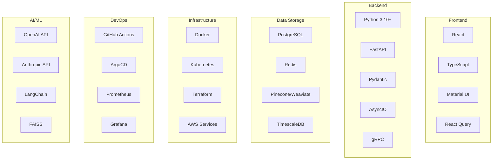

# Engineering AI Agent Technology Stack

This document provides a comprehensive overview of the technology stack used in the Engineering AI Agent platform. It includes detailed information about programming languages, frameworks, libraries, and tools used in different components of the system.

## Core Technology Stack



## Programming Languages

### Python 3.10+

Python is the primary backend language for the Engineering AI Agent platform.

**Key Features Used:**
- Type hints for improved code quality and IDE support
- Async/await for non-blocking I/O operations
- Pattern matching for elegant data handling
- Context managers for resource management

**Best Practices:**
- Use type hints consistently throughout the codebase
- Follow PEP 8 style guidelines
- Leverage virtual environments for dependency isolation
- Use dataclasses for data-heavy classes

### TypeScript

TypeScript is used for the administrative dashboard and any frontend components.

**Key Features Used:**
- Strong typing with interfaces and types
- Modern ES6+ features
- Async/await for API calls
- Generics for reusable components

**Best Practices:**
- Define explicit interfaces for all data structures
- Use strict mode for better type safety
- Employ ESLint and Prettier for code quality
- Follow functional programming principles where applicable

## Backend Framework

### FastAPI

FastAPI is the primary web framework for the API Gateway and microservices.

**Key Features Used:**
- Automatic OpenAPI documentation
- Dependency injection system
- Pydantic integration for request/response validation
- Asynchronous request handling

**Implementation Details:**
- API versioning via URL path (/api/v1/, /api/v2/)
- Custom middleware for authentication and logging
- Background tasks for non-blocking operations
- WebSocket support for real-time notifications

**Configuration:**
```python
# Example FastAPI configuration
app = FastAPI(
    title="Engineering AI Agent API",
    description="API for the Engineering AI Agent platform",
    version="1.0.0",
    docs_url="/api/docs",
    redoc_url="/api/redoc",
    openapi_url="/api/openapi.json",
    middleware=[
        Middleware(
            CORSMiddleware,
            allow_origins=settings.CORS_ORIGINS,
            allow_credentials=True,
            allow_methods=["*"],
            allow_headers=["*"],
        ),
        Middleware(RequestIdMiddleware),
        Middleware(LoggingMiddleware),
    ]
)
```

### Pydantic

Pydantic is used for data validation, settings management, and serialization/deserialization.

**Key Features Used:**
- Data validation with custom validators
- Settings management with environment variable loading
- JSON schema generation
- ORM mode for database model integration

**Implementation Details:**
- BaseModel extension for common fields
- Custom validators for complex validation logic
- Field-level configuration for serialization control
- JSON schema customization for OpenAPI docs

**Example Models:**
```python
class TaskBase(BaseModel):
    title: str
    description: str
    priority: TaskPriority
    due_date: Optional[datetime] = None
    tags: List[str] = []
    
    @validator('due_date')
    def due_date_must_be_future(cls, v):
        if v and v < datetime.now():
            raise ValueError('due date must be in the future')
        return v

class TaskCreate(TaskBase):
    project_id: UUID

class TaskUpdate(BaseModel):
    title: Optional[str] = None
    description: Optional[str] = None
    priority: Optional[TaskPriority] = None
    due_date: Optional[datetime] = None
    tags: Optional[List[str]] = None
    status: Optional[TaskStatus] = None

class TaskInDB(TaskBase):
    id: UUID
    created_at: datetime
    updated_at: datetime
    created_by: UUID
    assigned_to: Optional[UUID] = None
    status: TaskStatus = TaskStatus.TODO
    
    class Config:
        orm_mode = True
```

## Database Technologies

### PostgreSQL

PostgreSQL is the primary relational database for structured data storage.

**Key Features Used:**
- JSON/JSONB data types for flexible schema
- Full-text search capabilities
- Advanced indexing strategies
- Transaction isolation levels

**Schema Design:**
- Normalized design for core entities
- Foreign key constraints for referential integrity
- Appropriate indexes for query performance
- Partitioning for large tables

**Access Patterns:**
- SQLAlchemy ORM for Python interaction
- Connection pooling for resource efficiency
- Prepared statements for security and performance
- Read replicas for scaling read operations

### Redis

Redis is used for caching, rate limiting, and pub/sub messaging.

**Key Features Used:**
- Key-value caching with TTL
- Distributed locking
- Rate limiting implementation
- Pub/Sub for real-time messaging

**Implementation Details:**
- Cache invalidation strategy
- Connection pooling configuration
- Sentinel/Cluster setup for high availability
- Lua scripts for atomic operations

### Pinecone/Weaviate

Vector database for storing and querying embeddings for semantic search.

**Key Features Used:**
- Vector similarity search
- Metadata filtering
- Hybrid search (vector + keyword)
- Namespace isolation

**Implementation Details:**
- Embedding generation strategies
- Index configuration for performance/accuracy tradeoffs
- Query optimization techniques
- Chunking strategy for documents

## Frontend Technologies

### React

React is used for building the admin dashboard and any user interfaces.

**Key Features Used:**
- Functional components with hooks
- Context API for state management
- Suspense for data loading
- Error boundaries for graceful error handling

**Best Practices:**
- Component composition over inheritance
- Container/presentation component pattern
- Custom hooks for reusable logic
- Memoization for performance optimization

### Material UI

Material UI provides a consistent component library for the frontend.

**Key Features Used:**
- Theming system for brand consistency
- Responsive layout components
- Form components with validation integration
- Data display components (tables, lists, etc.)

**Customization:**
- Custom theme configuration
- Styled components for custom styling
- Component overrides for unique requirements
- Responsive design utilities

## Infrastructure & DevOps

### Docker & Kubernetes

Docker is used for containerization, and Kubernetes for orchestration.

**Key Features Used:**
- Multi-stage builds for optimized images
- Helm charts for deployment management
- StatefulSets for stateful services
- ConfigMaps and Secrets for configuration

**Implementation Details:**
- Resource limits and requests
- Horizontal pod autoscaling
- Liveness and readiness probes
- Network policies for security

**Example Dockerfile:**
```dockerfile
# Build stage
FROM python:3.10-slim AS builder

WORKDIR /app

COPY requirements.txt .
RUN pip wheel --no-cache-dir --no-deps --wheel-dir /app/wheels -r requirements.txt

# Final stage
FROM python:3.10-slim

WORKDIR /app

# Copy built wheels and install
COPY --from=builder /app/wheels /wheels
RUN pip install --no-cache /wheels/*

COPY . .

ENV PYTHONPATH=/app
ENV PYTHONUNBUFFERED=1

EXPOSE 8000

CMD ["uvicorn", "app.main:app", "--host", "0.0.0.0", "--port", "8000"]
```

### Terraform

Terraform is used for infrastructure as code.

**Key Features Used:**
- Modules for reusable infrastructure components
- Remote state storage for collaboration
- Workspaces for environment separation
- Provider configuration for multi-cloud support

**Implementation Details:**
- Resource naming conventions
- State locking configuration
- Variable organization for configuration
- Output definitions for cross-stack references

### AWS Services

AWS is the primary cloud provider for the platform.

**Key Services Used:**
- EKS for Kubernetes orchestration
- RDS for PostgreSQL databases
- ElastiCache for Redis
- S3 for object storage
- SQS/SNS for messaging
- CloudWatch for monitoring
- IAM for access management

## AI/ML Technologies

### LLM Providers

The platform integrates with multiple LLM providers:

**OpenAI API:**
- Models: GPT-4, GPT-3.5-Turbo
- Features: Function calling, JSON mode, vision capabilities
- Implementation: Direct API calls with retry mechanisms

**Anthropic API:**
- Models: Claude 3 (Opus, Sonnet, Haiku)
- Features: Tool use, structured output
- Implementation: Direct API integration with fallback strategies

**Google AI API:**
- Models: Gemini Pro, Gemini Ultra
- Features: Multimodal capabilities, function calling
- Implementation: Secondary fallback option

### LangChain

LangChain is used for orchestrating LLM interactions.

**Key Features Used:**
- Prompt templates and management
- Chain composition for complex workflows
- Document loaders for data ingestion
- Output parsers for structured responses

**Implementation Details:**
- Custom chain implementations for domain-specific tasks
- Integration with vector stores for retrieval
- Memory management for conversation context
- Callbacks for observability

### Vector Libraries

FAISS and other vector libraries are used for efficient similarity search.

**Key Features Used:**
- Approximate nearest neighbor search
- Index types optimized for different use cases
- Clustering capabilities
- Batched operations for performance

**Implementation Details:**
- Index configuration for speed/recall tradeoffs
- Quantization for memory efficiency
- Hybrid search techniques
- Dimensionality reduction where appropriate

## Testing Technologies

### PyTest

PyTest is the primary testing framework for Python components.

**Key Features Used:**
- Fixtures for test setup and dependency injection
- Parameterization for testing multiple scenarios
- Mocking and patching for isolation
- Markers for test categorization

**Implementation Details:**
- Test organization by component/feature
- Integration test setup with containers
- Async test support
- Coverage reporting configuration

### Jest & React Testing Library

Jest and React Testing Library are used for frontend testing.

**Key Features Used:**
- Component rendering and interaction testing
- Mock service worker for API mocking
- Snapshot testing for UI regression
- User event simulation

**Implementation Details:**
- Test organization by component
- Custom test utilities and renderers
- Integration with CI/CD pipeline
- Visual regression testing setup

## Monitoring & Observability

### Prometheus & Grafana

Prometheus is used for metrics collection, and Grafana for visualization.

**Key Features Used:**
- Custom metrics for business KPIs
- Alert rules for proactive monitoring
- Recording rules for complex calculations
- Dashboard templates for different stakeholders

**Implementation Details:**
- Service-level objectives (SLOs) definition
- Cardinality management for scalable metrics
- Retention and aggregation policies
- Integration with alerting systems

### ELK Stack / OpenSearch

The ELK Stack (Elasticsearch, Logstash, Kibana) or OpenSearch is used for log management.

**Key Features Used:**
- Structured logging format
- Log aggregation and centralization
- Full-text search and filtering
- Visualization and dashboard creation

**Implementation Details:**
- Log routing and shipping configuration
- Index lifecycle management
- Alerting based on log patterns
- Audit logging for compliance

### Jaeger / OpenTelemetry

Distributed tracing is implemented using Jaeger or OpenTelemetry.

**Key Features Used:**
- Trace context propagation
- Span creation and tagging
- Sampling strategies
- Service dependency visualization

**Implementation Details:**
- Instrumentation approach for different services
- Integration with existing middleware
- Correlation with logs and metrics
- Performance impact minimization

## Version Control & CI/CD

### GitHub

GitHub is used for source code management and collaboration.

**Key Features Used:**
- Pull request workflow
- Branch protection rules
- Code owners for review assignment
- Issue templates and project boards

**Implementation Details:**
- Branching strategy (GitHub Flow)
- Commit message conventions
- Pull request templates
- Code review guidelines

### GitHub Actions

GitHub Actions is used for continuous integration and delivery.

**Key Features Used:**
- Matrix builds for multiple environments
- Caching for faster builds
- Environment deployments
- Reusable workflows

**Implementation Details:**
- Pipeline organization by stage
- Secret management
- Integration with code quality tools
- Deployment approval process

## Development Tools

### Development Environment

The recommended development environment includes:

- VS Code with Python, TypeScript, and Docker extensions
- Pre-commit hooks for code quality
- Local Kubernetes (k3d/minikube) for testing
- Docker Compose for local dependencies

**Setup Instructions:**
- Local environment configuration
- IDE settings and extensions
- Debug configuration
- Local secrets management

### Code Quality Tools

Code quality is maintained using:

- Black for Python formatting
- isort for import sorting
- flake8 for linting
- mypy for type checking
- ESLint and Prettier for TypeScript/JavaScript

**Configuration:**
- Tool-specific settings
- Integration with pre-commit
- CI enforcement
- Editor integration

## Conclusion

This technology stack is designed to provide a robust, scalable, and maintainable foundation for the Engineering AI Agent platform. Each technology was selected based on its strengths in addressing specific requirements of the system.

Developers are encouraged to follow the established patterns and best practices when working with these technologies to ensure consistency across the codebase.
