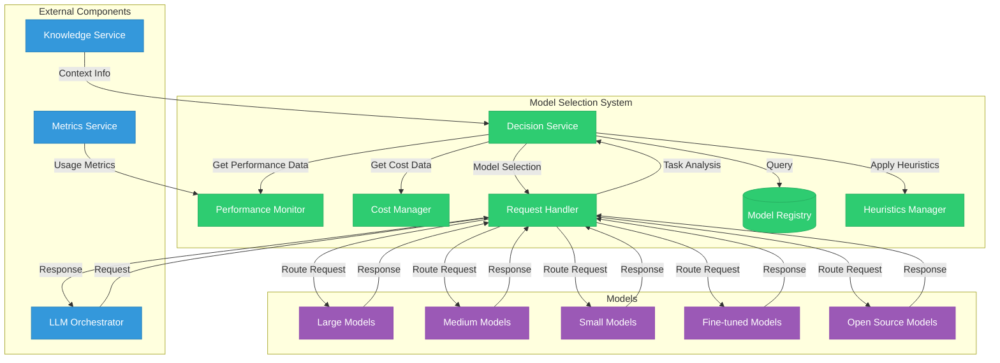
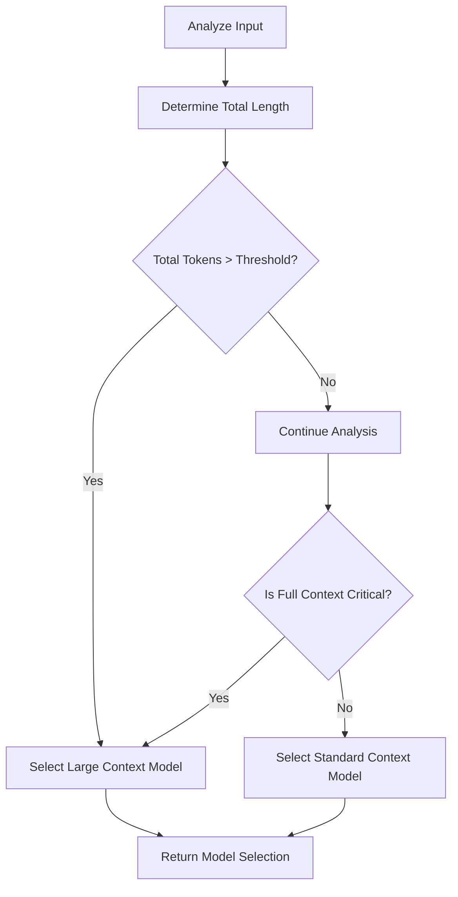
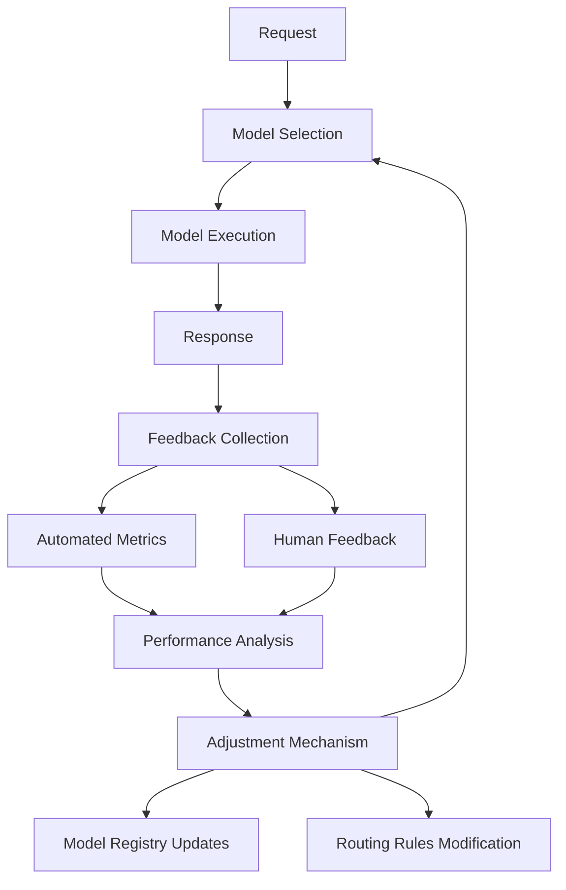

# Model Selection

## Overview

The Model Selection system is responsible for determining which AI model is most appropriate for a given task within the Engineering AI Agent. This component optimizes for performance, cost-efficiency, and quality by dynamically routing requests to the most suitable models based on various criteria.



## Core Components

### Decision Service

The Decision Service is the brain of the Model Selection system, evaluating multiple factors to determine the optimal model for a specific request:

```python
class DecisionService:
    def select_model(self, task_data, constraints=None):
        """
        Select the optimal model for a given task based on multiple criteria.
        
        Args:
            task_data: Information about the task including type, complexity, context length.
            constraints: Optional constraints such as max_cost, max_latency, required_capabilities.
            
        Returns:
            selected_model: The model identifier that best matches the requirements.
        """
        # 1. Analyze task requirements
        task_requirements = self._analyze_task(task_data)
        
        # 2. Get candidate models from registry
        candidate_models = self.model_registry.get_candidates(task_requirements)
        
        # 3. Apply filters based on constraints
        if constraints:
            candidate_models = self._apply_constraints(candidate_models, constraints)
        
        # 4. Score models based on multiple criteria
        model_scores = {}
        for model in candidate_models:
            performance_score = self.performance_monitor.get_score(model, task_requirements)
            cost_score = self.cost_manager.get_score(model, task_data)
            feature_score = self._calculate_feature_match(model, task_requirements)
            
            # Combined score with customizable weights
            model_scores[model] = (
                performance_score * self.weights["performance"] +
                cost_score * self.weights["cost"] +
                feature_score * self.weights["features"]
            )
        
        # 5. Apply heuristics for special cases
        model_scores = self.heuristics_manager.apply_heuristics(model_scores, task_data)
        
        # 6. Select the highest scoring model
        selected_model = max(model_scores.items(), key=lambda x: x[1])[0]
        
        # 7. Log the decision for future analysis
        self._log_decision(task_data, selected_model, model_scores)
        
        return selected_model
```

### Model Registry

The Model Registry maintains information about all available models, their capabilities, and current status:

```json
{
  "models": [
    {
      "id": "gpt-4",
      "provider": "openai",
      "size_category": "large",
      "context_window": 8192,
      "capabilities": ["code_generation", "reasoning", "instruction_following", "creativity"],
      "specializations": ["software_development", "technical_writing"],
      "performance_tier": "premium",
      "cost_per_1k_tokens": {
        "input": 0.03,
        "output": 0.06
      },
      "average_latency_ms": 2500,
      "status": "active"
    },
    {
      "id": "gpt-3.5-turbo",
      "provider": "openai",
      "size_category": "medium",
      "context_window": 4096,
      "capabilities": ["code_generation", "reasoning", "instruction_following"],
      "specializations": ["general_purpose"],
      "performance_tier": "standard",
      "cost_per_1k_tokens": {
        "input": 0.0015,
        "output": 0.002
      },
      "average_latency_ms": 800,
      "status": "active"
    },
    {
      "id": "claude-2",
      "provider": "anthropic",
      "size_category": "large",
      "context_window": 100000,
      "capabilities": ["code_generation", "reasoning", "instruction_following", "long_context"],
      "specializations": ["documentation", "technical_analysis"],
      "performance_tier": "premium",
      "cost_per_1k_tokens": {
        "input": 0.011,
        "output": 0.032
      },
      "average_latency_ms": 3000,
      "status": "active"
    },
    {
      "id": "llama-2-70b",
      "provider": "meta",
      "deployment": "self_hosted",
      "size_category": "large",
      "context_window": 4096,
      "capabilities": ["code_generation", "reasoning", "instruction_following"],
      "specializations": ["general_purpose"],
      "performance_tier": "standard",
      "cost_per_1k_tokens": {
        "input": 0.0005,
        "output": 0.0005
      },
      "average_latency_ms": 4500,
      "status": "active"
    },
    {
      "id": "code-llama-34b",
      "provider": "meta",
      "deployment": "self_hosted",
      "size_category": "medium",
      "context_window": 16384,
      "capabilities": ["code_generation", "code_completion", "debugging"],
      "specializations": ["software_development"],
      "performance_tier": "specialized",
      "cost_per_1k_tokens": {
        "input": 0.0004,
        "output": 0.0004
      },
      "average_latency_ms": 3500,
      "status": "active"
    },
    {
      "id": "software-developer-specialized",
      "base_model": "gpt-4",
      "provider": "openai",
      "deployment": "fine_tuned",
      "size_category": "large",
      "context_window": 8192,
      "capabilities": ["code_generation", "debugging", "refactoring", "test_generation"],
      "specializations": ["software_development"],
      "performance_tier": "specialized",
      "cost_per_1k_tokens": {
        "input": 0.03,
        "output": 0.06
      },
      "average_latency_ms": 2600,
      "status": "active"
    }
  ]
}
```

### Performance Monitor

The Performance Monitor tracks and analyzes model performance across various dimensions:

```python
class PerformanceMonitor:
    def __init__(self, metrics_service):
        self.metrics_service = metrics_service
        self.performance_cache = {}
        self.update_interval = 3600  # Update performance metrics hourly
        
    def get_score(self, model_id, task_requirements):
        """Calculate a performance score for a model on a given task type."""
        # Get recent performance metrics
        metrics = self._get_recent_metrics(model_id, task_requirements["type"])
        
        # Calculate success rate
        success_rate = metrics.get("success_rate", 0.5)  # Default if no data
        
        # Calculate average latency normalized to expectations
        latency_score = self._calculate_latency_score(
            metrics.get("avg_latency"), 
            task_requirements.get("latency_sensitivity", "medium")
        )
        
        # Calculate quality score based on human feedback
        quality_score = metrics.get("quality_rating", 0.5)  # Default if no data
        
        # Calculate error rate penalty
        error_penalty = 1.0 - metrics.get("error_rate", 0)
        
        # Combined weighted score
        weights = self._get_weights_for_task(task_requirements["type"])
        final_score = (
            success_rate * weights["success_rate"] +
            latency_score * weights["latency"] +
            quality_score * weights["quality"] +
            error_penalty * weights["reliability"]
        )
        
        return final_score
        
    def _get_recent_metrics(self, model_id, task_type):
        """Retrieve recent performance metrics for the model on similar tasks."""
        cache_key = f"{model_id}:{task_type}"
        
        # Check if we have fresh cached data
        if cache_key in self.performance_cache:
            cache_entry = self.performance_cache[cache_key]
            if time.time() - cache_entry["timestamp"] < self.update_interval:
                return cache_entry["metrics"]
        
        # Fetch new metrics
        metrics = self.metrics_service.get_model_metrics(
            model_id=model_id,
            task_type=task_type,
            time_window="7d"  # Last 7 days
        )
        
        # Cache the results
        self.performance_cache[cache_key] = {
            "metrics": metrics,
            "timestamp": time.time()
        }
        
        return metrics
```

### Cost Manager

The Cost Manager optimizes model selection based on cost constraints and budget considerations:

```python
class CostManager:
    def __init__(self, budget_service):
        self.budget_service = budget_service
        
    def get_score(self, model_id, task_data):
        """
        Calculate a cost-efficiency score for a model on a given task.
        Higher score means better cost efficiency.
        """
        # Get model cost information
        model_costs = self.budget_service.get_model_costs(model_id)
        
        # Estimate token usage for this task
        estimated_tokens = self._estimate_token_usage(task_data)
        
        # Calculate estimated cost
        estimated_cost = (
            estimated_tokens["input"] * model_costs["cost_per_1k_tokens"]["input"] / 1000 +
            estimated_tokens["output"] * model_costs["cost_per_1k_tokens"]["output"] / 1000
        )
        
        # Get current budget status
        budget_status = self.budget_service.get_budget_status()
        
        # Apply budget considerations
        if budget_status["status"] == "critical":
            # Strongly prefer cheaper models when budget is critical
            cost_score = 1.0 - min(1.0, estimated_cost / budget_status["avg_task_budget"] * 5)
        elif budget_status["status"] == "warning":
            # Prefer cheaper models when budget is warning
            cost_score = 1.0 - min(1.0, estimated_cost / budget_status["avg_task_budget"] * 2)
        else:
            # Normal budget status
            cost_score = 1.0 - min(1.0, estimated_cost / budget_status["avg_task_budget"])
        
        return cost_score
        
    def _estimate_token_usage(self, task_data):
        """Estimate the token usage for input and output based on task data."""
        # Baseline estimations
        input_tokens = len(task_data.get("prompt", "")) / 4  # Rough estimate: 4 chars per token
        
        # Adjust based on task complexity
        complexity_multiplier = {
            "simple": 0.5,
            "medium": 1.0,
            "complex": 2.0
        }.get(task_data.get("complexity", "medium"), 1.0)
        
        # Estimate output tokens based on task type
        output_token_estimates = {
            "code_generation": 1000,
            "text_generation": 500,
            "summarization": 300,
            "classification": 50,
            "question_answering": 200
        }
        
        base_output_tokens = output_token_estimates.get(
            task_data.get("type", "text_generation"), 
            300  # Default value
        )
        
        estimated_output_tokens = base_output_tokens * complexity_multiplier
        
        return {
            "input": input_tokens,
            "output": estimated_output_tokens
        }
```

### Heuristics Manager

The Heuristics Manager applies special rules and considerations to model selection:

```python
class HeuristicsManager:
    def __init__(self):
        self.heuristics = self._load_heuristics()
        
    def apply_heuristics(self, model_scores, task_data):
        """Apply heuristic rules to adjust model scores based on special cases."""
        adjusted_scores = model_scores.copy()
        
        for heuristic in self.heuristics:
            if self._should_apply_heuristic(heuristic, task_data):
                adjusted_scores = heuristic["adjust_function"](adjusted_scores, task_data)
                
        return adjusted_scores
        
    def _should_apply_heuristic(self, heuristic, task_data):
        """Determine if a heuristic should be applied to this task."""
        condition = heuristic["condition"]
        
        if condition["type"] == "task_type":
            return task_data.get("type") in condition["values"]
            
        elif condition["type"] == "complexity":
            return task_data.get("complexity") in condition["values"]
            
        elif condition["type"] == "token_count":
            estimated_tokens = task_data.get("estimated_tokens", {})
            return estimated_tokens.get("input", 0) > condition["threshold"]
            
        elif condition["type"] == "time_sensitivity":
            return task_data.get("time_sensitivity") in condition["values"]
            
        return False
        
    def _load_heuristics(self):
        """Load heuristic rules from configuration."""
        return [
            {
                "name": "prefer_specialized_for_code",
                "condition": {
                    "type": "task_type",
                    "values": ["code_generation", "code_review", "debugging"]
                },
                "adjust_function": lambda scores, task: self._boost_specialized_models(scores, ["code_generation"], 1.5)
            },
            {
                "name": "prefer_large_context_for_long_inputs",
                "condition": {
                    "type": "token_count",
                    "threshold": 4000
                },
                "adjust_function": lambda scores, task: self._boost_models_by_feature(scores, "large_context", 2.0)
            },
            {
                "name": "prefer_fast_models_for_interactive",
                "condition": {
                    "type": "time_sensitivity",
                    "values": ["high", "critical"]
                },
                "adjust_function": lambda scores, task: self._boost_fast_models(scores, 3.0)
            }
        ]
```

### Request Handler

The Request Handler manages the flow of requests through the Model Selection system:

```python
class RequestHandler:
    def __init__(self, decision_service, model_clients):
        self.decision_service = decision_service
        self.model_clients = model_clients
        
    async def handle_request(self, request):
        """Process an incoming model request, select model, and route appropriately."""
        # Extract task data
        task_data = self._extract_task_data(request)
        
        # Extract constraints if any
        constraints = request.get("constraints")
        
        # Select the optimal model
        selected_model = self.decision_service.select_model(task_data, constraints)
        
        # Get the appropriate model client
        model_client = self._get_model_client(selected_model)
        
        # Pre-process the request for the selected model
        processed_request = self._preprocess_request(request, selected_model)
        
        # Send request to the model
        try:
            response = await model_client.generate(processed_request)
            return {
                "status": "success",
                "model_used": selected_model,
                "response": response
            }
        except Exception as e:
            # Handle errors and possibly retry with fallback model
            return await self._handle_model_error(e, request, selected_model)
            
    async def _handle_model_error(self, error, request, failed_model):
        """Handle model errors with appropriate fallback strategies."""
        # Log the error
        logger.error(f"Error using model {failed_model}: {str(error)}")
        
        # Get fallback models
        fallback_models = self.decision_service.get_fallbacks(failed_model)
        
        if not fallback_models:
            return {
                "status": "error",
                "error": str(error),
                "model_used": failed_model
            }
        
        # Try fallback models in order
        for fallback_model in fallback_models:
            try:
                model_client = self._get_model_client(fallback_model)
                processed_request = self._preprocess_request(request, fallback_model)
                response = await model_client.generate(processed_request)
                
                # Success with fallback
                return {
                    "status": "success",
                    "model_used": fallback_model,
                    "fallback_from": failed_model,
                    "response": response
                }
            except Exception as fallback_error:
                logger.error(f"Fallback error using {fallback_model}: {str(fallback_error)}")
                # Continue to next fallback
        
        # All fallbacks failed
        return {
            "status": "error",
            "error": "All models including fallbacks failed",
            "model_used": failed_model
        }
```

## Selection Criteria

### Task Complexity Assessment

The system evaluates task complexity to match with appropriate model capabilities:

| Complexity Level | Characteristics | Preferred Model Size |
|-----------------|----------------|---------------------|
| Simple | Basic tasks, straightforward instructions, limited context | Small |
| Medium | Multi-step tasks, moderate context, standard reasoning | Medium |
| Complex | Advanced reasoning, specialized domain knowledge, creative tasks | Large |
| Expert | System design, complex problem-solving, nuanced understanding | Large + Specialized |

### Context Length Optimization

Model selection considers the input and expected output lengths:



### Domain Specialization

The system maps task domains to specialized models:

| Domain | Specialized Models | Characteristics |
|--------|-------------------|----------------|
| Software Development | `software-developer-specialized`, `code-llama-34b` | Code generation, debugging, software architecture |
| Requirements Analysis | `requirements-analyst-ft` | Natural language understanding, ambiguity detection |
| Quality Assurance | `qa-specialist-ft` | Test generation, bug identification, edge case analysis |
| DevOps | `devops-engineer-ft` | Infrastructure as code, deployment scripts, monitoring |
| Technical Writing | `technical-writer-ft` | Documentation, clear explanations, formatting |

### Cost Optimization Strategies

Different cost optimization strategies are applied based on budget status:

| Budget Status | Strategy | Description |
|--------------|----------|-------------|
| Normal | Balanced | Consider cost as one factor among many in selection |
| Warning | Cost-Conscious | Give higher weight to cost in selection criteria |
| Critical | Minimum Viable | Use smallest/cheapest model that can accomplish the task |
| Unlimited | Performance-First | Prioritize performance and quality over cost considerations |

## Model Fallback Mechanisms

### Fallback Chains

The system defines fallback sequences for different model categories:

```json
{
  "fallback_chains": {
    "large_general": [
      "gpt-4",
      "claude-2",
      "llama-2-70b",
      "gpt-3.5-turbo"
    ],
    "code_specialized": [
      "software-developer-specialized",
      "code-llama-34b",
      "gpt-4",
      "gpt-3.5-turbo"
    ],
    "requirements_specialized": [
      "requirements-analyst-ft",
      "gpt-4",
      "claude-2",
      "gpt-3.5-turbo"
    ]
  }
}
```

### Fallback Triggers

Fallbacks are activated based on specific trigger conditions:

1. **Service Unavailability**: API errors, timeouts, or service disruptions
2. **Rate Limiting**: When usage quotas are exceeded
3. **Context Overflow**: When input exceeds model's context window
4. **Quality Threshold**: When confidence in output quality is below threshold
5. **Specialized Failure**: When a specialized model fails at its primary task

## Routing Strategies

### Load Balancing

The system implements load balancing across equivalent models:

```python
def load_balance_requests(models, request_history):
    """Distribute requests across equivalent models based on current load."""
    model_loads = {}
    
    # Calculate current load for each model
    for model in models:
        recent_requests = request_history.get_recent(model, window="5m")
        current_requests = request_history.get_in_progress(model)
        
        # Calculate load score
        load_score = len(current_requests) + (len(recent_requests) * 0.2)
        model_loads[model] = load_score
    
    # Find the model with minimum load
    min_load_model = min(model_loads.items(), key=lambda x: x[1])[0]
    
    return min_load_model
```

### Scheduled Routing

Different routing policies can be scheduled based on time periods:

```json
{
  "routing_schedules": [
    {
      "name": "business_hours",
      "active": {
        "days": ["monday", "tuesday", "wednesday", "thursday", "friday"],
        "hours": [9, 10, 11, 12, 13, 14, 15, 16, 17]
      },
      "policy": "performance_priority"
    },
    {
      "name": "off_hours",
      "active": "outside_business_hours",
      "policy": "cost_priority"
    },
    {
      "name": "weekend",
      "active": {
        "days": ["saturday", "sunday"]
      },
      "policy": "balanced"
    }
  ]
}
```

## Request Preprocessing

### Dynamic Prompt Optimization

The system adapts prompts based on the selected model:

```python
def optimize_prompt_for_model(prompt, model_id, model_registry):
    """Optimize a prompt for a specific model's capabilities and limitations."""
    model_info = model_registry.get_model(model_id)
    
    # Get model-specific optimization rules
    optimization_rules = get_optimization_rules(model_id)
    
    optimized_prompt = prompt
    
    # Apply model-specific optimizations
    for rule in optimization_rules:
        optimized_prompt = apply_optimization_rule(optimized_prompt, rule)
    
    # Handle context length limitations
    if len(optimized_prompt) > model_info["context_window"] * 3.5:  # Approximate tokens
        optimized_prompt = truncate_prompt(optimized_prompt, model_info["context_window"])
    
    # Add model-specific formatting
    optimized_prompt = format_for_model(optimized_prompt, model_id)
    
    return optimized_prompt
```

### Context Windowing

For long inputs that exceed context limits, the system implements context windowing:

```python
def apply_context_windowing(full_context, query, model_context_limit):
    """Apply a sliding window approach for long contexts."""
    if len(full_context) + len(query) <= model_context_limit:
        return full_context + query
    
    # Calculate how much context we can keep
    available_context_space = model_context_limit - len(query) - 100  # Buffer
    
    # Strategy 1: Keep most recent context
    recent_context = full_context[-available_context_space:]
    
    # Strategy 2: Summarize older context
    older_context = full_context[:-available_context_space]
    summary = generate_summary(older_context)
    
    # Combine summarized older context with recent context
    windowed_context = summary + "\n\n" + recent_context
    
    return windowed_context + query
```

## Monitoring and Feedback

### Performance Metrics

The system tracks key metrics for continuous improvement:

| Metric | Description | Usage |
|--------|-------------|-------|
| Success Rate | Percentage of successful completions | Model reliability assessment |
| Latency | Response time by model and task type | Performance optimization |
| Token Efficiency | Output quality per token used | Cost optimization |
| Fallback Rate | Frequency of fallback activation | Reliability improvement |
| User Satisfaction | Feedback ratings from users | Quality assessment |

### Feedback Loop

Continuous improvement through automated and human feedback:



## Deployment Configuration

### Kubernetes Deployment

```yaml
apiVersion: apps/v1
kind: Deployment
metadata:
  name: model-selection-service
  namespace: engineering-ai-agent
spec:
  replicas: 3
  selector:
    matchLabels:
      app: model-selection-service
  template:
    metadata:
      labels:
        app: model-selection-service
    spec:
      containers:
        - name: model-selection-service
          image: engineering-ai-agent/model-selection:latest
          ports:
            - containerPort: 8080
          env:
            - name: REDIS_URL
              valueFrom:
                secretKeyRef:
                  name: model-selection-secrets
                  key: redis-url
            - name: METRICS_SERVICE_URL
              valueFrom:
                configMapKeyRef:
                  name: service-endpoints
                  key: metrics-service
            - name: BUDGET_SERVICE_URL
              valueFrom:
                configMapKeyRef:
                  name: service-endpoints
                  key: budget-service
          resources:
            requests:
              memory: "256Mi"
              cpu: "100m"
            limits:
              memory: "512Mi"
              cpu: "300m"
          livenessProbe:
            httpGet:
              path: /health
              port: 8080
            initialDelaySeconds: 30
            periodSeconds: 10
          readinessProbe:
            httpGet:
              path: /health/ready
              port: 8080
            initialDelaySeconds: 5
            periodSeconds: 5
```

## API Endpoints

The Model Selection system exposes the following API endpoints:

| Endpoint | Method | Description |
|----------|--------|-------------|
| `/models/select` | POST | Select optimal model for a given task |
| `/models` | GET | List all available models with capabilities |
| `/models/{id}` | GET | Get detailed information about a specific model |
| `/models/{id}/performance` | GET | Get performance metrics for a specific model |
| `/fallbacks/{id}` | GET | Get fallback chain for a specific model |
| `/health` | GET | Health check endpoint |

## Testing Strategy

### Unit Testing

Tests for individual components:

- Decision service logic
- Cost calculation algorithms
- Performance scoring mechanisms
- Fallback handling

### Integration Testing

Tests for interactions between components:

- End-to-end model selection process
- Metrics collection and analysis
- Load balancing behavior

### Simulation Testing

Simulation of various scenarios:

- High load conditions
- API failures and timeouts
- Budget constraint scenarios
- Complex task processing

## Future Enhancements

1. **Reinforcement Learning**: Using RL to optimize model selection based on outcomes
2. **Predictive Routing**: Anticipating load patterns and preemptively adjusting routing
3. **Multi-model Ensembles**: Combining results from multiple models for critical tasks
4. **Automated A/B Testing**: Systematic comparison of different routing strategies
5. **User Preference Learning**: Tailoring model selection to individual user preferences
6. **Adaptive Cost Management**: Dynamic budget allocation based on business priorities

```python
class HeuristicsManager:
    def __init__(self):
        self.heuristics = self._load_heuristics()
        
    def apply_heuristics(self, model_scores, task_data):
        """Apply heuristic rules to adjust model scores based on special cases."""
        adjusted_scores = model_scores.copy()
        
        for heuristic in self.heuristics:
            if self._should_apply_heuristic(heuristic, task_data):
                adjusted_scores = heuristic["adjust_function"](adjusted_scores, task_data)
                
        return adjusted_scores
        
    def _should_apply_heuristic(self, heuristic, task_data):
        """Determine if a heuristic should be applied to this task."""
        condition = heuristic["condition"]
        
        if condition["type"] == "task_type":
            return task_data.get("type") in condition["values"]
            
        elif condition["type"] == "complexity":
            return task_data.get("complexity") in condition["values"]
            
        elif condition["type"] == "token_count":
            estimated_tokens = task_data.get("estimated_tokens", {})
            return estimated_tokens.get("input", 0) > condition["threshold"]
            
        elif condition["type"] == "time_sensitivity":
            return task_data.get("time_sensitivity") in condition["values"]
            
        return False
        
    def _load_heuristics(self):
        """Load heuristic rules from configuration."""
        return [
            {
                "name": "prefer_specialized_for_code",
                "condition": {
                    "type": "task_type",
                    "values": ["code_generation", "code_review", "debugging"]
                },
                "adjust_function": lambda scores, task: self._boost_specialized_models(scores, ["code_generation"], 1.5)
            },
            {
                "name": "prefer_large_context_for_long_inputs",
                "condition": {
                    "type": "token_count",
                    "threshold": 4000
                },
                "adjust_function": lambda scores, task: self._boost_models_by_feature(scores, "large_context", 2.0)
            },
            {
                "name": "prefer_fast_models_for_interactive",
                "condition": {
                    "type": "time_sensitivity",
                    "values": ["high", "critical"]
                },
                "adjust_function": (lambda scores, task: self._boost_fast_models(scores, 3.0))  # Fix: Added parentheses around lambda function
            }
        ]
