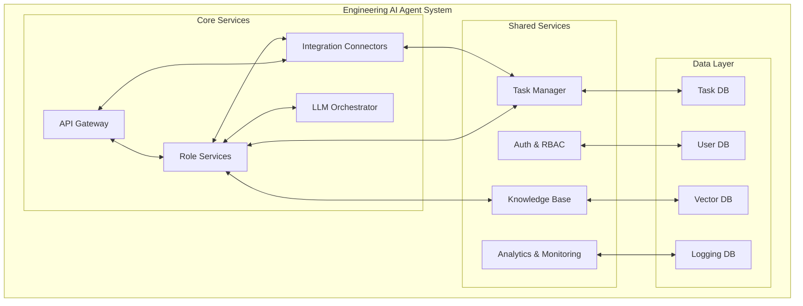
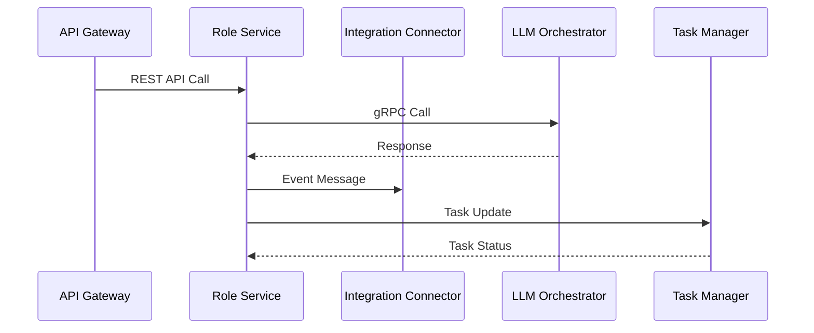
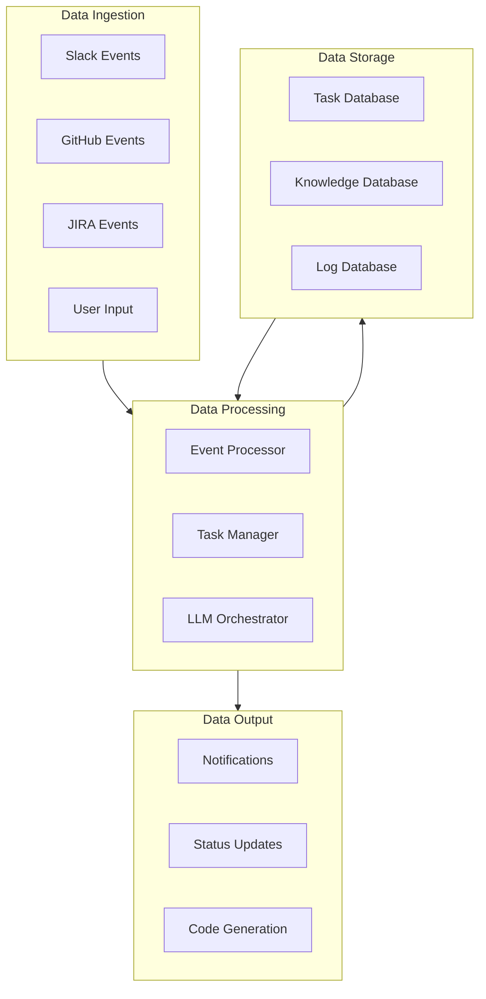
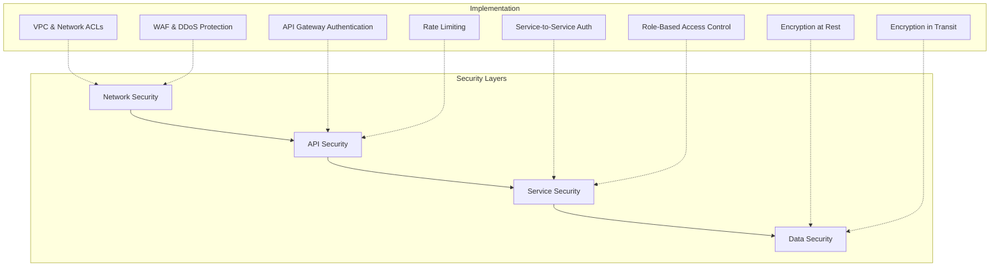
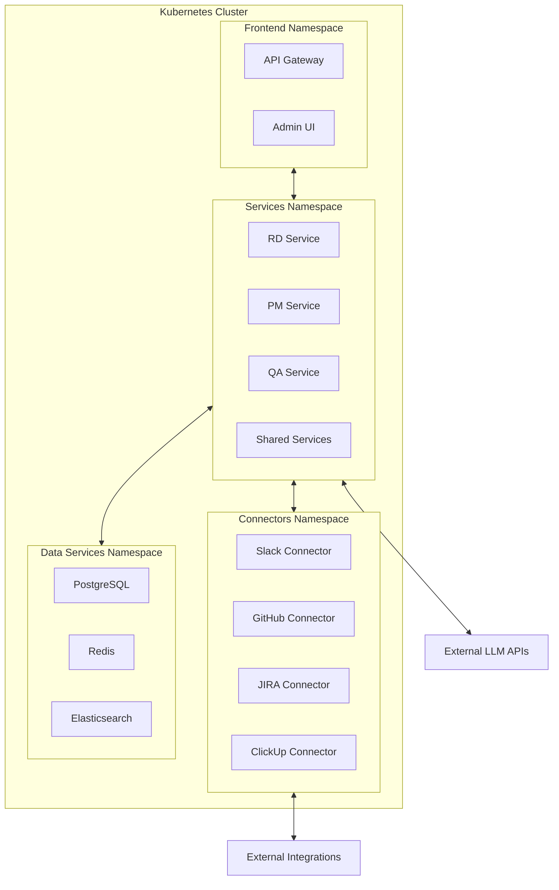

# Engineering AI Agent Architecture

This document provides a comprehensive overview of the Engineering AI Agent system architecture. It is intended for developers and contributors who need to understand the system internals for development, debugging, or enhancement purposes.

## System Architecture Overview

The Engineering AI Agent system follows a microservices architecture pattern with event-driven communication between components. This approach allows for independent scaling, development, and deployment of individual components.

## Core Architecture Principles

1. **Service Isolation**: Each component operates independently with well-defined interfaces
2. **Event-Driven Communication**: Asynchronous messaging for loosely-coupled components
3. **Stateless Design**: Services maintain minimal state for scalability
4. **Defense in Depth**: Multiple security layers throughout the system
5. **Observability First**: Comprehensive logging, metrics, and tracing

## Key Components

### API Gateway

The API Gateway serves as the single entry point for all client interactions with the system. It handles:

- Authentication and authorization
- Request routing to appropriate microservices
- Rate limiting and throttling
- Request/response transformation
- API documentation via Swagger/OpenAPI

**Implementation Details:**
- Built with FastAPI for high performance and automatic OpenAPI docs
- JWT-based authentication with role-based permissions
- Request validation and sanitization
- Distributed rate limiting with Redis

### Role Services

Role Services implement the business logic for each AI agent role. Each role operates as an independent microservice:

- **RD (Research & Development)**: Handles code generation, testing, and PR management
- **PM (Project Management)**: Manages requirements analysis and task breakdown
- **QA (Quality Assurance)**: Implements test planning, execution, and bug reporting
- **SA (System Architect)**: Provides architecture recommendations and design patterns
- **SD (Software Developer)**: Focuses on implementation, refactoring, and code quality
- **SRE (Site Reliability Engineer)**: Handles deployment, monitoring, and reliability

**Implementation Details:**
- Each role service is implemented as a separate Python microservice
- Shared code libraries for common functionality
- Role-specific business logic and prompting strategies
- Event-based communication for cross-role collaboration

### Integration Connectors

Integration Connectors facilitate communication with external systems:

- **Slack Connector**: Handles real-time messaging and interactions
- **GitHub Connector**: Manages repository operations, commits, and PRs
- **JIRA Connector**: Interfaces with JIRA for task management
- **ClickUp Connector**: Provides alternative task management integration

**Implementation Details:**
- Webhook receivers for real-time event handling
- OAuth 2.0 flow for user authorization
- Retry mechanisms with exponential backoff
- Rate limit awareness for API calls
- Event publication for system-wide notifications

### LLM Orchestrator

The LLM Orchestrator manages interactions with AI providers:

- Provider selection and fallback strategies
- Prompt management and templating
- Context handling and token optimization
- Response processing and validation

**Implementation Details:**
- Abstract provider interface for multi-provider support
- Configurable model selection based on task requirements
- Context window management with chunking strategies
- Caching layer for efficient token usage
- Asynchronous API calls for improved throughput

## Communication Patterns

### Service-to-Service Communication

Services communicate using a combination of:

1. **Synchronous REST API calls**: For request/response patterns that require immediate results
2. **gRPC calls**: For high-performance internal service communication
3. **Asynchronous messaging**: Using message queues for event-based communication
4. **Event streaming**: For real-time data flow between components

## Data Flow Architecture

## Database Schema Overview

The system uses multiple databases optimized for different purposes:

1. **Relational Database (PostgreSQL)**
   - User accounts and authentication
   - Task and workflow state
   - Configuration and settings
   - Relationship tracking

2. **Vector Database (Pinecone/Weaviate)**
   - Knowledge embeddings
   - Semantic search capabilities
   - Context storage for LLM interactions

3. **Time-Series Database (TimescaleDB)**
   - Performance metrics
   - Operational logs
   - Audit trails
   - Usage statistics

## Scalability and High Availability

The system is designed for horizontal scalability:

1. **Stateless Services**: All services can be scaled horizontally
2. **Database Scaling**:
   - Read replicas for high-read scenarios
   - Sharding for write-heavy workloads
   - Connection pooling for efficient resource usage
3. **Regional Redundancy**:
   - Multi-region deployment capability
   - Failover mechanisms for critical services
4. **Load Balancing**:
   - Layer 7 load balancing for API traffic
   - Service mesh for internal traffic management

## Security Architecture

The security architecture follows a defense-in-depth approach:

1. **Network Layer**
   - VPC isolation
   - Network ACLs and security groups
   - WAF for API protection
   - DDoS mitigation

2. **API Layer**
   - OAuth 2.0 and JWT authentication
   - API key management
   - Rate limiting and throttling
   - Input validation and sanitization

3. **Service Layer**
   - Service-to-service authentication
   - Role-based access control
   - Principle of least privilege
   - Audit logging

4. **Data Layer**
   - Encryption at rest
   - Encryption in transit
   - Data masking for sensitive information
   - Regular security scans

## Monitoring and Observability

The system implements a comprehensive observability strategy:

1. **Metrics Collection**
   - Service-level metrics (latency, throughput, error rates)
   - Business metrics (tasks processed, PR completion rate)
   - Resource utilization metrics (CPU, memory, disk, network)

2. **Distributed Tracing**
   - End-to-end request tracking
   - Service dependency mapping
   - Performance bottleneck identification

3. **Centralized Logging**
   - Structured logging format
   - Log aggregation and search
   - Alert generation from log patterns

4. **Health Checks and Alerting**
   - Service health probes
   - Synthetic transaction monitoring
   - Anomaly detection
   - Alert routing and escalation

## Deployment Architecture

## Technical Considerations

### Performance Optimization

1. **Caching Strategies**
   - Response caching for expensive operations
   - Distributed caching with Redis
   - Cache invalidation patterns

2. **Asynchronous Processing**
   - Background job processing for long-running tasks
   - Event-based architecture for non-blocking operations
   - Batch processing for efficiency

3. **Database Optimization**
   - Indexing strategy
   - Query optimization
   - Connection pooling
   - Read/write splitting

### Resilience Patterns

1. **Circuit Breakers**
   - Prevent cascading failures
   - Configurable failure thresholds
   - Fallback mechanisms

2. **Retry Mechanisms**
   - Exponential backoff
   - Jitter for distributed systems
   - Idempotency guarantees

3. **Bulkheads**
   - Resource isolation
   - Separate thread pools
   - Independent failure domains

4. **Graceful Degradation**
   - Feature toggles
   - Reduced functionality modes
   - Progressive enhancement

## Future Architecture Considerations

1. **Serverless Components**
   - Event-driven functions for sporadic workloads
   - Reduced operational overhead
   - Pay-per-use cost model

2. **Edge Computing**
   - Reduced latency for global users
   - Content delivery optimization
   - Regional data compliance

3. **Hybrid LLM Approach**
   - On-premise models for sensitive tasks
   - Cloud models for general tasks
   - Custom fine-tuned models for specific domains
