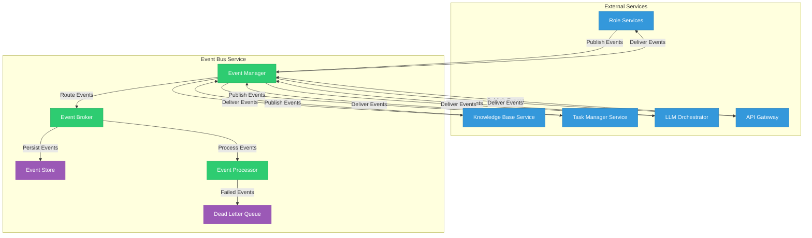
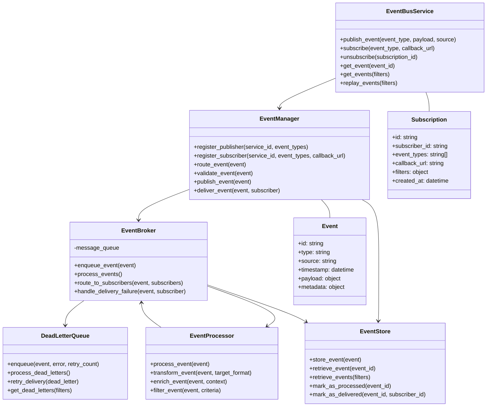

# Event Bus Service

## Overview

The Event Bus Service is a critical infrastructure component that enables asynchronous, event-driven communication between the various microservices in the Engineering AI Agent system. It provides a publish-subscribe messaging pattern that decouples service components, enhancing system resilience and scalability.



The Event Bus Service provides the following key features:

1. **Reliable Messaging**: Guarantees message delivery even in the face of service failures.
2. **Message Persistence**: Stores messages for replay and audit purposes.
3. **Asynchronous Communication**: Enables non-blocking interactions between services.
4. **Message Routing**: Routes messages to the appropriate subscribers.
5. **Dead Letter Handling**: Manages failed message processing.
6. **Event Tracing**: Tracks event flows throughout the system.

## Architecture

The Event Bus Service is built around a central event broker with supporting components:



## Event Model

Events in the system follow a standardized structure:

```json
{
  "id": "evt_123456789",
  "type": "task.created",
  "source": "task_manager_service",
  "timestamp": "2025-06-03T01:15:23.456Z",
  "payload": {
    "task_id": "task_987654321",
    "title": "Implement user authentication",
    "description": "Add JWT-based authentication to the API",
    "assignee": "developer_123",
    "priority": "high",
    "due_date": "2025-06-10T00:00:00Z"
  },
  "metadata": {
    "correlation_id": "corr_abcdef123456",
    "trace_id": "trace_123456abcdef",
    "version": "1.0",
    "retry_count": 0
  }
}
```

### Event Types

The system defines several categories of events:

1. **Task Events**
   - `task.created`: A new task has been created
   - `task.updated`: An existing task has been updated
   - `task.assigned`: A task has been assigned to a user
   - `task.completed`: A task has been marked as completed
   - `task.deleted`: A task has been deleted

2. **User Events**
   - `user.created`: A new user has been created
   - `user.updated`: User information has been updated
   - `user.deleted`: A user has been deleted

3. **Role Service Events**
   - `role.action.requested`: A role service action has been requested
   - `role.action.completed`: A role service action has been completed
   - `role.action.failed`: A role service action has failed

4. **Knowledge Base Events**
   - `knowledge.item.created`: A new knowledge item has been created
   - `knowledge.item.updated`: A knowledge item has been updated
   - `knowledge.item.deleted`: A knowledge item has been deleted

5. **LLM Orchestrator Events**
   - `llm.request.created`: A new LLM request has been created
   - `llm.response.received`: An LLM response has been received
   - `llm.error.occurred`: An error occurred during LLM processing

## Components

### Event Manager

The Event Manager handles the registration of publishers and subscribers, validates events, and coordinates event routing:

#### Publisher Registration

Publishers must register with the Event Bus Service to publish events:

```json
// Publisher Registration Request
{
  "service_id": "task_manager_service",
  "name": "Task Manager Service",
  "event_types": [
    "task.created",
    "task.updated",
    "task.assigned",
    "task.completed",
    "task.deleted"
  ],
  "authentication": {
    "api_key": "api_key_123456789"
  }
}
```

#### Subscriber Registration

Subscribers register to receive specific event types:

```json
// Subscriber Registration Request
{
  "service_id": "notification_service",
  "name": "Notification Service",
  "event_types": [
    "task.created",
    "task.assigned"
  ],
  "callback_url": "https://notification-service.example.com/events",
  "filters": {
    "task.assigned": {
      "priority": ["high", "critical"]
    }
  },
  "authentication": {
    "api_key": "api_key_987654321"
  }
}
```

### Event Broker

The Event Broker is responsible for the reliable delivery of events to subscribers:

#### Delivery Protocols

The Event Broker supports multiple delivery protocols:

1. **HTTP Callbacks**: Events are delivered via HTTP POST to the subscriber's callback URL
2. **Message Queue**: Events are published to a message queue that subscribers can consume
3. **WebSockets**: Events are pushed to subscribers via WebSocket connections
4. **Server-Sent Events (SSE)**: Events are pushed using the SSE protocol

#### Delivery Guarantees

The Event Broker provides different delivery guarantees:

1. **At-Least-Once Delivery**: Events are delivered at least once, with possible duplicates
2. **Exactly-Once Delivery**: Events are delivered exactly once (with additional overhead)
3. **At-Most-Once Delivery**: Events are delivered at most once, with possible message loss

### Event Store

The Event Store provides persistence for events, enabling replay and audit capabilities:

#### Storage Schema

Events are stored with additional metadata for efficient retrieval:

| Column | Type | Description |
|--------|------|-------------|
| `id` | string | Unique identifier for the event |
| `type` | string | Type of the event |
| `source` | string | Service that generated the event |
| `timestamp` | datetime | Time when the event was generated |
| `payload` | jsonb | Event payload |
| `metadata` | jsonb | Event metadata |
| `processed` | boolean | Whether the event has been processed |
| `deliveries` | jsonb | Delivery status for each subscriber |
| `created_at` | datetime | Time when the event was stored |
| `updated_at` | datetime | Time when the event was last updated |

### Dead Letter Queue

The Dead Letter Queue handles events that failed to be processed or delivered:

#### Error Handling

Failed events are stored with error information:

```json
// Dead Letter Entry
{
  "event_id": "evt_123456789",
  "subscriber_id": "notification_service",
  "error": {
    "code": "DELIVERY_FAILED",
    "message": "HTTP 503 Service Unavailable",
    "timestamp": "2025-06-03T01:17:45.123Z"
  },
  "retry_count": 3,
  "next_retry_at": "2025-06-03T01:27:45.123Z",
  "created_at": "2025-06-03T01:17:45.123Z",
  "updated_at": "2025-06-03T01:17:45.123Z"
}
```

## API Endpoints

The Event Bus Service exposes a RESTful API:

| Endpoint | Method | Description |
|----------|--------|-------------|
| `/events` | POST | Publish a new event |
| `/events` | GET | List events with optional filters |
| `/events/{id}` | GET | Get a specific event by ID |
| `/events/{id}/replay` | POST | Replay a specific event |
| `/subscriptions` | POST | Create a new subscription |
| `/subscriptions` | GET | List subscriptions |
| `/subscriptions/{id}` | GET | Get a specific subscription |
| `/subscriptions/{id}` | DELETE | Delete a subscription |
| `/publishers` | POST | Register a new publisher |
| `/publishers` | GET | List publishers |
| `/dead-letters` | GET | List dead letters |
| `/dead-letters/{id}/retry` | POST | Retry delivery of a dead letter |

## Event Patterns

### Command Pattern

Commands are events that represent requests to perform an action:

```json
// Command Event
{
  "id": "evt_command_123",
  "type": "command.generate_code",
  "source": "requirement_analyst_service",
  "timestamp": "2025-06-03T01:20:15.789Z",
  "payload": {
    "requirement_id": "req_456",
    "language": "python",
    "framework": "fastapi",
    "description": "Implement a user authentication endpoint"
  },
  "metadata": {
    "correlation_id": "corr_789",
    "reply_to": "requirement_analyst_service.commands.responses"
  }
}
```

### Event Sourcing

The system uses event sourcing to reconstruct state from a sequence of events:

```json
// Event Sourcing Example
[
  {
    "id": "evt_task_created",
    "type": "task.created",
    "timestamp": "2025-06-03T01:21:00.000Z",
    "payload": {
      "task_id": "task_123",
      "title": "Implement authentication"
    }
  },
  {
    "id": "evt_task_assigned",
    "type": "task.assigned",
    "timestamp": "2025-06-03T01:22:00.000Z",
    "payload": {
      "task_id": "task_123",
      "assignee": "developer_456"
    }
  },
  {
    "id": "evt_task_updated",
    "type": "task.updated",
    "timestamp": "2025-06-03T01:23:00.000Z",
    "payload": {
      "task_id": "task_123",
      "status": "in_progress"
    }
  }
]
```

## Deployment Configuration

### Kubernetes Deployment

```yaml
apiVersion: apps/v1
kind: Deployment
metadata:
  name: event-bus-service
  namespace: engineering-ai-agent
spec:
  replicas: 3
  selector:
    matchLabels:
      app: event-bus-service
  template:
    metadata:
      labels:
        app: event-bus-service
    spec:
      containers:
        - name: event-bus-service
          image: engineering-ai-agent/event-bus:latest
          ports:
            - containerPort: 8000
          env:
            - name: DATABASE_URL
              valueFrom:
                secretKeyRef:
                  name: event-bus-secrets
                  key: database-url
            - name: KAFKA_BOOTSTRAP_SERVERS
              valueFrom:
                configMapKeyRef:
                  name: event-bus-config
                  key: kafka-bootstrap-servers
            - name: REDIS_URL
              valueFrom:
                secretKeyRef:
                  name: event-bus-secrets
                  key: redis-url
          resources:
            requests:
              memory: "256Mi"
              cpu: "100m"
            limits:
              memory: "512Mi"
              cpu: "300m"
```

### Message Broker Configuration

The Event Bus Service can be configured to use different message brokers:

#### Apache Kafka Configuration

```yaml
event_bus:
  broker:
    type: kafka
    config:
      bootstrap_servers: "kafka-1:9092,kafka-2:9092,kafka-3:9092"
      client_id: "event-bus-service"
      group_id: "event-bus-service-group"
      auto_offset_reset: "earliest"
      enable_auto_commit: false
      max_poll_records: 100
      default_topic_config:
        num_partitions: 10
        replication_factor: 3
```

#### RabbitMQ Configuration

```yaml
event_bus:
  broker:
    type: rabbitmq
    config:
      host: "rabbitmq"
      port: 5672
      virtual_host: "/"
      username: "event-bus-service"
      password: "${RABBITMQ_PASSWORD}"
      connection_attempts: 3
      retry_delay: 5
      exchange:
        name: "events"
        type: "topic"
        durable: true
```

## Security

### Authentication and Authorization

The Event Bus Service implements security measures:

1. **Service Authentication**: Services must authenticate using API keys or mutual TLS
2. **Authorization**: Publishers can only publish events they are registered for
3. **Payload Encryption**: Sensitive event payloads can be encrypted
4. **TLS**: All communications use TLS for transport security

### Audit Logging

All significant operations are logged for audit purposes:

```json
// Audit Log Entry
{
  "timestamp": "2025-06-03T01:25:00.000Z",
  "action": "event.published",
  "actor": "task_manager_service",
  "resource": "event/evt_123456789",
  "resource_type": "event",
  "details": {
    "event_type": "task.created",
    "event_id": "evt_123456789"
  },
  "status": "success",
  "ip_address": "10.0.1.123"
}
```

## Monitoring

### Health Checks

The Event Bus Service exposes health check endpoints:

- `/health/live`: Liveness probe checking if the service is running
- `/health/ready`: Readiness probe checking if the service can handle requests
- `/health/broker`: Health check for the message broker connection
- `/health/database`: Health check for the database connection

### Metrics

The service exports Prometheus metrics:

- `event_bus_events_published_total`: Counter of published events by type
- `event_bus_events_delivered_total`: Counter of delivered events by type and subscriber
- `event_bus_delivery_failures_total`: Counter of delivery failures by type and subscriber
- `event_bus_delivery_latency_seconds`: Histogram of event delivery latency
- `event_bus_dead_letters_total`: Counter of dead letters by type and subscriber
- `event_bus_active_subscriptions`: Gauge of active subscriptions by event type

## Testing Strategy

### Unit Testing

Tests for individual components:

- Test event validation
- Test subscription matching
- Test delivery protocol implementations
- Test error handling and retry logic

### Integration Testing

Tests for interactions between components:

- Test end-to-end event publishing and delivery
- Test event persistence and retrieval
- Test dead letter queue processing
- Test subscription management

### Load Testing

Performance tests under load:

- Test maximum event throughput
- Test latency under various loads
- Test recovery from broker failures
- Test handling of backpressure

## Future Enhancements

1. **Schema Registry**: Implement a schema registry for event validation
2. **Event Versioning**: Add support for event schema versioning
3. **Circuit Breakers**: Implement circuit breakers for failing subscribers
4. **Enhanced Filtering**: Support more sophisticated event filtering
5. **Real-time Analytics**: Add real-time analytics on event flows
