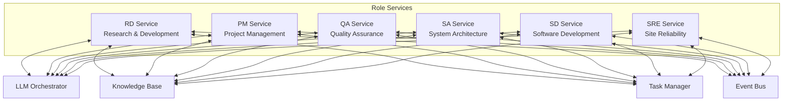
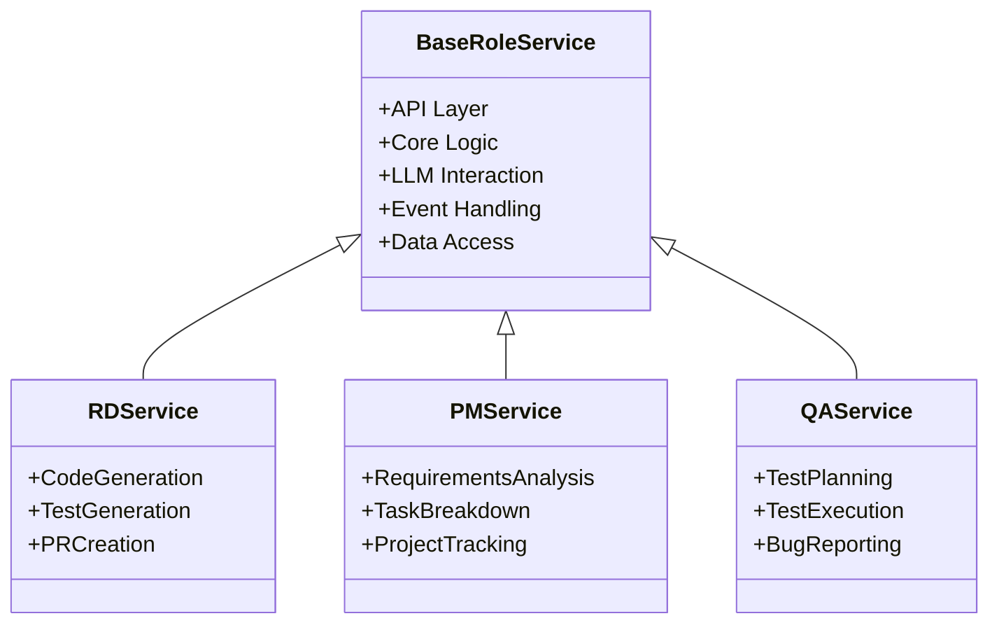
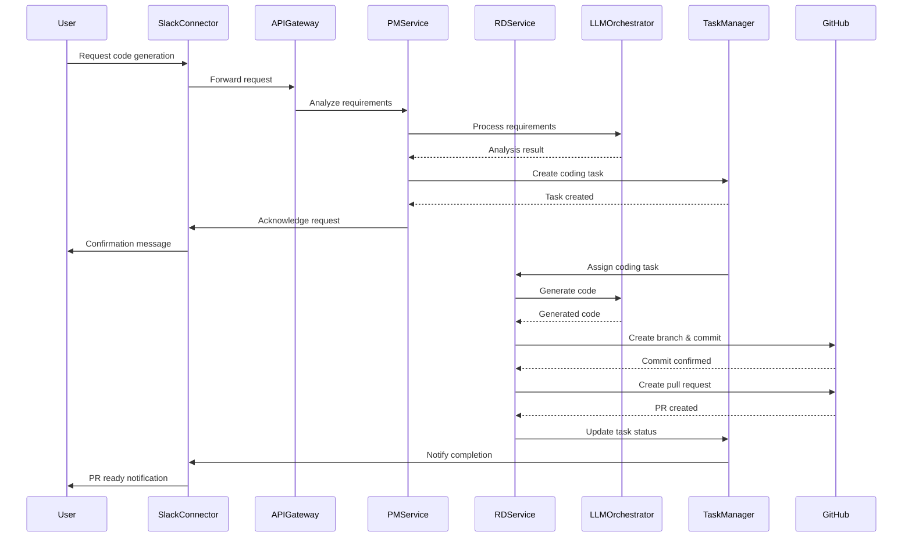
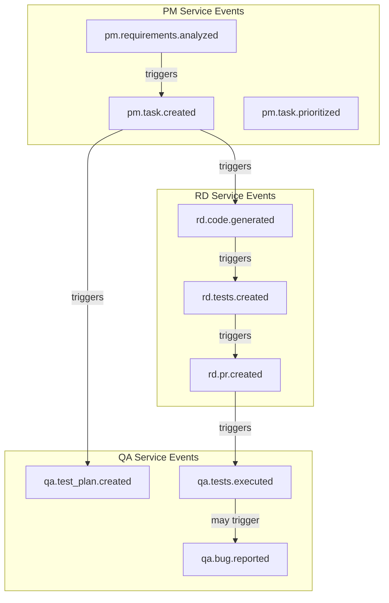

# Role Services

This document provides detailed information about the Role Services in the Engineering AI Agent system, including their architecture, implementation details, and development guidelines.

## Overview

Role Services are specialized microservices that implement the core business logic for each AI agent role. Each role represents a different software engineering discipline and operates independently while collaborating through events and shared services.



## Role Descriptions and Responsibilities

### RD Service (Research & Development)

The RD Service focuses on code generation, testing, and PR management.

**Core Responsibilities:**
- Analyzing requirements and technical documentation
- Generating code based on specifications
- Creating unit tests for generated code
- Preparing pull requests with appropriate descriptions
- Responding to code review feedback

**Key Interactions:**
- Works with PM Service to understand requirements
- Collaborates with QA Service for test planning
- Interfaces with GitHub for code management

### PM Service (Project Management)

The PM Service handles requirements analysis and task breakdown.

**Core Responsibilities:**
- Analyzing user requests and requirements
- Breaking down requirements into actionable tasks
- Prioritizing tasks based on dependencies and importance
- Tracking project progress and generating reports
- Managing project timelines and dependencies

**Key Interactions:**
- Interfaces with JIRA/ClickUp for task management
- Coordinates with all other roles for task assignment
- Works with Slack for user communication

### QA Service (Quality Assurance)

The QA Service implements test planning, execution, and bug reporting.

**Core Responsibilities:**
- Creating test plans based on requirements
- Designing test cases for new features
- Executing automated tests
- Reporting and tracking bugs
- Verifying bug fixes

**Key Interactions:**
- Works with RD Service to validate code quality
- Interfaces with JIRA/ClickUp for bug tracking
- Collaborates with PM Service on test priorities

### SA Service (System Architecture)

The SA Service provides architecture recommendations and design patterns.

**Core Responsibilities:**
- Analyzing system requirements for architectural implications
- Recommending appropriate design patterns and approaches
- Creating high-level architecture diagrams
- Evaluating technical decisions for long-term impact
- Ensuring architectural consistency across components

**Key Interactions:**
- Collaborates with RD Service on implementation approaches
- Works with PM Service to understand system requirements
- Interfaces with SD Service for component design

### SD Service (Software Development)

The SD Service focuses on implementation, refactoring, and code quality.

**Core Responsibilities:**
- Implementing complex features
- Refactoring existing code for improved quality
- Optimizing performance-critical components
- Identifying and fixing technical debt
- Ensuring coding standard compliance

**Key Interactions:**
- Works closely with RD Service on implementation details
- Collaborates with SA Service on component design
- Interfaces with QA Service for testing

### SRE Service (Site Reliability Engineering)

The SRE Service handles deployment, monitoring, and reliability.

**Core Responsibilities:**
- Creating and maintaining deployment pipelines
- Setting up monitoring and alerting
- Implementing logging and observability
- Planning for scalability and redundancy
- Troubleshooting production issues

**Key Interactions:**
- Works with all services on deployment requirements
- Interfaces with infrastructure providers
- Collaborates with SD Service on performance optimization

## Service Architecture

Each Role Service follows a similar architecture pattern for consistency while allowing for role-specific customizations.



### Common Components

Each Role Service includes these standard components:

1. **API Layer**
   - RESTful endpoints for direct interaction
   - WebSocket support for real-time updates
   - Authentication and authorization
   - Request validation and error handling

2. **Core Logic**
   - Role-specific business logic
   - Task processing workflows
   - Decision making algorithms
   - Coordination with other services

3. **LLM Interaction**
   - Role-specific prompts and templates
   - Context management for LLM calls
   - Response parsing and validation
   - Fallback strategies for failures

4. **Event Handling**
   - Event publication for state changes
   - Event subscription for relevant updates
   - Event processing and reaction
   - Idempotent event handling

5. **Data Access**
   - Repository pattern for data access
   - Caching strategies for performance
   - Data validation and transformation
   - Transactional operations

## Implementation Details

### Core Service Structure

```python
# Base role service implementation
class RoleService:
    def __init__(
        self,
        llm_client,
        event_bus,
        task_manager,
        knowledge_base,
        repository
    ):
        self.llm_client = llm_client
        self.event_bus = event_bus
        self.task_manager = task_manager
        self.knowledge_base = knowledge_base
        self.repository = repository
    
    async def process_task(self, task_id: str) -> Dict[str, Any]:
        """Process a task assigned to this role."""
        # Retrieve task details
        task = await self.task_manager.get_task(task_id)
        
        # Update task status
        await self.task_manager.update_task_status(
            task_id=task_id,
            status="in_progress"
        )
        
        try:
            # Retrieve relevant context
            context = await self.get_context_for_task(task)
            
            # Process the task using role-specific logic
            result = await self._process_task_implementation(task, context)
            
            # Update task with results
            await self.task_manager.update_task(
                task_id=task_id,
                status="completed",
                result=result
            )
            
            # Publish completion event
            await self.event_bus.publish(
                event_type=f"{self.role_name}.task.completed",
                data={
                    "task_id": task_id,
                    "result": result
                }
            )
            
            return result
        except Exception as e:
            # Handle failure
            await self.task_manager.update_task_status(
                task_id=task_id,
                status="failed",
                error=str(e)
            )
            
            # Publish failure event
            await self.event_bus.publish(
                event_type=f"{self.role_name}.task.failed",
                data={
                    "task_id": task_id,
                    "error": str(e)
                }
            )
            
            raise
    
    async def get_context_for_task(self, task: Dict[str, Any]) -> Dict[str, Any]:
        """Retrieve relevant context for a task."""
        # Get project context
        project_context = await self.knowledge_base.get_project_context(
            project_id=task["project_id"]
        )
        
        # Get task-specific context
        task_context = await self.knowledge_base.search(
            query=task["description"],
            filters={"project_id": task["project_id"]},
            limit=5
        )
        
        # Get role-specific context
        role_context = await self._get_role_specific_context(task)
        
        return {
            "project": project_context,
            "task": task_context,
            "role": role_context
        }
    
    @abstractmethod
    async def _process_task_implementation(
        self, 
        task: Dict[str, Any],
        context: Dict[str, Any]
    ) -> Dict[str, Any]:
        """Role-specific task processing implementation."""
        pass
    
    @abstractmethod
    async def _get_role_specific_context(
        self,
        task: Dict[str, Any]
    ) -> Dict[str, Any]:
        """Role-specific context retrieval."""
        pass
```

### Role-Specific Implementation Example

```python
# RD Service implementation
class RDService(RoleService):
    role_name = "rd"
    
    async def _process_task_implementation(
        self, 
        task: Dict[str, Any],
        context: Dict[str, Any]
    ) -> Dict[str, Any]:
        """Process an RD task - typically code generation."""
        task_type = task.get("type", "code_generation")
        
        if task_type == "code_generation":
            return await self._generate_code(task, context)
        elif task_type == "test_generation":
            return await self._generate_tests(task, context)
        elif task_type == "pr_creation":
            return await self._create_pull_request(task, context)
        else:
            raise ValueError(f"Unsupported task type: {task_type}")
    
    async def _generate_code(
        self,
        task: Dict[str, Any],
        context: Dict[str, Any]
    ) -> Dict[str, Any]:
        """Generate code based on task requirements."""
        # Prepare prompt for code generation
        prompt = self.prompt_manager.get_prompt(
            prompt_type="code_generation",
            variables={
                "requirements": task["description"],
                "language": task.get("language", "python"),
                "project_context": context["project"],
                "additional_context": context["task"]
            }
        )
        
        # Generate code using LLM
        llm_response = await self.llm_client.generate(prompt)
        
        # Parse and validate the generated code
        code = self.code_parser.extract_code(llm_response)
        validation_result = self.code_validator.validate(
            code=code,
            language=task.get("language", "python")
        )
        
        if not validation_result["valid"]:
            # If code is invalid, retry or apply fixes
            code = await self._fix_code_issues(
                code=code,
                issues=validation_result["issues"]
            )
        
        # Store the generated code
        file_path = task.get("file_path", f"generated_{uuid.uuid4()}.py")
        await self.repository.store_file(
            project_id=task["project_id"],
            file_path=file_path,
            content=code
        )
        
        return {
            "code": code,
            "file_path": file_path,
            "validation": validation_result
        }
    
    async def _get_role_specific_context(
        self,
        task: Dict[str, Any]
    ) -> Dict[str, Any]:
        """Get RD-specific context for a task."""
        # For code generation, get relevant code files
        if task.get("type") == "code_generation":
            related_files = await self.repository.find_related_files(
                project_id=task["project_id"],
                description=task["description"],
                limit=3
            )
            
            # Get code snippets from related files
            code_snippets = {}
            for file_path in related_files:
                content = await self.repository.get_file_content(
                    project_id=task["project_id"],
                    file_path=file_path
                )
                code_snippets[file_path] = content
            
            return {
                "related_files": related_files,
                "code_snippets": code_snippets,
                "coding_standards": await self.knowledge_base.get_coding_standards(
                    project_id=task["project_id"],
                    language=task.get("language", "python")
                )
            }
        
        return {}
```

## Task Processing Workflow



## Prompt Engineering for Role Services

Each role service uses specialized prompts designed for its specific tasks. Here are examples of role-specific prompt templates:

### RD Service Prompts

```
# Code Generation Prompt Template

You are an expert software developer specializing in {language}. Your task is to write code based on the following requirements:

Requirements:
{requirements}

Project Context:
{project_context}

Additional Information:
{additional_context}

Please follow these coding standards:
{coding_standards}

Generate professional, well-structured, and well-documented code that fulfills these requirements. Include appropriate error handling, tests, and comments.
```

### PM Service Prompts

```
# Task Breakdown Prompt Template

You are an experienced project manager. Your task is to break down the following requirement into smaller, actionable tasks:

Requirement:
{requirement}

Project Context:
{project_context}

For each task, please provide:
1. A clear, concise title
2. A detailed description
3. Estimated complexity (Low/Medium/High)
4. Suggested role assignment (RD, QA, SA, SD, SRE)
5. Any dependencies on other tasks

Organize the tasks in a logical sequence of implementation.
```

## Event-Based Communication

Role Services communicate with each other and with other system components through an event-driven architecture. This enables loose coupling and asynchronous processing.

### Key Events



### Event Schema Example

```json
{
  "event_id": "evt_123456789",
  "event_type": "rd.code.generated",
  "timestamp": "2023-06-03T12:34:56Z",
  "producer": "rd-service",
  "correlation_id": "corr_987654321",
  "data": {
    "task_id": "task_123456",
    "project_id": "proj_654321",
    "file_path": "src/components/user_service.py",
    "language": "python",
    "lines_of_code": 120,
    "status": "success"
  },
  "metadata": {
    "user_id": "user_112233",
    "priority": "high",
    "version": "1.0.0"
  }
}
```

## Testing Approach

### Unit Testing

Each Role Service should have comprehensive unit tests covering:

- Business logic components
- LLM prompt construction
- Response parsing and validation
- Event handling
- Error scenarios

```python
# Example unit test for RD Service
import pytest
from unittest.mock import AsyncMock, patch

@pytest.mark.asyncio
async def test_generate_code():
    # Mock dependencies
    llm_client = AsyncMock()
    llm_client.generate.return_value = """
    Here's the implementation:
```python
    def calculate_total(items):
        return sum(item.price for item in items)
    ```
"""
    
    repository = AsyncMock()
    knowledge_base = AsyncMock()
    knowledge_base.get_coding_standards.return_value = "PEP 8"
    
    task_manager = AsyncMock()
    event_bus = AsyncMock()
    
    # Create service instance with mocks
    service = RDService(
        llm_client=llm_client,
        repository=repository,
        knowledge_base=knowledge_base,
        task_manager=task_manager,
        event_bus=event_bus
    )
    
    # Test data
    task = {
        "id": "task_123",
        "project_id": "proj_456",
        "type": "code_generation",
        "description": "Implement a function to calculate the total price of items",
        "language": "python"
    }
    
    context = {
        "project": {"name": "E-commerce API"},
        "task": ["Item class has a price attribute"],
        "role": {
            "related_files": ["models/item.py"],
            "code_snippets": {"models/item.py": "class Item:\n    def __init__(self, price):\n        self.price = price"},
            "coding_standards": "PEP 8"
        }
    }
    
    # Execute
    result = await service._generate_code(task, context)
    
    # Assert
    assert "def calculate_total(items):" in result["code"]
    assert "return sum(item.price for item in items)" in result["code"]
    assert result["file_path"] is not None
    
    # Verify dependencies were called correctly
    llm_client.generate.assert_called_once()
    repository.store_file.assert_called_once()
```

### Integration Testing

Integration tests should verify:

- Correct interaction between role services
- Proper event publishing and handling
- End-to-end task processing flows
- Integration with external systems

```python
# Example integration test with mock LLM but real event bus
@pytest.mark.integration
@pytest.mark.asyncio
async def test_task_processing_flow():
    # Setup test environment
    event_bus = get_test_event_bus()
    task_manager = get_test_task_manager()
    
    # Mock LLM client
    llm_client = AsyncMock()
    llm_client.generate.side_effect = [
        # PM Service response for task breakdown
        """Task breakdown:
        1. Create calculate_total function
        2. Add unit tests""",
        
        # RD Service response for code generation
        """
```python
        def calculate_total(items):
            return sum(item.price for item in items)
        ```"""
    ]
    
    # Create services with real event bus and task manager
    pm_service = PMService(
        llm_client=llm_client,
        event_bus=event_bus,
        task_manager=task_manager,
        knowledge_base=get_test_knowledge_base(),
        repository=get_test_repository()
    )
    
    rd_service = RDService(
        llm_client=llm_client,
        event_bus=event_bus,
        task_manager=task_manager,
        knowledge_base=get_test_knowledge_base(),
        repository=get_test_repository()
    )
    
    # Create test project
    project_id = await create_test_project()
    
    # Submit requirement
    requirement = "Create a function to calculate the total price of items"
    task_id = await pm_service.process_requirement(
        project_id=project_id,
        requirement=requirement
    )
    
    # Wait for events to propagate
    await asyncio.sleep(1)
    
    # Check task status
    task = await task_manager.get_task(task_id)
    assert task["status"] == "completed"
    
    # Verify code was generated
    code_files = await get_test_repository().list_files(project_id)
    assert len(code_files) > 0
    
    # Verify the code contains the expected function
    code_content = await get_test_repository().get_file_content(
        project_id=project_id,
        file_path=code_files[0]
    )
    assert "def calculate_total(items):" in code_content
```
## Deployment Configuration

### Kubernetes Deployment
```yaml
apiVersion: apps/v1
kind: Deployment
metadata:
  name: rd-service
  namespace: engineering-ai-agent
spec:
  replicas: 2
  selector:
    matchLabels:
      app: rd-service
  template:
    metadata:
      labels:
        app: rd-service
    spec:
      containers:
        - name: rd-service
          image: engineering-ai-agent/rd-service:latest
          ports:
            - containerPort: 8000
          env:
            - name: LOG_LEVEL
              value: "info"
            - name: LLM_PROVIDER
              value: "openai"
            - name: EVENT_BUS_HOST
              valueFrom:
                configMapKeyRef:
                  name: app-config
                  key: event_bus_host
            - name: LLM_API_KEY
              valueFrom:
                secretKeyRef:
                  name: app-secrets
                  key: llm_api_key
          resources:
            limits:
              cpu: 1000m
              memory: 1Gi
            requests:
              cpu: 500m
              memory: 512Mi
          livenessProbe:
            httpGet:
              path: /health
              port: 8000
            initialDelaySeconds: 30
            periodSeconds: 10
          readinessProbe:
            httpGet:
              path: /health/ready
              port: 8000
            initialDelaySeconds: 5
            periodSeconds: 5
```
## Scaling Considerations

Role Services can be scaled independently based on workload:

1. **Horizontal Scaling**
   - Increase replica count for high-demand roles
   - Scale based on task queue length
   - Autoscaling based on CPU/memory usage

2. **Resource Allocation**
   - Allocate more resources to compute-intensive roles (e.g., RD)
   - Optimize memory for context-heavy roles (e.g., SA)
   - Balance CPU/memory based on role characteristics

3. **Load Distribution**
   - Task-based routing for even distribution
   - Consistent hashing for related tasks
   - Priority-based scheduling for critical roles

## Development Guidelines

### Setting Up Local Development

1. **Prerequisites**
   - Python 3.10+
   - Docker and Docker Compose
   - Redis (for event bus)
   - PostgreSQL (for task storage)

2. **Environment Setup**
```bash
   # Clone the repository
   git clone https://github.com/your-org/engineering-ai-agent.git
   cd engineering-ai-agent/services/rd-service
   
   # Create virtual environment
   python -m venv venv
   source venv/bin/activate  # On Windows: venv\Scripts\activate
   
   # Install dependencies
   pip install -r requirements.txt
   pip install -r requirements-dev.txt
   
   # Setup pre-commit hooks
   pre-commit install
   ```
3. **Configuration**
```bash
   # Copy example environment file
   cp .env.example .env
   
   # Edit .env file with your local configuration
   # Start local dependencies
   docker-compose up -d redis postgres
   
   # Run the service
   uvicorn app.main:app --reload
   ```
### Code Organization
```
role-service/
├── app/
│   ├── __init__.py
│   ├── main.py                 # Application entry point
│   ├── config.py               # Configuration handling
│   ├── api/                    # API endpoints
│   │   ├── __init__.py
│   │   ├── tasks.py
│   │   └── health.py
│   ├── core/                   # Core business logic
│   │   ├── __init__.py
│   │   ├── service.py          # Main service implementation
│   │   ├── processors/         # Task-specific processors
│   │   │   ├── __init__.py
│   │   │   ├── code_generator.py
│   │   │   └── test_generator.py
│   │   └── validators/         # Validation logic
│   │       ├── __init__.py
│   │       └── code_validator.py
│   ├── llm/                    # LLM interaction
│   │   ├── __init__.py
│   │   ├── client.py           # LLM client
│   │   ├── prompts/            # Prompt templates
│   │   │   ├── __init__.py
│   │   │   └── code_generation.py
│   │   └── parsers/            # Response parsers
│   │       ├── __init__.py
│   │       └── code_parser.py
│   ├── events/                 # Event handling
│   │   ├── __init__.py
│   │   ├── publisher.py
│   │   ├── subscriber.py
│   │   └── handlers/           # Event handlers
│   │       ├── __init__.py
│   │       └── task_handlers.py
│   ├── data/                   # Data access
│   │   ├── __init__.py
│   │   ├── repositories/       # Data repositories
│   │   │   ├── __init__.py
│   │   │   └── task_repository.py
│   │   └── models/             # Data models
│   │       ├── __init__.py
│   │       └── task.py
│   └── utils/                  # Utility functions
│       ├── __init__.py
│       └── logging.py
├── tests/                      # Test suite
│   ├── __init__.py
│   ├── conftest.py
│   ├── unit/                   # Unit tests
│   │   ├── __init__.py
│   │   ├── test_service.py
│   │   └── test_code_generator.py
│   └── integration/            # Integration tests
│       ├── __init__.py
│       └── test_task_processing.py
├── .env.example                # Example environment variables
├── Dockerfile                  # Container definition
├── docker-compose.yml          # Local development services
├── requirements.txt            # Production dependencies
└── requirements-dev.txt        # Development dependencies
```
### Best Practices

1. **Code Quality**
   - Follow PEP 8 style guidelines
   - Use type hints consistently
   - Write comprehensive docstrings
   - Apply SOLID principles

2. **Testing**
   - Maintain high test coverage (aim for 80%+)
   - Write both unit and integration tests
   - Use parameterized tests for edge cases
   - Mock external dependencies

3. **Error Handling**
   - Use custom exception classes
   - Implement proper error logging
   - Provide meaningful error messages
   - Use structured error responses

4. **Performance**
   - Implement caching for expensive operations
   - Use asynchronous code for I/O operations
   - Optimize LLM token usage
   - Profile and optimize bottlenecks

5. **Security**
   - Validate all inputs
   - Use secure coding practices
   - Never log sensitive information
   - Follow least privilege principle

## Troubleshooting

### Common Issues

1. **LLM Connection Issues**
   - Check API key validity
   - Verify network connectivity
   - Inspect rate limiting
   - Review request/response logs

2. **Event Bus Problems**
   - Confirm event bus is running
   - Check connection parameters
   - Verify event schema
   - Inspect message queues

3. **Task Processing Failures**
   - Review task input data
   - Check for incomplete context
   - Inspect LLM response quality
   - Verify integration points

### Debugging Techniques

1. **Enable Debug Logging**
```bash
   export LOG_LEVEL=debug
   ```
2. **Trace LLM Interactions**
```bash
   export TRACE_LLM_CALLS=true
   ```
3. **Inspect Event Flow**
```bash
   export TRACE_EVENTS=true
   ```
4. **Manual Task Testing**
```bash
   # Using the API directly
   curl -X POST http://localhost:8000/tasks/process \
     -H "Content-Type: application/json" \
     -d '{"task_id": "task_123", "type": "code_generation", "description": "..."}'
   ```

## Future Enhancements

1. **Specialized LLM Models**
   - Role-specific fine-tuned models
   - Smaller models for simple tasks
   - Multi-modal models for diagram generation

2. **Advanced Collaboration**
   - Cross-role collaborative tasks
   - Consensus mechanisms for decisions
   - Iterative improvement workflows

3. **Learning Capabilities**
   - Feedback-based improvement
   - Quality tracking over time
   - Adaptive prompt optimization
