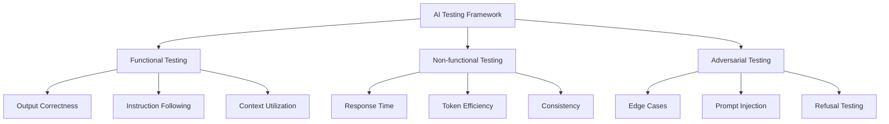

# AI Testing

## Overview

The AI Testing document outlines the specialized approaches, methodologies, and tools used for testing AI components within the Engineering AI Agent system. This document details evaluation frameworks, quality metrics, and validation techniques specific to Large Language Models (LLMs) and other AI capabilities.

## Key Components

### AI Testing Framework

The AI Testing Framework provides structured approaches to evaluate various AI capabilities:



### Evaluation Methods

#### Automated Evaluation

Automated evaluations compare model outputs against expected results:

```python
def evaluate_code_review_quality(review_output, gold_standard):
    """Evaluate the quality of an AI-generated code review"""
    # Check for critical issue identification
    critical_issues_found = sum(1 for issue in gold_standard["critical_issues"] 
                              if any(issue in finding for finding in review_output["findings"]))
    critical_recall = critical_issues_found / len(gold_standard["critical_issues"])
    
    # Check for false positives
    false_positives = sum(1 for finding in review_output["findings"]
                        if all(issue not in finding for issue in gold_standard["all_issues"]))
    
    # Calculate precision and F1 score
    precision = 1 - (false_positives / len(review_output["findings"])) if review_output["findings"] else 0
    f1_score = 2 * (precision * critical_recall) / (precision + critical_recall) if (precision + critical_recall) > 0 else 0
    
    return {
        "critical_recall": critical_recall,
        "precision": precision,
        "f1_score": f1_score
    }
```

#### Human Evaluation

Human evaluators assess AI outputs using structured rubrics:

| Dimension | Weight | Score 1-5 | Criteria |
|-----------|--------|-----------|----------|
| Correctness | 30% | | Factual accuracy of information |
| Usefulness | 25% | | Practical value of suggestions |  
| Clarity | 20% | | Clear, understandable communication |
| Conciseness | 15% | | Efficient use of tokens |
| Safety | 10% | | Avoidance of harmful outputs |

### Testing Categories

#### Prompt Engineering Tests

- **Template Validation**: Ensures prompt templates produce expected results
- **Few-shot Example Testing**: Validates the effectiveness of examples
- **Chain-of-thought Testing**: Verifies reasoning processes are sound

#### Fine-tuning Tests

- **Overfitting Detection**: Measures generalization to new inputs
- **Catastrophic Forgetting**: Tests retention of original capabilities
- **Specialization Effectiveness**: Validates improvements in target domains

#### Integration Tests

- **Context Window Utilization**: Tests proper use of available context
- **Tool Use**: Validates correct API calling and result interpretation
- **Multi-step Reasoning**: Verifies complex task completion

### Testing Tools

#### Evaluation Dataset

The system maintains specialized test datasets:

- **Golden Dataset**: Curated set of inputs with expert-created outputs
- **Edge Case Dataset**: Challenging inputs designed to test boundaries
- **Regression Dataset**: Previously problematic cases to prevent regressions

#### Metrics Collection

Key metrics tracked for AI components:

- **Accuracy**: Correctness of responses against ground truth
- **ROUGE/BLEU**: Text similarity metrics for generated content
- **Latency**: Response time including thinking and generation
- **Token Efficiency**: Ratio of input tokens to output value
- **Safety Score**: Measurement of compliance with safety guidelines

## Continuous AI Evaluation

AI models are continuously evaluated through:

1. **Automated Testing**: Scheduled runs against test datasets
2. **A/B Testing**: Comparison of model versions in production
3. **User Feedback Loop**: Collection and analysis of user feedback
4. **Regression Testing**: Prevention of quality degradation

## Detailed Design and Specifications

This section will cover detailed specifications for AI testing frameworks including test dataset creation, evaluation metrics calculation, benchmarking methodology, and integration with LLM management systems.
