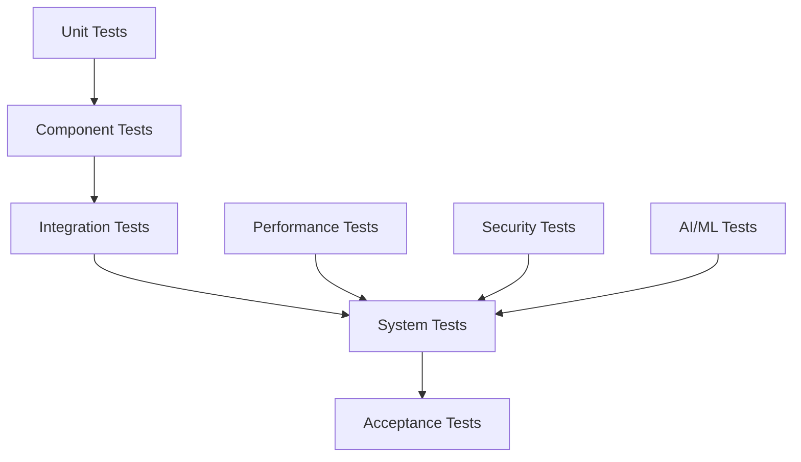
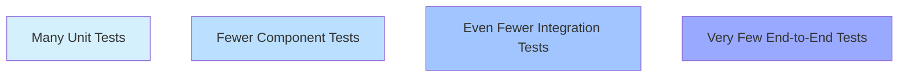

# Testing Strategy

## Overview

The Testing Strategy document outlines the comprehensive approach to testing the Engineering AI Agent system. This document details the testing levels, methodologies, tools, and processes to ensure quality across all system components.

## Testing Levels

The system employs a multi-level testing approach:



### Unit Testing

- Tests individual functions and classes
- Focuses on logical correctness
- Uses mocking for dependencies
- Aims for high code coverage (>80%)

```python
def test_vector_similarity():
    """Test that vector similarity calculation works correctly"""
    vec1 = np.array([1, 0, 0])
    vec2 = np.array([0, 1, 0])
    similarity = calculate_cosine_similarity(vec1, vec2)
    assert similarity == 0.0
    
    vec3 = np.array([1, 1, 0])
    similarity = calculate_cosine_similarity(vec1, vec3)
    assert np.isclose(similarity, 0.7071, atol=1e-4)
```

### Component Testing

- Tests individual services in isolation
- Uses containerized dependencies
- Validates service APIs and contracts
- Verifies error handling and edge cases

### Integration Testing

- Tests communication between services
- Validates end-to-end workflows
- Uses choreographed test environments
- Verifies data consistency across services

### AI/ML Testing

- Specialized tests for AI/ML components
- Evaluates model performance and accuracy
- Tests prompt engineering effectiveness
- Validates fine-tuning outcomes
- Ensures consistent AI responses

## Testing Pyramid

The system follows the testing pyramid principle to balance thoroughness with execution speed:



## Test Data Management

- Generated synthetic test data
- Anonymized production data
- Version-controlled test fixtures
- Environment-specific data sets

## Testing Tools and Frameworks

- **Unit Testing**: pytest, unittest
- **Mock Objects**: pytest-mock, unittest.mock
- **API Testing**: pytest-httpx, requests-mock
- **Performance Testing**: Locust, JMeter
- **E2E Testing**: Robot Framework, Selenium
- **AI Testing**: Custom evaluation frameworks

## Continuous Testing

- Tests integrated into CI/CD pipeline
- Automated test execution on code changes
- Nightly comprehensive test suites
- Weekly performance and security tests

## Test Reporting

- Consolidated test results dashboard
- Trend analysis of test metrics
- Coverage reports
- Visual regression testing

## Testing Environments

- Local development environment for unit tests
- Isolated test environments for component tests
- Shared integration environments for integration tests
- Production-like staging for system tests

## Detailed Design and Specifications

This section will cover detailed specifications for the testing strategy including test configuration, execution frameworks, reporting mechanisms, and integration with the development workflow.
